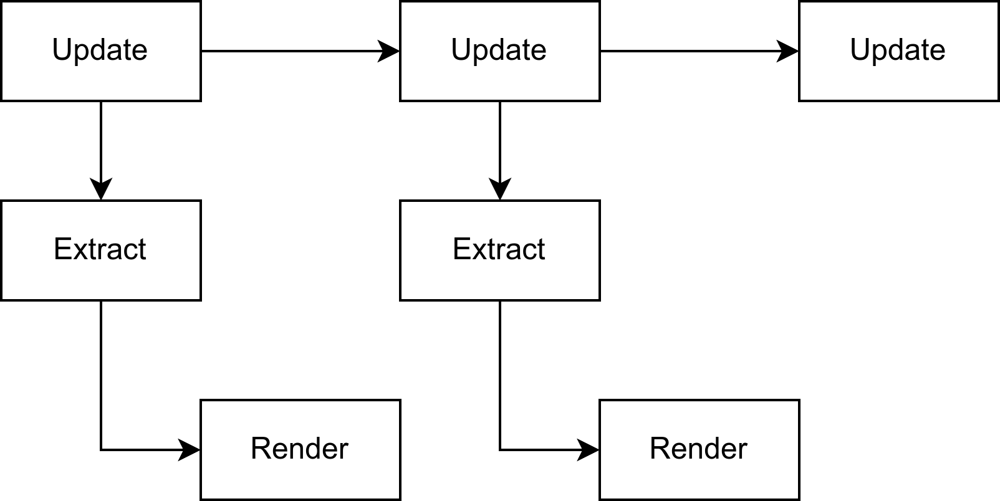
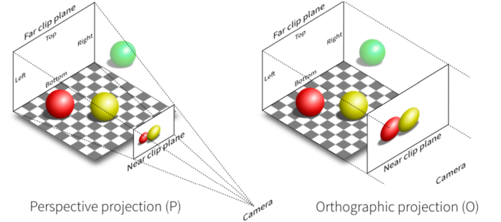

## 1.1 章节序言

***孔明在荆州，与石广元、徐元直、孟公威俱游学，三人务于精熟，而亮独观其大略。*                           *—— 《魏略》***

​	笔者一直认为，学习一件事要由粗入细，由浅入深，因此本章的目标主要是快速让读者对于Bevy能有一个大概的印象，了解Bevy程序的主要组成部分。大量的细节部分我都将略去，因此读者如现在遇到不理解的地方可以不求甚解，后续的章节将会依次仔细展开各个部分进行详细的介绍。

## 1.2 Hello Bevy!

​	将Bevy作为一个依赖项，新建一个Rust项目，输入以下代码让我们开始吧

```rust
use bevy::prelude::*;

fn main() {
  App::new()
    .add_systems(Update, hello_world)
    .run();
}

fn hello_world() {
  println!("hello world");
}
```

​	上面的这些代码的含义不言而喻，我们实例化了一个`App`，然后在系统**更新时**调用`hello_world`函数，最后运行。使用cargo命令运行这些代码，预想中的游戏窗口和界面并未出现，而是在终端上打印了一条"hello_world"后程序就关闭了，这是怎么回事？

### 1.2.1 窗口与循环

​	Bevy的设计理念是插件化的，这意味着每一项功能对于Bevy来说都是以插件的形式启用的，因此窗口的显示、游戏的循环逻辑等功能都需要引入插件。在上面的代码中，我们未添加任何插件，只是简单的声明了 `App`后调用了`hello_world`函数，因此程序将在终端中打印一条消息，然后立刻退出。

​	然而，由于窗口和游戏循环的创建和管理几乎是必选项，除非你想让你的应用在无窗口模式下运行。因此Bevy提供了一组默认的插件用来启用这些功能，更改我们的代码如下，再运行一次，窗口就会显示出来了，同时控制台将不断打印"hello_world"。

```rust
App::new()
		//加入这行代码
    .add_plugins(DefaultPlugins)
    .add_systems(Update, hello_world)
    .run();
```

​	这行代码都导入了哪些插件？点开`DefaultPlugins`的定义，可以看到其中包含如下代码，其中就包含了基本的窗口显示、资源加载、渲染、窗口事件、鼠标键盘输入等。感兴趣的读者可以查看详细的[文档](https://docs.rs/bevy/0.17.1/bevy/struct.DefaultPlugins.html)，这里不再详细展开。

```rust
#[cfg(feature = "bevy_window")]
bevy_window:::WindowPlugin,
...
bevy_asset:::AssetPlugin,
#[cfg(feature = "bevy_scene")]
bevy_scene:::ScenePlugin,
#[cfg(feature = "bevy_winit")]
bevy_winit:::WinitPlugin,
#[cfg(feature = "bevy_render")]
bevy_render:::RenderPlugin,
......
```

### 1.2.2 调度系统

​	前面说到，在系统**更新时**，调用了我们的`hello_world`函数，那么什么是更新时呢？这就涉及到了Bevy的调度系统以及Bevy的整个生命周期。

​	在Bevy中，系统的调度由[Schedule](https://docs.rs/bevy/0.17.1/bevy/ecs/prelude/struct.Schedule.html)执行，`Schedule`包含了一个函数的集合，将在游戏的不同时间段，利用元数据去执行这些函数。换句话说，`Schedule`负责执行游戏的开始、循环、结束逻辑，并在合适的时候执行用户或者系统的函数。Bevy应用的调度主要有三部分组成，他们的名称如下表所示。

|  名称   |                   作用                   |
| :-----: | :--------------------------------------: |
|  Main   |         游戏的**主世界**主要逻辑         |
| Extract | 将游戏数据从**主世界**转移到**渲染世界** |
| Render  |  将**渲染世界**里的数据渲染数据到屏幕上  |

​	这里提到了主世界与渲染世界，何为主世界？何为渲染世界？

​	按照传统的渲染流程，系统的工作是顺序的即：更新->渲染->更新->渲染，这样的工作方式导致下一帧的更新需要等待上一帧的渲染结束。


​	将渲染步骤剥离出来，划分为主世界与渲染世界，并在其中添加Extract同步系统，即可将其变为并行工作的系统提高效率。这便是主世界与渲染世界的由来，这种分离的方式将游戏划分为三部分并分别独立出来，能够使得系统解偶的同时提高并行化。



​	在游戏的主要逻辑中，我们主要需要关注的就是Main中的逻辑，如果需要进行高级图形处理定制化渲染效果，则需要对Extract和Render过程进行修改。在Main调度中，又分为以下10个步骤，其含义不言而喻，`Startup`的三个过程在启动中只会执行一次，然后游戏将在一个`Update`循环中不断运行，之前我们在运行`hello_world`时所指定的`Update`就是这里。


​	在这其中，除了`RunFixedMainLoop`外，几乎所有的步骤都是不言而喻的，那么`RunFixedMainLoop`是什么？

​	一般而言，在游戏逻辑中，存在着两种更新方式：

1. 游戏的画面将以某些帧率，在每帧都进行更新
2. 游戏的逻辑应该与帧率无关，应该是实际的物理时间

​	这样的更新方式确保了即使我们的游戏帧率发生变化，其游戏逻辑，例如攻击，闪避等指令的物理的花费时间仍然相同，这是非常重要的，而这个计时的方式，即是`RunFixedMainLoop`的存在意义。`RunFixedMainLoop`中同样也有一个类似的`FixedPreUpdate`、`FixedUpdate`等环节，但不同的是这些调度中的逻辑是按照一定的时间间隔而执行的，这意味着虽然在每一次游戏循环中都会经历，但是并不一定代表着其中的逻辑将会执行，只有当前后两次的时间间隔达到了设定，其中的逻辑才会再次运行。

​	**因此，我们只应该将游戏的渲染处理部分放入`Update`中，而应该将游戏的实际逻辑处理部分放入`RunFixedMainLoop`中。**

## 1.3 实体-组件-系统(ECS模式)

​	只是让程序不断的打印"hello_world"显然是一件很无聊的事情，让我们试着将程序变得更有意思些吧！将原来的代码修改为以下的代码。

```rust
use bevy::prelude::*;
use std::time::{SystemTime, UNIX_EPOCH};
#[derive(Component, Default)]
struct FpsCounter {
    frame_count: f64,
    current_time: f64,
    previous_time: f64,
}

fn main() {
    App::new()
        .add_plugins(DefaultPlugins)
        .add_systems(Startup, setup)
    		//尝试换成add_systems(FixedUpdate, counter_fps)看看显示的结果有什么不同
        .add_systems(Update, counter_fps)
        .run();
}

fn setup(mut commands: Commands) {
    commands.spawn_empty().insert(FpsCounter::default());
}

fn counter_fps(mut counters: Query<&mut FpsCounter>) {
    let mut counter = counters
        .single_mut()
        .expect("Expected exactly one FpsCounter entity");

    if counter.previous_time == 0.0 {
        counter.previous_time = counter.current_time;
    }

    let now = SystemTime::now();
    let unix_time_f32 = now.duration_since(UNIX_EPOCH).unwrap().as_secs_f64();

    counter.current_time = unix_time_f32;

    if counter.current_time - counter.previous_time >= 1.0 {
        println!(
            "FPS: {}",
            counter.frame_count / (counter.current_time - counter.previous_time)
        );
        counter.frame_count = 0.0;
        counter.previous_time = counter.current_time;
    } else {
        counter.frame_count += 1.0;
    }
}
```

​	乍一看，或许你有些慌乱，`Component`是什么？`Query`又是什么？`Commands`又是什么？但是如果你仔细端详这些代码，你会发现他只是一个简单的手写fps计算器，功能不过是计算帧率并打印到控制台之上。这些简单的代码包含了两个层面，第一个是复习我们的调度系统，第二个则是展示了Entity-Component-System(ECS)模式的使用方式。在我的系统上，当使用`Startup`时，显示的帧率在128帧左右，而当使用`FixedUpdate`时，则显示在64帧左右。这说明Bevy的默认游戏帧率要比实际的物理时间快一倍。

### 1.3.1 Entity、Component、System是什么

​	在面向对象的程序中，游戏里的实体例如玩家、怪物等，往往被建模为一些类，其中拥有他们的各种成员以及属性，一个面向对象语言中的玩家也许会被建模成如下的代码。

```C++
class Player {
public:
    Player(...){...}
    void move(...) {...}
private:
    std::string _name;
    float _health; 
    int _level; 
    float _position_x = 0;
    float _position_y = 0;
};
```

​	而在一个ECS系统中，则会将其建模为如下的部分。观察他们，我们可以发现在面向对象中，对象的各种属性对应的就是ECS中的`Component`，而对象的方法则对应一个有着特殊参数的普通的函数在，这个有着特殊参数的函数，就是ECS模式中的`System`。

```rust
#[derive(Entity)]
struct Entity(u64)

#[derive(Component)]
struct Name(String)
#[derive(Component)]
struct Health(f32)
#[derive(Component)]
struct Level(u32)
#[derive(Component)]
struct Position{
  x:f32,
  y:f32
}

fn move(mut Players:Query<&mut Player>){
  ....//some actions
}
```

​	既然`Component`和`System`都能找到对应与对象的部分，那么`Entity`又是什么呢？**简单来说，`Entity`只是一个简单的标识符，用于标识唯一的实体。**在大多数时候，不需要关心此值让Bevy为我们自动生成即可。

​	在大量的参考手册中，都使用数据库的例子与ECS系统进行类比，不过二者在多种层次上的相似性确实令人惊叹。学习过数据库的读者应该知道，在关系数据库的一张表中，每一行是一个记录，而每一列则是一个属性，其中每一行都应当有一个唯一的标识ID。

​	我们可以将ECS中的`Entity`想象为一张表的标识ID列，其他的`Component`作为属性列，二者共同标识了游戏世界中唯一的一个实体和实体的各种数据。不过有些许不同的是，数据库的每张表所拥有的属性列是固定的，而不同实体拥有的属性的数目则不需要一样。

### 1.3.2 Commands与Query

​	经过前面的介绍，你现在应该已经大致理解了ECS模式，可是在一开始的的代码中，`Commands`与`Query`又是什么呢？

​	沿用前面数据库的例子，对数据库来说最重要的就是对数据的增删改查询。这些操作从操作的对象层面来说，可以分为表级别和行级别，前者代表我们可以对表进行操作来添加和删除一些数据来改变行的总数，后者代表我们可以对某些行进行属性的修改而不改变行的总数。这些操作对应到ECS系统中，就是`Commands`与`Query`。

​	利用`Commands`，我们可以在表级别的范围内修改数据，即我们可以在游戏中添加或删除一些实体。在下面的代码中，我们使用`spawn_empty()`方法创建了一个没有任何属性的实体，然后使用`insert()`方法往其中添加了一个属性，其值是`FpsCounter::default()`，由于这些操作过于常用，因此还有一个`spawn()`的简写方式

```rust
commands.spawn_empty().insert(FpsCounter::default());
//等同于下面这行
commands.spawn((FpsCounter::default(),))
```

​	利用`Query`，我们可以在行级别的范围内修改数据，即我们可以得到某些实体然后修改他们相关联的组件。下面的代码中，我们使用`Query`尝试获取主世界中那些拥有`FpsCounter`组件的实体的`FpsCounter`的**可变引用**作为参数，然后在函数中进行修改。

​	`Query`类似于一个包含着查询结果的vec，这是因为所能查询到的组件有可能有很多个，若我们断定只有一个，可以使用`single_mut()`方法将其转换为单一结果。当然，Bevy中也拥有其他更方便的方式来实现这样的目标，但是作为对于ECS模式的第一次粗略介绍，笔者认为还是尽量不应使用各种方便的技巧，重点是让读者认识到ECS模式的工作流程。此外，**Query的第二个泛型可以接受`With`和`Without`参数，以实现过滤查询，这类似于数据库中`Where`子句。**

```rust
//查询拥有Player组件标识的实体的Health的内容
fn get_players_health(mut health:Query<&mut Health,With<Player>>){....}
```

## 1.4 Resource

​	在编写程序中，我们往往需要一些全局的单例变量，最典型的应用场景就是游戏的设置功能，`Resource`就是为此而存在的，每种类型的`Resource`将以单例的方式存在于游戏世界中，在需要时可以在`System`中进行修改。

### 1.4.1 创建Resource

​	要定义一个资产，我们只需要像定义`Component`一样即可。

```rust
#[derive(Resource)]
struct Setting{
  source:f32
};
```

​	要将此资产加入`App`所管理的资产中，需要在创建`App`后调用其`insert_resource()`方法并将一个单例传递给`App`。

```rust
fn main() {
  App::new()
    .add_plugins(DefaultPlugins)
    .insert_resource(Setting{source:0})
    .run();
}
```

​	或者，为资产实现`Default`或者`FromWorld`，即可让Bevy自动创建默认实例。

```rust
//实现Default
#[derive(Resource,Default)]

//指明泛型参数，Bevy会自动创建实例
App.insert_resource::<Setting>()
```

​	除了使用`App`在创建游戏时插入我们的资产，在游戏运行时我们如何动态的决定是否添加某些资产呢？答案就是使用`Commands`。

```rust
fn add_score(mut commands: Commands) {
  commands.init_resource::<Setting>();
  //或者我们也可以在这里删除一些资产
  commands.remove_resource::<Setting>();
}
```

### 1.4.2 使用Resource

​	现在我们插入了自己的资产，之后我们该如何使用呢？只需像使用`Query`时一样，利用一个特定的类型作为`System`的参数，Bevy就会为我们进行资产的查询和管理。在这里我们有三种方式获得资产，他们分别获得资产的共享引用`Res`，可变引用`ResMut`，还有可选资产`Option`。

```rust
//获得资产的可变引用以便更改
fn some_system(mut score: ResMut<Score>) 
//只获得共享引用
fn some_system(score: Res<Score>) 
//如果资产可能尚未创建，那么需要使用Option使之变为可选
fn some_system(mut score: Option<ResMut<Score>>) 
```

### 1.4.3 默认Resource

​	除了我们自己创建的一些资产外，Bevy内存在着一些非常重要的内置全局资产，他们包括游戏经过的时间、键盘或鼠标的状态、网格、材质等，这些信息在游戏中是如此的常用。我们现在只粗略介绍一些，目的在于让读者明白Bevy中是通过`Resource`来管理这些重要数据的，后续章节中将会继续详细介绍其中使用方法。

```rust
Res<Time> //自应用启动以来的时间，以及上一帧逝去的时间
Res<Events<E>> //用于访问各种引擎事件
Res<Assets<T>> // 用于加载静态资产
Res<Window> //存储主窗口的属性
Res<ButtonInput<B>> //用于查询键盘或者鼠标的状态
```

## 1.5 资产Assets

​	资产是需要加载到游戏中的资源，通常来自于各种硬盘里的文件，例如图像、模型、材质、字体、音频等等等等。由于这些资源的加载往往需要耗费大量时间，因此Bevy里这些资产的加载往往都是以异步的形式以避免阻塞游戏循环。

​	在Bevy中，我们可以使用`AssetServer`从硬盘里加载资产，使用`Assets<T>`来存储已经加载的各类资产。

### 1.5.1 AssetServer

​	`AssetServer`作为一种全局资源，可以使用之前我们加载资源的方式以`Res`来获取。默认情况下，加载的资产都相对于项目目录下的assets文件夹，要修改这个默认行为，可以修改`BEVY_ASSET_ROOT`环境变量来指定加载资产的目录。下面展示了一个常用的加载资产并共享的方式。

​	首先，我们使用`AssetServer`加载了一个图像并获得其句柄，然后将其句柄储存在一个全局资源`ShareImage`上，这样，我们之后便可以通过 `Res<ShareImage>`来获得其句柄以便进行操作。

```rust
#[derive(Resource)]
struct ShareImage {
  handle: Option<Handle<Image>>,
}

fn load_image(asset_server: Res<AssetServer>, mut share_image: ResMut<ShareImage>) {
    let image_handle = asset_server.load("test.png");
    share_image.handle = Some(image_handle);
}
```

​	上面我们提到了句柄(`Handle`)，那么什么是句柄呢？简单来说，句柄类似于一个对资产的引用计数指针，但能被克隆为强句柄和弱句柄，当不再存在资产的强句柄时，Bevy能够自动将其回收并销毁以释放内存。所以，**为了保证资产的持续存在，必须将句柄存储在一个`Resource`或者`Component`中。**

​	由于`AssetServer`返回的是一个句柄并采取异步的方式加载资源，如果你的逻辑中需要判断资源是否加载完成，不能依靠句柄本身存在与否来判断，要实现此功能，可以使用其身上的`get_load_state()`方法。

```rust
fn on_asset_event(
  mut commands: Commands,
  asset_server: Res<AssetServer>,
  share_image: Res<ShareImage>,
) {
  match asset_server.get_load_state(&share_image.handle) {
    Some(LoadState::NotLoaded) => {}
    Some(LoadState::Loading) => {}
    Some(LoadState::Loaded) => {
      //在这里使用handle，这时已经加载完成
    }
}
```

### 1.5.2 Assets

​	前面说到，`AssetServer`负责加载资源，而`Assets<T>`负责储存资源，这是什么意思呢？**`Assets<T>`** 是一个键值对集合，存储了特定类型 `T` 的所有**实际资产数据**。当`AssetServer`成功加载资源后，将会将真正的数据保存在对应的**`Assets<T>`** 中，如果你需要获得真正的数据，则需要使用相关的句柄和对应类型的`Assets`

```rust
fn read_image_data(images: ResMut<Assets<Image>>, share_image: Res<ShareImage>) {
    let handle = match &share_image.handle {
        None => return,
        Some(handle) => handle,
    };
    if let Some(image) = images.get(handle) {
        // 现在你有了image的真正数据，可以读取或者修改
        println!("Loaded image size: {:?}", image.size());
    }
}
```

### 1.5.3 自定义资产

​	Bevy支持常见的资产，这些资产不需要任何操作即可使用`AssetServer`进行加载，但是如果我们的资产是某种Bevy不支持的格式时我们该怎么办？这时我们必须手动编写代码和Bevy进行交互来定义我们的**资产类型**、资产的**加载方法**、资产的**设置**以及加载时可能的**错误**。

​	现在，我们想要声明一个能够加载点云las文件的资产，我们应该怎么做呢？如果你不知道las文件是什么，不用担心，那只是一些用二进制格式存储的点的三维坐标和一些属性而已。

​	首先，让我们定义我们的资产数据应该长什么样子。本质上，那只是一个点的`Vec`而已，其中每个点都有自己的位置、点的尺寸、以及颜色信息，看起来可能是下面这个样子，注意到我们使用了`#[derive(Asset)]`来告诉Bevy这是我们的资产。

```rust
//点云资产
#[derive(Asset)]
pub struct PointCloud {
    pub points: Vec<PointCloudData>,
}

//实际的点数据
#[repr(C)]
pub struct PointCloudData {
    pub position: Vec3,
    pub point_size: f32,
    pub color: [f32; 4],
}
```

​	接着，让我们定义加载时可能出现的一些错误，我们可以使用`thiserror`来快速声明这些错误类型。

```rust
use thiserror::Error;
#[derive(Error, Debug)]
pub enum LasLoaderError {
    #[error("failed to load file: {0}")]
    Io(#[from] std::io::Error),
}
```

​	之后，让我们定义一些资产的加载设置和加载器，并为我们的加载器实现`AssetLoader`特型，在之前我们介绍过，Bevy中的资产加载是异步的，因此需要使用`async`声明`load`方法。这里的代码没什么神奇的，但值得一提的是这里的 `Reader`读取的是二进制数据，需要使用一个`Vec<u8>`来作为缓冲区存储这些字节数据。

```rust
//在加载时我们可以额外传递一个配置以便动态的控制加载过程，但是在这里我们不需要这些
pub struct LasLoaderSettings{}

//我们的加载器
pub struct LasLoader {}

impl AssetLoader for LasLoader {
    type Asset = PointCloud;
    type Settings = LasLoaderSettings;
    type Error = LasLoaderError;

    async fn load(
        &self,
        reader: &mut dyn bevy_asset::io::Reader,
        _settings: &Self::Settings,
        _load_context: &mut LoadContext<'_>,
    ) -> Result<PointCloud, Self::Error> {
      let mut bin_data = Vec::new();
      reader.read_to_end(&mut bin_data).await?;
      //在这里编写真正加载数据的逻辑
  }
```

​	最后，让我们在`App`中注册这些资产和相应的加载器。

```rust
fn main() {
  App::new()
    .add_plugins(DefaultPlugins)
  	//通过这两个方法注册相应的加载器和资产类型
    .init_asset_loader::<LasLoader>()
    .init_asset::<PointCloud>()
    .run();
}

//现在，我们应该能够直接使用这些资产类型了
fn load_pointcloud(
    mut commands: Commands,
    asset_server: Res<AssetServer>,
){
  let point_cloud_handler = asset_server.load::<PointCloud>("pointCloud.las");
}
```

## 1.6 相机

​	`Camera`是一个虚拟的三维场景摄像机，想象一下一个人手持相机在一个三维场景中不断变换位置的过程，在不同的位置和不同的角度，`Camera`上所呈现的画面也会不同。在游戏中，`Camera`的各种参数决定了所能够看见的画面是怎样的，但是`Camera`本身往往是相对于游戏中的各种场景所独立的，Bevy中内置了两种类型的相机：`Camera2d`和`Camera3d`，不言而喻，前者用于2D画面的渲染，后者用于3D画面的渲染。

​	在Bevy中，`Camera2d`和`Camera3d`作为两个内置组件直接使用即可，将以下代码替换掉`Startup`调度中原来的函数，即可在屏幕上绘制一个立方体。虽然我们尚未介绍灯光、变换、材质的具体相关内容，但是你现在也应该能够大致理解这些代码中每一行的作用。

```rust
fn setup(
    mut commands: Commands,
    mut meshes: ResMut<Assets<Mesh>>,
    mut materials: ResMut<Assets<StandardMaterial>>,
) {
    // 立方体
    commands.spawn((
        Mesh3d(meshes.add(Cuboid::new(1.0, 1.0, 1.0))),
        MeshMaterial3d(materials.add(Color::srgb_u8(124, 144, 255))),
        Transform::from_xyz(0.0, 0.5, 0.0),
    ));
    // 灯光
    commands.spawn((
        PointLight {
            shadows_enabled: true,
            ..default()
        },
        Transform::from_xyz(4.0, 8.0, 4.0),
    ));
    // 相机
    commands.spawn((
        Camera3d::default(),
        Transform::from_xyz(-2.5, 4.5, 9.0).looking_at(Vec3::ZERO, Vec3::Y),
    ));
}

```

​	本小节不会讲解投影变换所需要的矩阵运算和数学知识，仅仅是面向新手的定性的讲解。

### 1.6.1 投影与坐标系

​	在计算机图形学中，存在着两种投影方式，正交投影(Orthographic pro)和透视投影(Perspective projection)，他们的示意如下图所示其中`Camera2d`默认采用正交投影，`Camera3d`则是透视投影。

​	正交投影是一种平行投影，读者可以想想将一个三维空间沿着视线轴压扁成二维平面。其重要的特点是投影之后物体的大小能够精确反应在三维空间的大小，但是丧失了物体之间的深度关系，在2D游戏或者工程制图中往往最常用。

​	透视投影则是根据公线方程来进行投影的，投影后的结果和人眼观察三维空间所得到的结果相同。其重要的特点是符合近大远小的透视特征，图形具备立体感，在3D游戏中是最常用的投影。



​	说完了投影，我们再来说说Bevy中的坐标系。在Bevy中的世界坐标系是一个空间右手坐标系，且Z轴从屏幕指向外部，Y轴从屏幕底部指向顶部，其原点默认处于屏幕的中心。这说明，对于`Camera2d`来说，Z轴的大小决定了相机的远近，也决定了画面的大小。而画面则是一副标准的右手平面直角坐标系。

> [!NOTE]
>
> 想一想，为何Bevy要采用这样的设计？


### 1.6.2 渲染

​	一个相机渲染的目标输出结果在程序中的绝大多数时候是`Winodw`或者`Image`。渲染到`Winodw`上即是将渲染结果渲染到实际窗口上，而渲染到`Image`则一般是为了保存到本地，或者使用UI库(例如egui)时显示3D画面。

​	默认状态下，相机的渲染目标是`Window`，如果要渲染到`Image`需要先进行一定的配置，这部分将在后面的章节中详细介绍。

## 1.7 输入

​	 Bevy中的输入分为两类：

1. Bevy系统对于某些动作自动发出的事件，例如资产加载完成
2. 系统接收到的外部输入，例如键盘鼠标等

​	在本小节中，我们主要简要介绍来自键盘与鼠标的输入及其窗口事件，Bevy中其他的输入方式将留到后续的章节中进行介绍。

​	键盘和鼠标在Bevy中统一类型为按钮输入(`ButtonInput`)，但是查询系统只负责进行查询，按键的状态则需要我们自己来判断，`ButtonInput`提供了多重方法来对按键的状态进行判断，以下是常用的三种方法。

|    **方法**     |               **描述**                |
| :-------------: | :-----------------------------------: |
|    `pressed`    |      当按键被按下时一直为`true`       |
| `just_pressed`  | 按键按下时返回 `true`，有效时间仅一帧 |
| `just_released` | 按键释放时返回`true`，有效时间仅一帧  |

### 1.7.1 键盘

​	最简单的方式是像使用`Resource`一样使用`ButtonInput`对象。指定`ButtonInput`的中的泛型类型为`KeyCode`，将会在每一帧进行查询，利用前面所属的`just_pressed()`方法，即可在每一帧内判断是否按下了某些按键。

```rust
fn jump_system(input: Res<ButtonInput<KeyCode>>) {
  	//需要在这里进行判断
    if input.just_pressed(KeyCode::Space) {
        info!("Jump!");
    }
}
```

​	如果我们的按键是组合按键怎么办？例如我们需要判断是否同时按下ctrl + shift + a时。这里可以利用一个`any_pressed()`方法，不言而喻只要组合里的任一按键被按下，那么该方法将会返回`true`，当然，也有一个`all_pressed()`方法。

```rust
fn combo_key_system(input: Res<ButtonInput<KeyCode>>) {
  	//注意这里是pressed，而下面是just_pressed，这保证了我们可以一直按着shift和ctrl
    let shift = input.any_pressed([KeyCode::ShiftLeft, KeyCode::ShiftRight]);
    let ctrl = input.any_pressed([KeyCode::ControlLeft, KeyCode::ControlRight]);

    if ctrl && shift && input.just_pressed(KeyCode::KeyA) {
        info!("Special ability activated! (Ctrl + Shift + A)");
    }
}
```

### 1.7.2 鼠标

​	鼠标的按键使用方式完全与键盘相同。但是其泛型类型由`KeyCode`变为了`MouseButton`。

```rust
fn shoot_input_system(mouse: Res<ButtonInput<MouseButton>>) {
  if mouse.just_pressed(MouseButton::Left) {
    info!("Bang! Weapon fired.");
  }
}
```

​	看到这里读者可能会有疑问，为何对于鼠标只介绍了按键的判断，鼠标的移动、拖动、滑轮滑动等事件如何进行处理呢？答案很明显，既然已经用事件来形容这些输入，那么自然就要在事件系统中进行处理。

## 1.8 事件

​	事件用于**多个系统之间的通讯**，他可以由某些系统或者Bevy发出，在另一些系统中得到处理。Bevy中有两种类型的事件。

1. `Message`用于系统之间的通信
2. `Event`用户触发立即行为`EntityEvent`的**观察者**

### 1.8.1 Message

​	Bevy的`Message`系统组成主要分为三部分，他们三者相互配合一起构成了Bevy的`Message`系统。为了避免消息队列的无限增长，**上一帧的`Message`将会在下一帧结束时被清除**，因此如果你不采取一些另外的措施，就不能将消息留到之后进行处理。

|        名称        | 作用                                                         |
| :----------------: | ------------------------------------------------------------ |
|   `Messages<T>`    | 一个队列，用于容纳事件的信息，本质上是一个带有一些其他方法的`Vec<T>`。 |
| `MessageWriter<T>` | 从队列中读取事件，同时进行一些额外操作保证不会重复读取同一个事件。 |
| `MessageReader<T>` | 将消息写入`Messages<T>`中。                                  |

​	在使用`Message`系统前，必须要先定义我们的消息类型，然后进行消息类型的注册。

```rust
//在这里定义消息
#[derive(Message)]
struct CustomMessage {
  //发出事件的实体ID
  entity: Entity,
  //其他信息
  some_infos: f32,
}

//在app中注册消息
App::new()
  .add_message::<CustomMessage>();
```

​	之后，便可以在一个`System`中发出事件，另一个`System`中处理这些事件。通过这种方式，我们可以将系统之间进行解偶，将功能划分为多个系统并提高系统的复用性。

```rust
fn write_message(
  mut messages: MessageWriter<CustomMessage>,
  entity_and_transform: Query<Entity, With<SomeCompoents>>,
) {
  for entity in entity_and_transform {
    // 发送某些信息
    //...
    messages.write(CustomMessage{
      entity,
      some_infos,
    });
  }
}

fn read_message(mut messages: MessageReader<CustomMessage>) {
  for message in messages.read() {
    //对消息做一些处理
    //...
  }
}
```

### 1.8.2 Event

​	除了通信方式的`Message`，Bevy还有另一套`Event`模式的事件监听与分发系统。这套基于`Event`模式的事件系统有`Event`与`EntityEvent`两种方式。前者用于全局事件，后者则作用在某个特定的实体上，所以被称为`EntityEvent`，二者的定义方式均与`Message`相似。

```rust
#[derive(Event)]
struct ReturnToTitle;

#[derive(EntityEvent)]
struct PlayerKilled {
  entity: Entity
}
```

​	要触发这些事件，只需在`commands`中调用其`trigger`方法并传入事件对象。

```rust
// 触发一个全局的广播事件
commands.trigger(ReturnToTitle)

// 出发某个特定实体上的事件
commands.trigger(PlayerKilled { entity })
```

​	为了相应这些事件，我们还需要定义一个`Observer`来监听这些事件。一个`Observer`只是一个特定的函数，其中需要将`On`作为第一个参数的类型以表示逻辑**当<事件类型>发生时**。

​	对于全局的广播事件， 我们应当在`App`上进行注册，对于某个特定实体上的事件，则需要在使用`commands`上调用`spawn`时注册。

```rust

fn on_return_to_title(
  event: On<ReturnToTitle>,
) {
  //做一些全局的工作
}

fn main() {
  //在这里注册全局的观察者
  App::new().add_plugins(DefaultPlugins).add_observer(on_respawn);
}
```

```rust
fn on_player_Killed(
  event: On<PlayerKilled>,
  query: Query<&Player>,
) {
  if let Ok(player) = query.get(event.entity) {
    //在这里可以处理一些数据
  }
}

fn set_up(mut commands: Commands) {
  //在这里注册监听器
  commands.spawn(Player::default()).observe(on_player_Killed);
}
```

​	关于消息与事件的大体介绍就到这里，你可能想问，什么时候我该使用`Message`，什么时候又该使用`Event`呢？

​	简而言之，`Message`更适合于频繁被触发，需要解耦系统的场景，而`Event`则适合于处理单个事件且需要将事件限定在某些实体范围内的场景。此外，`Event`还能够在组件之间进行冒泡，这在某些场景下可能非常有用，具体的使用方式将在后续章节中仔细介绍。

​	现在，可以回答我们最初的问题了，如何对鼠标的移动、滑轮滚动等做出响应呢？使用`EventReader`读取相应的事件类型即可。

```rust
fn mouse_event(
  mut cursor_events: EventReader<CursorMoved>,
  mut wheel_events: EventReader<MouseWheel>,
) {
  for event in cursor_events.read() {
    info!("Cursor moved: {:?}", event);
  }
  for event in wheel_events.read() {
    info!("Mouse wheel used: {:?}", event);
  }
}
```

## 1.9 UI

​	GUI的编写是一项繁杂的工作，到目前为止 (0.17.2)利用Bevy自身的UI系统来构建UI都是一件麻烦事。不过，UI系统已经被开发人员们提上[日程](https://github.com/bevyengine/bevy/pull/20158)且重点讨论，相信在不久的将来Bevy将经过一次重大更新并给出一个符合人体工程学的UI系统。

​	在后面的章节中，我们将使用[`bevy_egui`](https://github.com/mvlabat/bevy_egui)来构建UI，这是`egui`的Bevy绑定，`egui`是一个以简洁易用而出名的立即式UI框架，相信我，不需要太多学习你便能掌握它。

## 1.10 音频

### 1.10.1 音频播放

​	Bevy中播放音频只需要加载资产后使用`AudioPlayer`和`PlaybackSettings`即可控制音频的播放。前者用于与系统交互播放音频，后者负责初始化的设置。

```rust
fn play_audio(
  asset_server: Res<AssetServer>,
  mut commands: Commands,
) {
  let audio = asset_server.load("audio.ogg");
	//在这里向实体插入AudioPlayer和PlaybackSettings组件
  commands.spawn((
    AudioPlayer::new(audio),
    PlaybackSettings::LOOP,
  ));
}

```

​	其中，音频的格式必须是Bevy支持的格式之一，即`wav`，`ogg`，`flac`，`mp3`其中之一，默认情况下Bevy只支持ogg格式音频，若需要读取其他格式音频，需要在toml中启用其功能。

```toml
[dependencies]
bevy = { version = "0.17", features = ["mp3"] }
```

### 1.10.2 音频控制

​	我们当然不能简单的只是音频，在大多数情况下我们都需要对音频进行播放控制和进度控制等等。Bevy在音频开始播放后，会在实体上自动插入一个`AudioSink`组件，利用该组件上暴露的方法，便可以对正在播放的音频进行控制或查询其音频属性进行显示。

​	该组件包含常用`play()`、`pause()`、`is_paused()`等方法和`position`等属性，这些方法和属性的作用不言而喻，详细的其他方法可以查看[文档](https://docs.rs/bevy/0.17.2/bevy/audio/struct.AudioSink.html)。

```rust
#[derive(Component)]
struct MyMusic;

//在setup中
commands.spawn((
    AudioPlayer::new(asset_server.load("sounds.ogg")),
    MyMusic,
));

//在一个system中获得AudioSink来操控音频
fn update_progress(
    music_controller: Single<&AudioSink, With<MyMusic>>,
) {
    println!("Progress: {}s", music_controller.position().as_secs_f32());
}
```

## 1.11 插件

​	在最初，我们便讲到“Bevy的设计理念是插件化的”。现在，我们终于来到了这里，什么是插件？怎么构建自己的插件呢？

​	插件是指任何接受一个`App`参数，并对其进行修改的函数。这些函数可以对`App`的行为做出任意更改，甚至可以添加其他插件。通过插件，可以将功能转移到`App`外的其他部分，使程序的解耦化。

​	要编写一个自己的插件，我们需要为我们的插件结构体实现 `Plugin`的`build`方法，如果我们还需要在`build`完成后时进行额外的工作，则还可以实现其`cleanup`方法。

```rust
pub struct CustomPlugin;

impl Plugin for CustomPlugin {
  fn cleanup(&self, _app: &App){
    //....
  }

  fn build(&self, app: &mut App) {
    //....
  }
}
```

​	就是这样！插件本身没什么奇特的，但是在使用和编写的过程中需要谨慎**注意插件的使用顺序和关系**，不然会导致层次混乱甚至多次调用同一插件，这可能会导致**应用崩溃**。

## 1.12 物理引擎

​	通过前面的介绍你可能已经注意到了，我们的目光一直放在如何显示和操控上，而并没有关心真正的物理效应例如碰撞，重力等，而这些物理效果和交互，则是由物理引擎来进行处理。

​	物理引擎是一种用于在虚拟环境中模拟现实世界物理现象的核心软件组件。 它负责处理物体间的碰撞检测、动力学模拟、刚体运动、重力、摩擦力、关节约束等物理效果，使得游戏中的物体能够以真实或符合游戏设定的方式相互作用。

​	Bevy没有官方的物理引擎，其将物理引擎的选择交给了用户，用户可以自由选择rust生态中的一些物理引擎，不过主流的选择是`Avian`或`Rapier`，其前者致力于与Bevy进行集成，后者则是与Bevy分离的单独项目。由于`Avian`其实已经实质上成为了Bevy的首选物理引擎，因此在之后的章节中我们将详细介绍`Avian`，至于`Rapier`读者可以自行阅读文档进行学习。

## 1.13 反射与依赖注入

​	反射指的是程序在运行时能够访问、检测和修改程序本身状态或行为的一种能力。通过反射，我们**可以在程序运行时修改类型的内容并使用字符串进行动态的字段访问。**

​	在Bevy中，广泛使用了一种叫**依赖注入**的技术，这种技术使我们在编译时能够抹除数据的真实类型而在程序运行时动态的指定数据，其就是利用了反射来实现这样的效果。这也就是为什么虽然我们在编写`System`时并没有告诉Bevy其参数的个数与类型而仅只是声明在了函数定义中，但是Bevy仍然能够将正确的参数传递给`System`的原因。

​	由于Bevy的系统高度依赖反射来实现各种功能，因此当你需要向Bevy中添加自己的类型时候，就必须实现反射才能够让Bevy能够正常工作。

## 1.14 渲染

​	Bevy中的渲染是基于`wgpu`来完成的，`wgpu`是一个基于`WebGPU`规范的的Rust实现，其本身是跨平台的，这使得Bevy也能够在不同的平台上进行渲染。对于一般的渲染而言，我们通常不需要接触Bevy的渲染管道，但是当我们需要进行某种高级的图形学渲染效果开发时，则需要在Bevy中编写自己的**渲染命令**来告诉Bevy如何渲染。

​	在前面我们说到，Bevy中分为主世界和渲染世界，主世界中的组件通过`Extract`环节同步到渲染世界进行渲染，如果我们要在Bevy的渲染管线中自定义自己的渲染环节，则必须配置好以下几个部分使Bevy能够使用我们自己的着色器渲染数据。

1. 创建一个`ExtractComponent`来标识需要渲染的实体并在`Extract`阶段将其同步到渲染世界，这可以通过一个名为`ExtractComponentPlugin`的插件来实现自动化同步。
2. 在`RenderApp`上注册两个`Resource`作为缓冲区，一个储存了`RenderPipeline`包含。
3. 编写一个或多个渲染逻辑，并实现`RenderCommand`特型，获取上一步`Resource`并结合其他代码决定如何处理数据，将这些逻辑组合成一个元组并在`RenderApp`上使用`add_render_command`方法注册。
4. 在`RenderApp`的`Render`调度中的`Prepare`环节调用我们编写的`prepare`函数来准备渲染所需的数据，在这里定义我们的渲染管线的结构、缓冲区的布局等等。
5. 在`RenderApp`的`Render`调度中的`Queue`环节调用我们编写的`queue`函数来渲染数据

