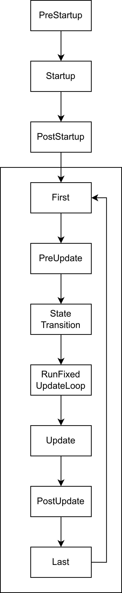

## 2.1 Entity

### 2.1.1 EntityCommands

​	在前面我们生成实体时，还记得我们使用了`Command.spawn()`方法生成了一个没有组件的实体，然后依次往该实体上插入了一些组件，可如何我们想在之后修改实体该怎么办？查看该方法返回的值，可以发现其返回了一个`EntityCommands`类型的值而不是一个`Entity`类型的值，如果要获得真正的`Entity`，我们需要调用`EntityCommands`上的`id`方法。

​	这样设计是因为，单一的`Entity`几乎没有任何用处，真正有用的是与其相关的`EntityCommands`，其本质上是一个有关修改实体命令的队列，利用`EntityCommands`我们可以让我们快速对实体做出一些更改，这些更改大体上分为两类。

1. 与实体上的组件相关的方法
2. 与其他实体相关的方法

​	于此同时，`Commands`上有一个特殊的名为`entity`的方法，该方法接受一个`Entity`类型的参数并返回一个`EntityCommands`类型的值。利用`Commands`，我们可以通过查询系统获得的`Entity`来生成`EntityCommands`。通过这种方式，我们可以实现在游戏运行时**对实体而不是组件**进行修改，例如添加新的组件或者删除旧的组件等。

```rust
fn change_entity(
    mut commands: Commands,
    query: Query<Entity, With<Player>>, // 查找所有有 Player 组件的实体
) {
    for entity in query.iter() {
        let entity_commands = commands.entity(entity);
      	//在这里可以做实体做出修改
      	//..
    }
}
```

### 2.1.2 Relationship

​	之前我们一直侧重于实体与其所含有的组件的关系，但是不同的实体之间也会存在着关系，例如一个玩家可能拥有多个宠物、载具等，当玩家死亡时，这些子实体也应该被重置，这种关系被称为实体之间的`Relationship`。（有意思的是，`Relationship`并不定义在`Entity`上而是在他们的`Component`上）

​	Bevy为我们预先内置了两种关系：`ChildOf`和`children`。前者用于指定当前实体的父实体，后者用于指定当前实体的子实体。通过这样的父子关系，**子实体可以继承父实体的一些组件**，例如可见性或者全局变换。

​	要指定当前实体的父实体，需要我们获取父实体的`Entity`，这可以通过`EntityCommands`上的`id`方法获得。随后，我们使用一个内置的`ChildOf`组件包裹父实体的`Entity`，然后将其添加到子实体身上。当Bevy识别到`ChildOf`组件后，将会自动完成之后的工作，通过其中的`Entity`追踪父实体的生命周期**当父实体销毁时自动销毁子实体**。

```rust
let player = commands.spawn((Player).id();
commands.spawn((Car, ChildOf(player)));
```

​	要指定当前实体的子实体，可以通过通过`EntityCommands`上的`with_children`方法或者`children!`来实现。此外，`EntityCommands`还包含了大量与父子关系相关的方法，通过这些方法还可以动态的删除、替换实体之间的父子关系。

```rust
commands
	.spawn((Player)
  .with_children(|parent| {
			parent.spawn((Car,));
  });
   
//也可以使用宏来完成
commands
	.spawn((Player),
  children![
      (Car,),
      (Car,),
  ]);
```

​	除了父子关系外，实体之间还可能有着其他各种各样的关系，因此Bevy还提供了更高级的 API抽象，让我们能够自定义实体之间的关系并决定如何处理这种关系。要自定义关系，我们需要定义关系的`relationship`与`relationship_target`，前者作为关系的“源”，后者作为关系的“目标”。这类似于数据库关系中的One-to-Many关系，前者即是关系中的one，后者是关系中的many。

```rust
// 定义一个关系的“源”，一个“源”只能引用一个实体
#[derive(Component, Debug)]
#[relationship(relationship_target = TargetedBy)]
struct Targeting(Entity);

//定义一个关系的“目标”，由于一个目标会有多个相关联的实体，因此这里是Vec<Entity>
//在这里我们启用linked_spawn后，能够让Bevy在target销毁时自动清除其内的关联实体
#[derive(Component, Debug)]
#[relationship_target(relationship = Targeting，linked_spawn)]
struct TargetedBy(Vec<Entity>);
```

​	有了这些，我们便可以通过将其作为组件来使用

```rust
fn spawn_player(mut commands: Commands) {
  let player = commands.spawn((Player, Name::new("player_one"))).id();
	//使用Targeting代表关系中的“源”
  commands.spawn((Car, Targeting(player), Name::new("Lamborghini")));
  commands.spawn((Pet, Targeting(player), Name::new("Black")));
}

commands.spawn((
  Player,
  Name::new("player_one"),
  related!(TargetedBy[
    // 使用related!宏和TargetedBy直接从关系目标实体上定义关系
    (Car, Name::new("Lamborghini")),
    (Pet, Name::new("Black")),
  ]),
));
```

​	回想一下数据库中的基础知识，现在我们能够解决One-to-Many的关系情况了，如何解决Many-to-Many关系的呢？在数据库中，这往往通过新增一个关系表来实现，类比这种方法，在Bevy中我们也可以通过新增一个关系实体。我们可以利用最经典的学生与课程的例子来讲解。

​	我们将Many-to-Many分解为两个One-to-Many关系，并将其中的两个One组件插入到一个关系实体上，这样我们便可以借助连接实体“顺藤摸瓜”得到对应的学生和课程。

```rust
// 实体 Student
#[derive(Component)] struct Student;
// 实体 Course
#[derive(Component)] struct Course;

// 学生实体上的 Relationship
#[derive(Component)]
#[relationship(relationship_target = StudentEnrollments)]
struct JunctionToStudent(Entity);

// 课程实体上的 Relationship
#[derive(Component)]
#[relationship(relationship_target = CourseEnrollments)]
struct JunctionToCourse(Entity);

// 学生实体上的 RelationshipTarget
#[derive(Component)]
#[relationship_target(relationship = JunctionToStudent)]
struct StudentEnrollments(Vec<Entity>);

// 课程实体上的 RelationshipTarget
#[derive(Component)]
#[relationship_target(relationship = JunctionToCourse)]
struct CourseEnrollments(Vec<Entity>);


let student_a = commands.spawn(Student).id();
let course_math = commands.spawn(Course).id();

// 创建连接实体
commands.spawn((
    JunctionToStudent(student_a),
    JunctionToCourse(course_math),
));
```

## 2.2 Component

### 2.2.1 Archetype

​	实体与组件的关系可以类比成数据库中表，其中每一行代表了`world`中的某个实体与其相关的组件，每一列代表了其中的组件。然而，这只是我们一厢情愿的类比，这些实体和组件在Bevy中真正的存储方式要比这复杂的多。

​	Bevy将组件默认存储在`Table`中，从概念上讲，`Table`只是一种用于储存数据的数据结构，类似于一个`HashMap<ComponentId, Column>`，其中每个`Column`是一个`Vec<T:Component>`，这意味着其可以方便的查找，但是不方便组件的插入与删除（想象一下，当你向一个Vec中间插入一个新元素的时候，你需要把新位置后的元素全都向后平移一位以腾出位置）。因此，Bevy还提供了一种`SparseSet`形式的存储数据结构，使用这种稀疏数据结构，可以在需要频繁的插入与删除时提高性能。

```rust
#[derive(Component)]
//如果一个组件可能被频繁插入或者删除，可以标记为稀疏集来优化性能
#[component(storage = "SparseSet")]
struct SomeComponent;
```

​	想象一下在这样的数据结构中我们如何查找一个满足要求的行？必须首先从通过组件的`ComponentId`获取这一列，然后获取该列中实体的行。当我们需要查找的实体要满足很多条件时，重复进行这样的查找和修改是十分低效的，这是一个不能并行的操作，因为我们不能确定另外一个列位置上是否拥有同样的属性（为什么？）。

​	为了解决这个问题，Bevy中引入了`Archetype`。从技术上讲，`Archetype`是固定组件的组合，这意味着一个`Archetype`内的实体，其**拥有的组件种类是相同的**，这使得的Bevy能够通过矢量化操作提高查找或者修改的效率从而提高性能。Bevy在`Archetype`存储在了一个`Table`中的引用，这意味着多个`Archetype`可以共享一张表，但是每个`Archetype`都只指向一张`Table`。

​	作为一个例子，考虑下面的这张`Table`，当我们查询`Player`时如果没有`Archetype`，那么我们必须遍历每个实体才能找到我们最终的结果。

| Entity | Player | Monster | Health | Attack |
| :----: | :----: | :-----: | :----: | :----: |
|   1    |   ✓    |    -    |  100   |   10   |
|   2    |   -    |    ✓    |   50   |   15   |
|   3    |   -    |    ✓    |   75   |   20   |
|   4    |   ✓    |    -    |   80   |   15   |

​	现在，我们可以将其分为两个`Archetype`并引用上面表中的数据。当我们需要找到拥有`Player`的实体时，我们可以根据原型直接排除第一个`Archetype`上的所有实体。完美！现在我们的查询系统可以通过`Archetype`知道那些实体拥有同样的结构以此来对操作进行并行加速了。

| Entity | Monster | Health | Attack |
| :----: | :-----: | :----: | :----: |
|   1    |    ✓    |   50   |   15   |
|   2    |    ✓    |   75   |   20   |

| Entity | Player | Health | Attack |
| :----: | :----: | :----: | :----: |
|   1    |   ✓    |  100   |   10   |
|   2    |   ✓    |   80   |   15   |

​	尽管这些工作是引擎的幕后工作，但是了解Bevy是如何组织我们的数据是非常重要的，这使得我们能更好的够优化自己的数据组织方式来帮助Bevy更快的运行我们的程序。

### 2.2.2 Bundle

​	很多初次学习Bevy的人往往都弄不清楚`Bundle`和`component`的关系，从字面意思上来看，`Bundle`的含义是“一堆，一批”，从实际功用上来看，`Bundle`是一个容器，容纳了一组`component`。

​	还记得我们是如何往实体上插入属性的吗？通过`spawn`方法，我们传入了一个元组，如果你细心，你能够发现`spawn`方法接受的参数类型是一个实现了`Bundle`特型的泛型。由于Bevy为元组类型实现了该特型，因此在这里你不要自己声明`Bundle`。我们也可以自己声明需要的`Bundle`，只需要使用`Bundle`指令即可。

​	利用`Bundle`，最直观的便捷就是我们可以快速插入或者删除一组组件。不过，**不能在查询中使用`Bundle`**，这是因为查询系统需要访问其中的各个组件类型才能过滤实体。

```rust
commands.spawn((Player,Health::new(100),Attack::new(10)))

//实际上这些代码等同于下面这些
#[derive(Bundle)]
struct PlayerBundle {
  player: Player,
  health: Health,
  attack: Attack
}
//一次性插入多个组件
let player = commands
  .spawn_empty()
  .insert(PlayerBundle {
    player: Player,
    health: Health::new(100),
    attack: Attack::new(10)
  })
	.id();

//一次性删除这些组件
commands.entity(player).remove::<PlayerBundle>();
```

​	不过，既然Rust能够正确推断出类型，为什么我们还要自己手动实现需要的`Bundle`结构体呢？答案是`Bundle`能够帮我们更好的管理组件的结构帮助我们管理代码和实体。

​	当一个`Bundle`的字段里含有另一个`Bundle`时会发生什么（这是常见的，因为我们这可以复用我们的代码并解耦组件之间的以来）？我们知道所有的组件在Bevy中都是扁平化的，一个组件不可能包含另一个组件。因此Bevy会自动帮我们将其展开。但需要注意的是，**不能包含一个`Bundle`多次，否则Bevy将会崩溃**。

```rust
#[derive(Bundle)]
struct BiologyBundle {
  health: Health,
  attack: Attack
}

#[derive(Bundle)]
struct PlayerBundle {
  player: Player,
  health_and_attack: BiologyBundle,
}

//当我们拥有以上定义时，Bevy会自动帮我们扁平化PlayerBundle，生成下面的结构
//struct PlayerBundle {
//  player: Player,
//  health: Health,
//  attack: Attack
//}
```

### 2.2.3 require

​	`require`属性的组件会使插入一个组件时如果实体身上没有需要的组件时，自动插入其他的组件（必须实现`Default`或在指令中指定值）。

```rust
#[derive(Component)]
//下面这些方式都可以定义必须组件
#[require(Health, Attack)]
#[require(Health = Health{100},Health = Attack{100}]
struct Player;

//当我们插入Player时，Health和Attack也会被一并插入
let player = commands.spawn(Player).id();

//我们可以获得其身上自动插入的属性
commands.entity(player).get::<Health>().unwrap();
```

​	不过，这种情况也会导致一些类似于面向对象中的“多重继承”的问题，即一个组件通过多个`require`链产生了同一组件多次。一般来说，我们要避免这种情况的发生，不过当无法避免时，Bevy将遵循以下的初始化顺序。

1. 如果`#[require()]`中存在明显的构造函数，则优先选择该构造函数。
2. 否则，对`require`树执行深度优先搜索并选择找到的第一个。

​	以上的方式通过在编译时生成必须组件，当我们在运行时需要指定必须组件时，可以调用`World`上的`register_required_components`或`register_required_components_with`方法，具体的使用方式可以查询Bevy文档即可，这里不再赘述。

### 2.2.4 常用组件

​	Bevy为我们内置了一些常用的组件，这些组件提供了最基础的功能用于控制一些最基本的实体行为，我们将介绍一些常用的基本组件。

​	`Transform`是一个最常用的组件之一，用于控制实体的变换，其定义如下，包含最基本的平移、旋转、缩放。值得一提的是，**`Transform`是实体相对于其父位置的位置，如果没有ChildOf组件，则为参考框架，如果不想受到父实体的影响，可以使用`GlobalTransform`组件。**这些组件运行在`PostUpdate`调度中，因此改变后下一帧才会发生变化，不过在多数时候这都是不那么重要的。

```rust
pub struct Transform {
    pub translation: Vec3,
    pub rotation: Quat,
    pub scale: Vec3,
}
```

​	`Transform`拥有很多方便的工厂函数和方法，这些函数包括[from_xyz](https://doc.qu1x.dev/bevy_trackball/bevy/prelude/struct.Transform.html#method.from_xyz)，[from_matrix](https://doc.qu1x.dev/bevy_trackball/bevy/prelude/struct.Transform.html#method.from_matrix)， [from_rotation](https://doc.qu1x.dev/bevy_trackball/bevy/prelude/struct.Transform.html#method.from_rotation)，[looking_at](https://doc.qu1x.dev/bevy_trackball/bevy/prelude/struct.Transform.html#method.looking_at)，[with_translation](https://doc.qu1x.dev/bevy_trackball/bevy/prelude/struct.Transform.html#method.with_translation)等等等等。其作用是不言而喻的，具体的使用方法读者可以查看文档。

​	`Visibility`组件用于告诉相机某实体是否可见，其定义如下，该可见性同样会影响到子实体。

```rust
pub enum Visibility {
    Inherited,
    Hidden,
    Visible,
}
```

​	剩余的还有一些相机、灯光等组件，我们将在后续的章节中的合适位置再介绍。

## 2.3 System

### 2.3.1 System Order

​	回想一下在我们注册系统时，我们是将其组合在一个元组之中并调用`add_systems`方法添加的。但是当存在多个系统时，他们的运行顺序是怎样的呢？答案是：Bevy会努力使他们能够并行运行。

​	“努力并行”是什么意思呢？Bevy会检查不同系统所需要的参数，当两个系统的参数不存在同一对象的可变引用时，Bevy将会并行执行两个系统。例如我们有一个hello_world和一个hello_bevy系统，二者的作用只是打印两条不同的消息。当我们的程序运行时，并行运行意味着你不会看到二者按照顺序依次不断被打印，打印的结果就像下面这样。

```tex
Hello, bevy!
Hello, world!
Hello, world!
Hello, bevy!
Hello, bevy!
Hello, world!
Hello, bevy!
Hello, world!
Hello, world
```

​	当二者之间存在某一对象的可变引用时，情况就不同了。例如下面的两个系统，当我们注册之后**并在其中使用了`commands`**（由于是惰性的，如果不使用则仍然会并行），Bevy将会发现这两个系统不能够并行调用，因此这两个系统将会按照我们添加时的顺序来调用。

```rust
fn first_system(mut commands: Commands) {
  //...
}

fn second_system(mut commands: Commands) {
  //...
}
```

​	这很好，因为在这种情况下我们的系统确实不应该被并行。可如果存在两个系统能够并行，但是我们并不希望Bevy这样做时，我们该怎么办呢？Bevy为我们提供了一些便捷的方法来做到这种事，例如`before`、`after`、`chain`，顾名思义，这些方法的作用是指定某些系统和另一些系统的运行先后关系。不过需要注意的是，**使用这些方法时只是指定了顺序，你仍然需要把每个系统都注册，程序才能够正常运行。**

```rust
//在hello_world运行之前先运行hello_bevy，别忘了注册hello_bevy
add_systems(Update, (hello_world.before(hello_bevy),hello_bevy));
//在hello_bevy之后再运行hello_bevy，别忘了注册hello_world
add_systems(Update, (hello_bevy.after(hello_world),hello_world));
//以hello_bevy，hello_world的方式先后运行，这个方法更方便
add_systems(Update, (hello_bevy,hello_world).chain());
```

​	这些方法在名为[`IntoScheduleConfigs`](https://doc.qu1x.dev/bevy_trackball/bevy/prelude/trait.IntoScheduleConfigs.html#method.after)的特型上，还有一些其他的方便方法，读者可以自己查看相关文档，这里不再赘述。如果你查看过`add_systems`的签名，你会发现其第二个参数的类型就是实现了这个特型的泛型参数。Bevy为元组、函数等都实现了这个特型，这使得我们能够在函数上调用这些方法（他们本来不存在于这些类型上）。

​	解决了相互并行的系统之间的顺序，还剩下一个问题：**如何串行各个系统，使得系统的处理结果可以从前往后传递，像管道一样运行呢？**

​	既然提到了管道，Bevy也在系统特型为我们提供了一个`pipe`方法，通过`pipe`和特殊的`In`参数，我们可以做到这些。

```rust
// 从这个系统中我们可以返回一些消息传递给下一个系统
fn parse_message_system(message: Res<Message>) -> Result<usize, ParseIntError> {
    message.parse::<usize>()
}

// 特殊的In参数类型用于告诉Bevy该参数是从上个系统接收的返回值
fn handler_system(In(result): In<Result<usize, ParseIntError>>) {
    match result {
        Ok(value) => println!("parsed message: {value}"),
        Err(err) => println!("encountered an error: {err:?}"),
    }
}

//使用pipe方法，可以将这些系统组合到的一起
parse_message_system.pipe(handler_system)

//还有一种方法可以像使用迭代器一样组合这些系统
parse_message_system.map(|out|{handler_system(out)})
```

### 2.3.2 run_if

​	很多时候，你可能想要按照某些条件来动态的决定系统是否运行，Bevy为我们提供了`run_if`方法来做到这件事。

​	`run_if`需要一个函数，该函数需要**返回一个返回`bool`类型的闭包，并且该闭包也可以像一个system一样接受各种参数，Bevy将会自动注册这些参数**，在游戏的每个循环里，这个闭包将会被运行。当闭包返回true时，系统就会运行。

```rust
//run_if里也可以写如条件，使用and或者or的方式来连接
some_system.run_if(
  resource_exists::<InputCounter>.and(
    |counter: Res<InputCounter>| counter.is_changed() && !counter.is_added()
  )
)
```

​	同时，Bevy也为我们提供了一些常用的判断条件，这些条件函数将在以后的章节中依次介绍，与ECS系统相关的条件函数可以在[文档](https://docs.rs/bevy/0.17.3/bevy/ecs/prelude/index.html)里的Functions部分下找到。

### 2.3.3 System Set

​	当我们的系统越来越多时，如何管理和有条件的运行一批系统是至关重要的，例如我们希望用户在游戏中按下某个按键之后只运行系统的UI设置系统来渲染页面，而暂停游戏的逻辑。我们该如何有条件的运行和管理系统呢？Bevy中引入了`SystemSet`的概念，通过`SystemSet`我们可以将系统的运行阶段进行划分以更好的分组控制。

​	要使用`SystemSet`，首先要定义一个`enum`类型，派生 `SystemSet`并继承一系列必需的标准 Rust 特征：

```rust
#[derive(SystemSet, Debug, Clone, PartialEq, Eq, Hash)]
enum MySystemSet {
    SetOne,
    SetTwo,
}
```

​	之后，我们使用`in_set`方法来指定系统运行时需要所处的状态，使用`App`上的`configure_sets`来设置我们的系统的状态变化顺序，就像下面的代码一样（其中`hello_world_from_state_one`等系统只是一条打印消息的普通函数）。

```rust
fn main() {
    App::new()
        .add_plugins(DefaultPlugins)
        .add_systems(
            Update,
            (hello_world_from_set_one, hello_bevy_from_set_one)
                .chain()
                .in_set(MySystemSet::SetOne),
        )
        .add_systems(
            Update,
            (hello_world_from_set_two, hello_bevy_from_set_two)
                .chain()
                .in_set(MySystemSet::SetTwo),
        )
        // .add_systems(Update, change_Set)
        .configure_sets(Update, (MySystemSet::SetTwo, MySystemSet::SetOne).chain())
        .run();
}
```

​	运行这些代码，你可以发现我们的系统以下面的方式循环打印，这是因为我们以`chain`的方式指定了系统之间的运行顺序，因此总是先打印world再打印Bevy。同时，我们的这行代码`(MyState::StateTwo, MyState::StateOne).chain()`指定了在`Update`调度中，系统的状态是先处在`StateTwo`，然后变换到`StateOne`。因此`in_set(MyState::StateTwo)`内的两个系统将先运行，然后才是`in_set(MyState::StateOne)`的两个系统运行。

```tex
Hello, world! From set two
Hello, Bevy! From set two
Hello, world! From set one
Hello, Bevy! From set one
```

### 2.3.4 State

​	有了`SystemSet`我们可以对系统的运行阶段进行划分和分组，但是如何才能真正做到对系统运行阶段的控制呢？例如我们想要按下`ESC`键后能够暂停游戏逻辑的系统，而打开UI绘制和设置的系统，我们应该怎么做呢？这就要使用`State`来控制系统的状态。

​	在计算机科学中，`State`是一个非常通用的概念，用于描述系统、物体或者实体在特定时间点或特定情况下的情况、性质或特征。在Bevy中，我们通过切换`App`的`State`，再利用`State`与`SystemSet`，就能实现我们的需求——动态的控制系统的运行与关闭。

​	定义状态的步骤没什么特殊的，让编译器为我们实现`States`与一系列必需的标准 Rust 特征即可。然后，我们需要在`App`上使用`init_state`或者`insert_state`方法注册我们的状态。

```rust
#[derive(Debug, Clone, Eq, PartialEq, Hash, Default, States)]
enum MyState {
  #[default]
  StateOne,
  StateTwo,
}

App::new()
    // 添加我们的状态
    .init_state::<MyState>()
```

​	之后，我们可以通过创建一个系统来根据需要动态的改变系统的状态，在此系统中，我们可以获得两个特殊的参数：`Res<State<MyState>>`和 `mut next_state: ResMut<NextState<AppState>>`，利用前者，我们可以获得当前所处的状态，后者则可以将状态转换为下一状态。

```rust
fn toggle_state(
  mut next_state: ResMut<NextState<AppState>>,
  current_state: Res<State<AppState>>,
  input: Res<ButtonInput<KeyCode>>,
) {
  if input.just_pressed(KeyCode::Escape) {
    //按键按下时，设置新状态
    next_state.set(AppState::MainMenu);
  }
}
```

​	现在，我们可以更改一下我们的代码，写出一个简单的按键控制状态系统。注意到我们使用了`run_if`和`in_state`来动态的判断并运行不同系统。现在当你按下空格前，程序将只会打印From set one的两条消息，当你按下空格后，程序则只会打印From set two的两条消息。

```rust
fn main() {
    App::new()
        .add_plugins(DefaultPlugins)
        .init_state::<MyState>()
        .add_systems(
            Update,
            (hello_world_from_set_one, hello_bevy_from_set_one)
                .chain()
                .in_set(MySystemSet::SetOne)
          			//利用run_if方法和state动态判断是否应该执行这些systems
                .run_if(in_state(MyState::StateOne)),
        )
        .add_systems(
            Update,
            (hello_world_from_set_two, hello_bevy_from_set_two)
                .chain()
                .in_set(MySystemSet::SetTwo)
          			//利用run_if方法和state动态判断是否应该执行这些systems
                .run_if(in_state(MyState::StateTwo)),
        )
        .add_systems(Update, change_state)
        .configure_sets(Update, (MySystemSet::SetTwo, MySystemSet::SetOne).chain())
        .run();
}

fn change_state(
    input: Res<ButtonInput<KeyCode>>,
    state: Res<State<MyState>>,
    mut next_set: ResMut<NextState<MyState>>,
) {
    if input.just_pressed(KeyCode::Space) {
      	//按键按下时检测当前的状态，并更改为另一状态
        match state.get() {
            MyState::StateOne => next_set.set(MyState::StateTwo),
            MyState::StateTwo => next_set.set(MyState::StateOne),
        }
    }
}

```

​	除了使用`run_if`和`in_state`的方式，实际上Bevy还提供了`OnEnter`和`OnExit`两个特殊的调度器，这种方式类似于守卫模式，在进入和离开某个状态时将会各进入该调度一次。利用这两个调度，我们可以在状态转换时执行一些特定的系统，但是需要注意的是，**这个调度只会在转换时调用其中的函数一次，而`run_if`和`in_state`不会这样**。例如在`App`上使用下面这些代码，这些函数只会在按下空格键时执行一次。

```rust
add_systems(OnEnter(MyState::StateOne), || {
    println!("Entered State One");
})
add_systems(OnEnter(MyState::StateOne), || {
    println!("Entered State Two");
})
```

### 2.3.5  SystemParam

​	在前面定义系统时，我们直接将参数作为系统函数的参数，这样做固然方便，但当系统的参数越来越多时会导致我们的参数越来越多也越来越复杂，如果我们能够将其参数单独定义成一个结构体，那么就能将其分离。

​	利用指令`SystemParam`来让Bevy为我们自动实现结构体的`SystemParam`特型，这样我们就可以将原来的多个参数转移到结构体中，并使用结构体作为我们的参数。不过，当我们这样做时必须指定正确的生命周期，具体的生命周期类型，可以查看[文档](https://doc.qu1x.dev/bevy_trackball/bevy/ecs/system/trait.SystemParam.html)。

```rust
// 使用指令SystemParam来自动实现SystemParam trait
#[derive(SystemParam)]
struct PlayerCounter<'w, 's> {
    players: Query<'w, 's, &'static Player>,
    count: ResMut<'w, PlayerCount>,
}
impl<'w, 's> PlayerCounter<'w, 's> {
    fn count(&mut self) {
        self.count.0 = self.players.iter().len();
    }
}

/// 在系统中我们可以直接使用该结构体作为查询参数
fn count_players(mut counter: PlayerCounter) {
    counter.count();
    println!("{} players in the game", counter.count.0);
}


```

​	有时候，我们在system中不想修改原来的`SystemParam`，我们只是需要一份副本来执行某些操作，我们该怎么办呢？这时我们可以利用`Local`来修饰查询，这样bevy会为我们提供一个完整的副本，在副本上进行所有的操作都不会影响查询系统中的`SystemParam`。

```rust
fn count_players(mut counter: Local<PlayerCounter>) {
    //现在counter是一份完整的部分，我们修改这里的counter不会影响其他系统得到的counter
}
```

## 2.4 Query

### 2.4.1 QueryData

​	查看`Query`的定义，可以发现其有两个参数，`QueryData`和`QueryFilter`。

​	`QueryData`是查询获取的数据类型，将作为查询项返回。只有与请求数据匹配的实体才会生成查询项。
​	`QueryFilter`是一组可选条件，用于确定查询项应保留还是丢弃。默认值为unit，表示不会应用其他过滤器。

```rust
pub struct Query<'world, 'state, D, F = ()>where
    D: QueryData,
    F: QueryFilter,
{ /* private fields */ }
```

​	对于可变和不可变引用的获取，必须在`QueryData`中指定类型，这是为了使Bevy能够在查询不可变组件时尽可能的并行。另外，这两个泛型参数既可以是单个结构，也可以是一个元组，这意味着我们可以写出这样的代码来一次性查询实体上的多个组件。

```rust
// 获取一个组件的共享引用
fn immutable_query(query: Query<&ComponentA>) {
    // ...
}

// 获取一个组件的可变引用
fn mutable_query(query: Query<&mut ComponentA>) {
    // ...
}

// 获取同时拥有组件ComponentA和Player的实体上的这两个组件的引用
fn multiple_query(query: Query<(&mut ComponentA,Player)>) {
    // ...
}
```

​	Query返回的类型是一个**迭代器**，如果想要真正修改这些组件，我们就必须遍历其中的内容。除了使用常见的for循环，Query上还提供了很多便利的方法来获取其内容。

```rust
fn multiple_query(query: Query<(&mut ComponentA,Player)>) {
  for a,player in &query{
      ....
	}
}
```

​	在很多情况下，我们还需要进行更细力度的查询，类似“最少有一个”、“仅一个”、“0或1个”这样的数量判断，**如果不满足这些约束，则跳过我们的系统逻辑**。`Query`类型上有一些方法，能够方便我们判断这些情况。这些方法如下，具体的参数和使用方法读者可查阅[文档](https://doc.qu1x.dev/bevy_trackball/bevy/ecs/prelude/struct.Query.html)

| 方法                | 描述                                    |
| :------------------ | :-------------------------------------- |
| `iter`              | 返回所有项目的迭代器                    |
| `for_each`          | 为每个项目并行运行给定的函数            |
| `iter_many`         | 对与实体列表匹配的每个项目运行给定函数  |
| `iter_combinations` | 返回指定数量项目的所有组合的迭代器      |
| `par_iter`          | 返回并行迭代器                          |
| `get`               | 返回给定实体的查询项                    |
| `get_component<T>`  | 返回给定实体的组件                      |
| `many`              | 返回给定实体列表的查询项                |
| `get_single`        | 安全版本`single`返回`Result<T>`         |
| `single`            | 返回查询项，如果还有其他则会导致`panic` |
| `is_empty`          | 如果查询为空，则返回 `true`             |
| `contains`          | 如果查询包含给定实体，则返回 `true`     |

​	不过，Bevy直接为我们提供了一些`Query`的变体，能为我们方便的进行这样的查询。这些变体包括：

- `Single`： 恰好有一个匹配的查询项。
- `Option<Single>`： 零个或一个匹配的查询项。
- `Populated`：至少有一个匹配的查询项。

```rust
// 使用Single时不再需要便利查询
fn hurt_boss(mut boss: Single<&mut Boss>) {
   boss.health -= 4.0;
}
// 使用Option时返回的是一个Option
fn hurt_boss(boss: Option<Single<&mut Boss>>) {
   match boss{
     Some(boss)=>{//...},
     None=>{//...}
  }
}
// Populated则需要迭代处理
fn hurt_boss(boss: Populated<&mut Boss>) {
  for boss in &boss{
	//...
  }
}
```

​	当简单的组合不能描述我们想要的查询时，Bevy还提供了一些便捷的类型能够使得我们的查询更容易编写。这些类型包括：

| 类型        | 作用                                                         |
| :---------- | :----------------------------------------------------------- |
| `Entity`    | 获得查询得到的实体，实体只是一个数字，不需要引用。           |
| `Option<F>` | 查询可能为`None`。                                           |
| `AnyOf<T>`  | 指定多个组件，只需要满足这些组件里的任一即可。相当于`Option`的简便方法。 |
| `Ref<T>`    | 获得共享引用，与直接使用&不同的是，**这个类型还拥有一些特殊的方法用于检测组件的内容是否发生变化**。 |

```rust
// 获得Entity后，我们可以利用command来更改实体上的组件
fn change_entity(mut command:Command,query:Query<(Entity,Player)>){
  let entity_commands = commands.entity(entity);
  //...
}

// Option相当于查询的“或”运算
fn query_a_or_b(
  query: Query<(Option<&A>, Option<&B>)>,
) {
  for (a, b) in &query {
    if let Some(a) = a {
			//...
    }
    if let Some(b) = b {
			//...
    }
  }
}

// 使用Ref获得组件后，其上拥有一些特殊的方法（is_added、is_changed、changed_by）可以用来在组件改变时执行额外的逻辑
fn change_detect(query: Query<Ref<Player>>) {
  for player in &query {
    if player.is_added() {
      // ...
    }
    if player.is_changed(){
			//...
    }
    // changed_by仅用于调试，将打印一些有用的信息帮助调试
    println(component.changed_by())
  }
}

```

### 2.4.2 QueryFilter

​	在前面，我们只使用了`QueryData`进行查询，如果你细心，你可以发现在查询时虽然我们指定了一些组件，但是这些组件仅用于标识一些实体，而在实际获得后我们并不需要这些组件，也就是说，这些组件仅用于查询过滤条件。

​	利用Query的第二个泛型参数`QueryFilter`，我们可以将其分离开来，其同样支持以元组的形式指定多个条件，并且具有很多的便捷类型能够使得我们的查询更容易编写，这些类型包括：

| 类型         | 含义                                             |
| ------------ | ------------------------------------------------ |
| `With<T>`    | 查询的实体上应该具有组件T                        |
| `Without<T>` | 查询的实体上不应具有组件T                        |
| `Or<T>`      | 相当于或运算，指定多组过滤条件，满足其中一个即可 |
| `Changed<T>` | 实体必须有该组件，且该组件在这帧中被更改         |
| `Added<T>`   | 实体在这帧中添加了该组件                         |

​	我们仅介绍一下`Changed`类型，此过滤器的常见用途是避免值未改变时的冗余工作。就性能和效果而言，以下的两个系统是大致等价的。

```rust
fn system1(q: Query<&MyComponent, Changed<Transform>>) {
    for item in &q { /* component changed */ }
}

fn system2(q: Query<(&MyComponent, Ref<Transform>)>) {
    for item in &q {
        if item.1.is_changed() { /* component changed */ }
    }
}
```

### 2.4.3 自定义查询参数

​	Bevy虽然有强大的查询系统，不过当查询需要的条件越来越多时就会出现一些不可避免的问题。由于Rust的限制，最多只能存在15个参数，虽然我们可以对元组进行嵌套来解决这个问题，不过如果我们能够定义自己的查询类型，那么我们的代码就能够漂亮的多。该部分内容读者可查看[文档](https://doc.qu1x.dev/bevy_trackball/bevy/ecs/query/trait.QueryData.html)，Bevy对此已有详细的说明。

## 2.5  Resource

​	在第一章中写到`Resource`是一个全局单例。用于保存一些在游戏的整个生命周期里都存在的数据，例如游戏设置等。

​	要创建一个`Resource`，只需要使用`Resource`指令即可，然后我们便可以声明一个单例并初始化。

```rust
#[derive(Resource,Default)]
struct Setting{
  source:f32
};

//在App中直接初始化，在这里我们实现了Default，因此可以只指定类型
App.insert_resource::<Setting>()

//或者使用commands动态的添加和删除
fn add_score(mut commands: Commands) {
  commands.init_resource::<Setting>();
  //或者我们也可以在这里删除一些资产
  commands.remove_resource::<Setting>();
}

```

​	在使用时，只需要在需要使用的系统上使用`Res`或者`ResMut`来指定资源的类型即可。

```rust
//获得资产的可变引用以便更改
fn some_system(mut score: ResMut<Score>) 
//只获得共享引用
fn some_system(score: Res<Score>) 
//如果资产可能尚未创建，那么需要使用Option使之变为可选
fn some_system(mut score: Option<ResMut<Score>>) 
```

​	除了作为一个可以在系统中共享的数据单例，Bevy中许多功能的实现也都是基于`Resource`来实现的，在前面我们能已经介绍了一部分，这些内容如下。

```rust
Res<Time> //自应用启动以来的时间，以及上一帧逝去的时间
Res<Events<E>> //用于访问各种引擎事件
Res<Assets<T>> // 用于加载静态资产
Res<Window> //存储主窗口的属性
Res<ButtonInput<B>> //用于查询键盘或者鼠标的状态
```

​	`run_if`可以利用查询系统来结合`Resource`进行判断，就像下面这样。通过这种方法，可以结合各种`Resource`来动态的决定系统的运行状态。

```rust
some_system
	.run_if(|counter: Res<InputCounter>| counter.is_changed() && !counter.is_added())
```

​	Bevy里还为我们提供了一组与`Resource`相关的conditions，这些可以在[文档](https://docs.rs/bevy/0.17.3/bevy/ecs/prelude/index.html)里的Functions部分下找到，这些条件包括：[resource_added](https://docs.rs/bevy/0.17.3/bevy/ecs/prelude/fn.resource_added.html)、[resource_changed](https://docs.rs/bevy/0.17.3/bevy/ecs/prelude/fn.resource_changed.html)、[resource_exists](https://docs.rs/bevy/0.17.3/bevy/ecs/prelude/fn.resource_exists.html)等等等等

## 2.6 Message

### 2.6.1 用法回顾

​	在前面，我们曾简单的介绍过如何使用`Message`来在多个系统之间进行消息的传递，其最简单的使用方式如下。我们首先使用`Message`宏定义了消息，然后在App中注册了消息，最后我们使用`MessageWriter`和`MessageReader`来进行消息的发送和读取。

```rust
//在这里定义消息
#[derive(Message)]
struct CustomMessage {
  //发出事件的实体ID
  entity: Entity,
  //其他信息
  some_infos: f32,
}

//在app中注册消息
App::new()
  .add_message::<CustomMessage>();

fn write_message(
  mut messages: MessageWriter<CustomMessage>,
  entity_and_transform: Query<Entity, With<SomeCompoents>>,
) {
  for entity in entity_and_transform {
    // 发送某些信息
    //...
    messages.write(CustomMessage{
      entity,
      some_infos,
    });
  }
}

fn read_message(mut messages: MessageReader<CustomMessage>) {
  for message in messages.read() {
    //对消息做一些处理
    //...
  }
}
```

### 2.6.2 Message

​	使用`Message`宏会自动为结构体实现`Message` `trait`。实际的消息是存储在一个[`Messages`](https://docs.rs/bevy_ecs/0.17.3/bevy_ecs/message/struct.Messages.html)资源中，在bevy_ecs中其实定义如下，其包含两个队列用来存储消息，我们写入的消息就是存储在了这两个队列中。

​	`messages_a`中存储了上一帧中的消息，`messages_b`中存储了当前帧插入的消息。

```rust
#[derive(Debug, Resource)]
#[cfg_attr(feature = "bevy_reflect", derive(Reflect), reflect(Resource, Default))]
pub struct Messages<E: Message> {
    /// Holds the oldest still active messages.
    /// Note that `a.start_message_count + a.len()` should always be equal to `messages_b.start_message_count`.
    pub(crate) messages_a: MessageSequence<E>,
    /// Holds the newer messages.
    pub(crate) messages_b: MessageSequence<E>,
    pub(crate) message_count: usize,
}
```

### 2.6.3 MessageWriter

​	`MessageWriter`的实现没有什么神奇的，只是一个包含了`Messages`的`SystemParam`薄薄的包装。在我们使用的时候，消息会被写入其中的`messages`内。

```rust
#[derive(SystemParam)]
pub struct MessageWriter<'w, E: Message> {
    #[system_param(validation_message = "Message not initialized")]
    messages: ResMut<'w, Messages<E>>,
}
```

​		当我们使用`MessageWriter`写入消息时，会调用`messages`上的`write`方法，该方法会将消息写入`messages_b`这个队列中。`MessageWriter`还有一些很有用的方法，这些方法包括[write_default](https://docs.rs/bevy_ecs/0.17.3/bevy_ecs/message/struct.MessageWriter.html#method.write_default)和[write_batch](https://docs.rs/bevy_ecs/0.17.3/bevy_ecs/message/struct.MessageWriter.html#method.write_batch)，前者可以写入一个空消息，后者可以批量写入消息。

### 2.6.3 MessageReader

​	`MessageReader`的实现也没有什么神奇的，几乎和`MessageWriter`相同，消息会在`messages`内读取。

```rust
#[derive(SystemParam, Debug)]
pub struct MessageReader<'w, 's, E: Message> {
    pub(super) reader: Local<'s, MessageCursor<E>>,
    #[system_param(validation_message = "Message not initialized")]
    messages: Res<'w, Messages<E>>,
}
```

​	读取消息的实现则相对麻烦，这要借助另外几个结构：`MessageCursor` 、`MessageIterator`、`MessageMutator`等等。简而言之，这些结构帮助我们跟踪记录了每一种消息在队列`messages_a`和`messages_b`中的位置，当我们读取时将会按照顺序依次读取。

​	下一帧的时候将`messages_a`中的消息将被清空，`messages_b`中的消息将会转移到`messages_a`中。这也就是为什么如果**消息如果在下一帧不读取将会被丢弃**的原因。

​	`MessageReader`上也有一些很有用的方法，例如[is_empty](https://docs.rs/bevy_ecs/0.17.3/bevy_ecs/message/struct.MessageReader.html#method.is_empty)、[len](https://docs.rs/bevy_ecs/0.17.3/bevy_ecs/message/struct.MessageReader.html#method.len)等方法可以帮助我们再不读取消息的情况下做出一些决定。

## 2.7 Event

### 2.7.1 用法回顾

​	基于`Event`模式的事件系统有`Event`与`EntityEvent`两种方式，前者用于全局事件，后者则作用在某个特定的实体上，所以被称为`EntityEvent`。

​	对于前者，其使用方式如下。首先使用`Event`宏注册一个事件，然后在`App`上注册我们的`Observer`，一个`Observer`只是一个特定的函数，其中需要将`On`作为第一个参数的类型以表示逻辑**当<事件类型>发生时**。当我们需要时可以使用`command`触发一个全局事件来调用处理函数响应。

```rust
#[derive(Event)]
struct ReturnToTitle;


// 触发一个全局的广播事件
commands.trigger(ReturnToTitle)


fn on_return_to_title(
  event: On<ReturnToTitle>,
) {
  //做一些全局的工作
}

fn main() {
  //在这里注册全局的观察者
  App::new().add_plugins(DefaultPlugins).add_observer(on_return_to_title);
}
```

​	对于后者，其基本步骤是相同的，不过我们的`Observer`这时需要直接绑定到实体上，而且`PlayerKilled`中**要有一个`Entity`类型的`entity`字段，用来指定触发的事件是哪个实体。或者，由我们利用#[event_target]手动指定。**

​	值得一提的是，如果我们在`App`上通过`add_observer`也注册了一个处理`PlayerKilled`事件的函数，那么即使我们指定了触发的实体，这个函数也会运行，这是因为其底层使用的是和`Event`相同的触发器。

```rust
#[derive(EntityEvent)]
struct PlayerKilled {
  //一个Entity类型的entity字段作为目标实体
  entity: Entity
  //手动指定
  //#[event_target]
  //exploded_entity: Entity,
}

// 触发某个特定实体上的事件
commands.trigger(PlayerKilled { entity })

fn on_player_Killed(
  event: On<PlayerKilled>,
  query: Query<&Player>,
) {
  if let Ok(player) = query.get(event.entity) {
    //在这里可以处理一些数据
  }
}

fn set_up(mut commands: Commands) {
  //在这里注册监听器
  commands.spawn(Player::default()).observe(on_player_Killed);
}


```

### 2.7.2 lifecycle

​	在很多时候，Bevy会自动触发一些事件，这些事件被称为**生命周期**事件，包括实体上的组件被添加、删除、修改等，如果需要对某些特定的内置事件进行响应，那么可以使用`Event`，具体的示例如下，其中`On`的第一个参数是事件的类型，二个参数是具体的`Bundle`。如果要查看更详细的信息可以查看[文档](https://docs.rs/bevy_ecs/0.17.3/bevy_ecs/lifecycle/index.html)。

```rust
use bevy::prelude::*;


App::new()
    // 添加观察器
    .add_observer(react_on_removal)

fn react_on_removal(remove: On<Remove, MyComponent>) {
    //....
}
```

​	除了上面这种方法，还可以直接在`World`上对某个组件注册相应的处理函数，这些函数称为生命周期钩子（Hook），就像下面这样。这些钩子可以接受一个`HookContext`类型的参数，其中包含了发出这个事件的实体，组件的ID等。

```rust
fn setup(world: &mut World) {
    world
        .register_component_hooks::<MyComponent>()
        .on_add(
            |mut world,
             HookContext {
                 entity,
                 component_id,
                 caller,
                 ..
             }| {
							//..
            },
        )
  			//同样，我们也可以注册on_insert或on_remove等更多的钩子
        //.on_insert()
        //.on_remove();

```

### 2.7.3 propagate

​	在介绍`Relationship`的时候，我们曾讲过，子实体会继承父实体的一些组件。而当子实体和父实体都对同样`EntityEvent`注册了`observer`的时候，**事件将会以冒泡的形式，先在子实体上触发，然后再交给父实体**，而且子实体对事件的信息做出更改后，父实体将得到被修改的事件结构体。

```rust
//假设我们注册了一个父实体和三个子实体
commands
    .spawn((Name::new("Goblin"), HitPoints(50)))
    .observe(take_damage)
    .with_children(|parent| {
        parent
            .spawn((Name::new("Helmet"), Armor(5)))
            .observe(block_attack);
        parent
            .spawn((Name::new("Socks"), Armor(10)))
            .observe(block_attack);
        parent
            .spawn((Name::new("Shirt"), Armor(15)))
            .observe(block_attack);
    });


//为子实体注册observer
fn block_attack(mut attack: On<Attack>) {
    //对attack可以做出一些更改，例如被成功防御时设置attack.damage = 0;
  	//或者，我们可以阻止冒泡，调用attack.propagate(false);
}

//为父实体注册observer
fn take_damage(
    attack: On<Attack>,
) {
	//读取attack做一些处理，这时的attack中的内容是block_attack处理之后的
}
```

### 2.7.4 Event还是Message

​	之前我们对选择`Event`还是`Message`进行过一些简短的讨论，现在我们可以好好的说一下这件事了。

​	`Event`的消息处理是即时的、广播的、无序的、冒泡的。这意味着你的`Event`可以被多个`observer`同时响应，而且你无法决定他们的响应顺序，而且可以在子实体和父实体之间进行冒泡，这是很有用的。

​	`Message`的消息处理是最多延迟一帧的、专一的、有序的、不能冒泡的、有缓冲的。这意味着一般`Message`的消息只能被读取一次，然后下一帧就会被丢弃，而且多个系统读取到的`Message`是不一样的，读取的顺序是发出者发出的顺序。

​	明白了二者的区别，那么当你需要选择的时候就很明显了。如果你的需求和实体关系密切，需要精确的定位到某个特定的实体上并且不关心顺序，需要冒泡处理，那么就是`Event`，否则就是`Message`。

## 2.8 World

​	`World`本身其实没有什么要介绍的，但是`World`的概念却是无处不在的。简而言之，`World`是一个“舞台”，是一个容纳了所有实体、组件与系统的地方。要能使用ecs系统的内容，必须在`World`进行操作。因此我们其实可以把代码写成下面这样。

```rust
fn main() {
    let mut world = World::new();
  	//world.insert_resource(...)
  	//world.spwan(...)
  	//.....
}
```

​	现在我们可以说，一个`App`就是对`World`做了一层包装，我们在`App`上调用的很多方法，其实是调用的`World`上的方法。但是，**`World`只提供了这些与ecs相关的方法，没有提供游戏循环、时间管理、插件等等，这些其实是在App上提供的。**

## 2.9 Schedule

​	一个`schedule`是一个包含了如何对`World`进行调度的结构，简而言之，我们的各个游戏阶段，例如`Update`等，都是一个`schedule`，因此我们可以把代码写成这样。

```rust
fn hello_world() { println!("Hello world!") }

fn main() {
    let mut world = World::new();
    let mut schedule = Schedule::default();
  	//我们会将system注册在schedule上
    schedule.add_systems(hello_world);
  	//调用一次run会运行一次schedule上注册过的系统，因此hello_world只会运行一次
    schedule.run(&mut world);
}
```

​	实际上，这些所有的调度，包括下面这张图内的所有阶段，都是在`App`内注册的，因此我们说，`App`才是提供游戏循环、时间管理、插件的真正实现之处，单纯的`World`能实现的内容是相当有限的。



## 2.10 章节回顾

​	在这一章里，介绍了整个bevy_ecs crate中的主要内容，该部分是bevy能够运行的基石，同时也提供了强大的功能。利用依赖注入和ecs模式，bevy为我们搭建好了整个游戏的基础框架，使得我们不必再花费精力在状态管理和游戏循环以及并发之中。

​	阅读完这些内容，你现在应该已经能够看懂bevy储存库下example中的相当多内容了。虽然我们没有对ecs进行全面的细节介绍，但是通过这些介绍，你也应该能够自己自主探索剩下的内容了。仔细阅读example下的ecs示例，你会有新的收获。

> [!NOTE]
>
> 其实利用bevy_app、bevy_ecs、bevy_time三个crate，就能实现一个最基本的应用程序框架，有时候这是非常有用的。
>
> 例如你想编写一个没有窗口但是又不停运行的系统，但是又不想使用while和状态机来进行麻烦的状态管理，那么使用这三个crate就能解决你的问题。
