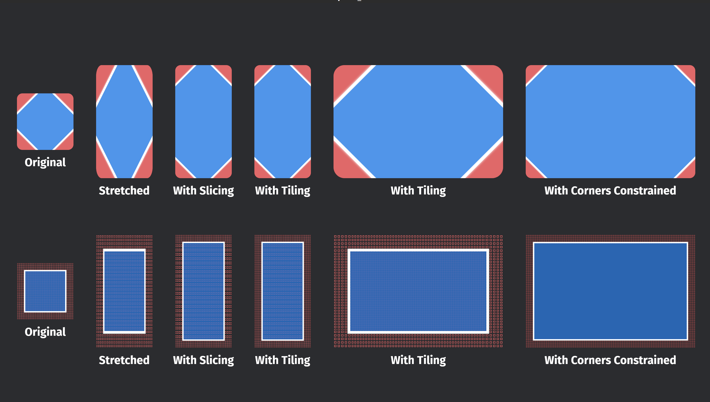
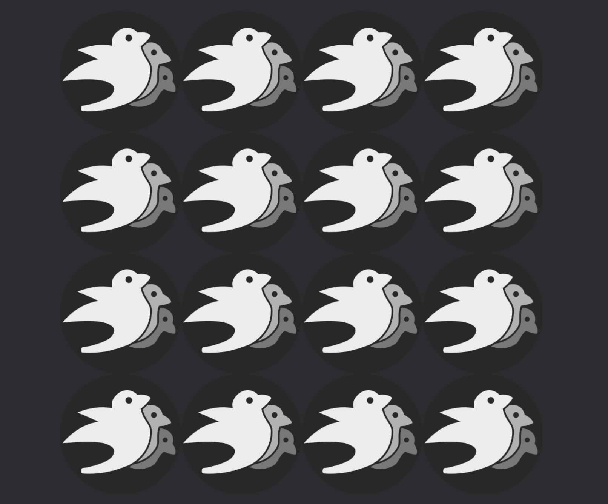

## 5.1 Mesh2d

在Bevy中，有 `Mesh2d`与`Mesh3d`两种，前者是三角形、矩形、圆形等各种二维形状，后者代表立方体、网格模型等三维物体。`Mesh2d`与`Mesh3d`可以像一个普通的组件一样使用，就像下面一样。在这些代码里，我们生成了一个实体，并在其之上添加了一个`Mesh2d`与对应的`MeshMaterial2d`。同时，别忘了我们还需要指定一个`Camera2d`来渲染这些内容。

```rust
fn setup(
    mut commands: Commands,
    mut meshes: ResMut<Assets<Mesh>>,
    mut materials: ResMut<Assets<ColorMaterial>>,
) {
    commands.spawn(Camera2d);

    commands.spawn((
        Mesh2d(meshes.add(Rectangle::default())),
        MeshMaterial2d(materials.add(Color::from(PURPLE))),
        Transform::default().with_scale(Vec3::splat(128.)),
    ));
}


```

`Mesh`代表由点组成的集合，他们可能是一个模型、一条线段、或者只是一些点，Bevy，而`ColorMaterial`则代表代表这些形状的颜色、材质等。在Bevy中，二者以`Assets`的形式存在，当使用时，我们应当使用`ResMut`获得该资源并向其中添加真正的数据类型。在`Assets`中我们说过，Bevy加载`Assets`时将返回一个对应的句柄并在后台加载这些数据，因此，创建`Mesh2d`与`MeshMaterial2d`组件时，我们传递的也是一个对应的`Handler`。

Bevy在bevy_math::primitives中为我们定义好了一组基本的几何形状，这些形状同样在preload中不需要我们再从bevy_math中导入，如上面的`Rectangle`就是其中的一个形状，这里不再一一赘述，读者可以查看[文档](https://doc.qu1x.dev/bevy_trackball/bevy_math/primitives/index.html)详细了解每种形状的创建方式。

## 5.2 MeshMaterial2d

`MeshMaterial2d`描述了Bevy应该如何渲染这些形状的具体信息，如果没有`MeshMaterial2d`只有`Mesh2d`，那么你会发现窗口上不会渲染任何东西。因此，不详细了解`MeshMaterial2d`，那么我们就无法掌握如何渲染这些形状。

### 5.2.1 ColorMaterial

`ColorMaterial`是一种二维的材质，其结构体的内容如下。可见，通过`ColorMaterial`我们能够控制的是一个`mesh2d`的颜色、透明度、uv变换、还有材质，下面我们来详细介绍一些其使用方式。

```rust
pub struct ColorMaterial {
    pub color: Color,
    pub alpha_mode: AlphaMode2d,
    pub uv_transform: Affine2,
    #[texture(1)]
    #[sampler(2)]
    pub texture: Option<Handle<Image>>,
}
```

在创建`ColorMaterial`时，我们可以直接向其传入上面的四个参数。

```rust
let mesh_handle = meshes.add(Rectangle::from_size(Vec2::splat(256.0)));
commands.spawn((
    //给Mesh2d传入一个形状的句柄
    Mesh2d(mesh_handle),
    //给MeshMaterial2d传入一个ColorMaterial的句柄
    MeshMaterial2d(materials.add(ColorMaterial {
        color: BLUE.into(),
        alpha_mode: AlphaMode2d::Opaque,
        texture: Some(texture_handle.clone()),
        ..default()
    })),
    Transform::from_xyz(-300.0, 0.0, 1.0),
));
```

对于第一个参数`color`而言，Bevy给了我们很多的构造方式，这些方式如下。

```rust
//bevy里有一组内置的常用颜色，可以直接引入他们
use bevy::color::palettes::css::{BLUE, GREEN, WHITE};
//或者，我们自己创建颜色结构体Color并传入
use bevy::prelude::*;
let color = Color::hsl(360. * i as f32 / num_shapes as f32, 0.95, 0.7);
```

枚举`alpha_mode`是一个`AlphaMode2d`类型，当我们使用图像做为材质时，该值设置对于图像的透明区域该如何处理。其包含三个值`Opaque`，`Mask(f32)`，`Blend`，他们的含义如下。

- `Opaque`：忽略图像的透明通道，使用底色填充（一般为黑色）
- `Mask(f32)`：设置一个阈值，类型为f32，当透明度低于这个值时将被渲染为透明，否则被认为完全不透明
- `Blend`：透明通道不为1时则为半透明颜色，并且会与下面的其他颜色相混合

```rust
use bevy::sprite_render::AlphaMode2d;

MeshMaterial2d(materials.add(ColorMaterial {
    alpha_mode: AlphaMode2d::Opaque,
    ..default()
})),
```

`uv_transform`要与`texture`一起使用时才能发挥作用，当我们加载了一个图像并传入时，我们可以通过指定`uv_transform`来决定图像应该如何与形状对其，这是一个二维的[仿射变换](https://doc.qu1x.dev/bevy_trackball/bevy/math/struct.Affine2.html)。

在加载图像时，若图像大小小于`Mesh2d`，那么**默认情况下，图像将会在左上角开始被放大到能填满区域为止**，但是当你**指定了`uv_transform`时**，若还不能覆盖整个区域，那么**边缘将会被拉伸到填满区域为止**；若图像大小大于`Mesh2d`，那么将**只会从图像的左上角开始显示**。或者，我们可以指定将图像进行重复显示，这是通过加载图像时指定`settings`做到的。

`ImageSamplerDescriptor`里包含了大量的设置，读者可以查看[文档](https://doc.qu1x.dev/bevy_trackball/bevy/image/struct.ImageSamplerDescriptor.html)详细了解，这里我们只使用其uv参数。

```rust
let image_with_repeated_sampler = asset_server.load_with_settings(
    "textures/fantasy_ui_borders/panel-border-010-repeated.png",
    |s: &mut _| {
        *s = ImageLoaderSettings {
            sampler: ImageSampler::Descriptor(ImageSamplerDescriptor {
                // 以重复的模式来加载图像
                address_mode_u: ImageAddressMode::Repeat,
                address_mode_v: ImageAddressMode::Repeat,
                ..default()
            }),
            ..default()
        }
    },
);

//使用时，我们需要指定Affine2来决定重复的次数，如果不指定，那么将默认为1，因此区域将铺满一个图像，而且使用临近插值
//因此，这样不会出现线性插值时导致的边缘模糊问题
MeshMaterial2d(materials.add(ColorMaterial {
    texture: Some(image_with_repeated_sampler),
    // uv_transform used here for proportions only, but it is full Affine2
    // that's why you can use rotation and shift also
    uv_transform: Affine2::from_scale(Vec2::new(2., 3.)),
    ..default()
})),
```

现在，我们介绍了`ColorMaterial`的四个重要的参数的使用方法，但是我们仍然缺少一种重要的材质渲染方式，这种方式是GPU最基础的也是功能最强大的，那就是利用顶点属性来渲染颜色。

 Mesh结构体上有一个特殊的方法，名叫`insert_attribute`，利用这个方法，我们可以对Mesh的顶点处插入一些属性，并指定这些属性的类型，当拥有这些属性时，wgpu将会自动工作来将其显示在屏幕上。同样，我们也可以移除这些属性，关于其他更多的方法可以查看相关的[文档](https://doc.qu1x.dev/bevy_trackball/bevy/prelude/struct.Mesh.html#method.insert_attribute)。

```rust
let mut mesh = Mesh::from(Rectangle::default());

//顶点属性是一组数组
let vertex_colors: Vec<[f32; 4]> = vec![
    LinearRgba::RED.to_f32_array(),
    LinearRgba::GREEN.to_f32_array(),
    LinearRgba::BLUE.to_f32_array(),
    LinearRgba::WHITE.to_f32_array(),
];

//利用insert_attribute可以插入这些数组，并指定其类型为Mesh::ATTRIBUTE_COLOR
mesh.insert_attribute(Mesh::ATTRIBUTE_COLOR, vertex_colors);

//现在，我们可以使用这个新的mesh作为Mesh2d
let mesh_handle = meshes.add(mesh);	
```

### 5.2.2 自定义材质

与2d相关的内容主要储存在bevy_sprite_render这个crate中，其中包括渲染管道的组成、材质的定义的代码等。我们可以通过实现一个 `Material2d`特型来创建自己的材质。这涉及到了一些底层的wgpu与图形学内容，因此这一节应该属于渲染管线的内容，但是在这里我们将会简要提一下，感兴趣的读者可以查看[文档](https://docs.rs/bevy/0.17.3/bevy/sprite_render/trait.Material2d.html)，或者等到学习自定义着色器时在反过来看这些内容。

## 5.3 Font

字体是2D显示的另一个方面，在Bevy中，我们可以加载自己的字体并显示。

字体是后戳为ttf的一些文件，包含了文字应该如何在屏幕上绘制的信息，要加载这些字体，就如同加载普通的`Aeest`一样。

```rust
let font = asset_server.load("fonts/FiraSans-Bold.ttf");
//加载字体之后，我们使用TextFont组件使用它，并指定一些字体的样式，就像使用图片一样
let text_font = TextFont {
    font: font.clone(),
    font_size: 50.0,
    ..default()
};

//将这个组件绑定到某个实体上，并指定一些其他的字体组件，便能显示在屏幕上
commands.spawn((
    Text2d::new(" translation "),
    text_font.clone(),
    TextLayout::new_with_justify(text_justification),
    TextBackgroundColor(Color::BLACK.with_alpha(0.5)),
    Text2dShadow::default(),
));
```

在这其中涉及到了大量的字体相关的组件，例如`TextLayout`，`TextBackgroundColor`，`Text2dShadow`，他们的作用不言而喻，通过修改这些组件便可以影响字体的显示效果，读者可以查阅文档来获得详细的信息，这里不再赘述。

## 5.4 Image

在前面，我们只是简单的使用了一下 `asset_server`来加载图像，但是我们还没有详细的介绍图像，在介绍Sprite相关的知识之前，有必要在介绍一下与图像相关的加载方式。在之前，我们知道了如何使用`asset_server`来加载图像，然后利用返回的handle，我们可以进行查询。

```rust
fn read_image_data(images: ResMut<Assets<Image>>, share_image: Res<ShareImage>) {
    let handle = match &share_image.handle {
        None => return,
        Some(handle) => handle,
    };
    if let Some(image) = images.get(handle) {
			//在这里可以使用
    }
}
```

以下是`Image`结构体的字段，顾名思义，我们可以通过data来访问原始的图像数据，另外我们还有一些配置项能够修改图像的渲染行为。这些参数的具体含义，读者可以查看[文档](https://docs.rs/bevy/0.17.3/bevy/image/struct.Image.html)。这里不再赘述。

```rust
pub struct Image {
    pub data: Option<Vec<u8>>,
    pub data_order: TextureDataOrder,
    pub texture_descriptor: TextureDescriptor<Option<&'static str>, &'static [TextureFormat]>,
    pub sampler: ImageSampler,
    pub texture_view_descriptor: Option<TextureViewDescriptor<Option<&'static str>>>,
    pub asset_usage: RenderAssetUsages,
    pub copy_on_resize: bool,
}
```

在这里，我们需要重点关注其`sampler`字段，其表示了当图像被缩放时应该怎么被渲染，默认情况下Bevy将会采取线性插值的方式渲染，这可能会导致我们的图像经过放大之后出现模糊。这时，我们可以更改其为最临近插值，即可解决这个问题。

```rust
image.sampler = ImageSampler::nearest();
```

更进一步，不知道读者是否还记得，每一种资产加载时，我们可以传递一个setting选项，Bevy为我们提供了`ImageLoaderSettings`选项，其中就可以直接指定我们的采样方式。

```rust
//加载图像时的一些可选配置
pub struct ImageLoaderSettings {
    pub format: ImageFormatSetting,
    pub texture_format: Option<TextureFormat>,
    pub is_srgb: bool,
    pub sampler: ImageSampler,
    pub asset_usage: RenderAssetUsages,
}

let image = asset_server.load_with_settings(
    "textures/fantasy_ui_borders/numbered_slices.png",
    |settings: &mut ImageLoaderSettings| {
        settings.sampler = ImageSampler::nearest();
    },
);
```

## 5.5 Sprite

`Sprite`通常翻译为“精灵”，但其实只是另一种形式的图像，通常用于2D游戏的贴图。由于`Sprite`只是一种图像，因此最简单的方式就是直接加载一个图像然后生成，这可以通过以下方式来做到，通过这种方式，生成的贴图将会保持图像的原始尺寸，默认情况下，其中心将位于坐标(0,0)处。

```rust
//Sprite包含了非常多的参数，这些参数我们将在后面一一介绍
pub struct Sprite {
  	//使用的图像的句柄
    pub image: Handle<Image>,
  	//用于渲染的图像集合（多用于精灵的动画）
    pub texture_atlas: Option<TextureAtlas>,
  	//设置颜色，可以用来控制透明度
    pub color: Color,
  	//是否沿着x轴反转精灵
    pub flip_x: bool,
  	//同上，不过是y轴
    pub flip_y: bool,
  	//渲染时选定的尺寸，用于限制精灵的大小
    pub custom_size: Option<Vec2>,
  	//
    pub rect: Option<Rect>,
  	//控制精灵的加载方式，缩放、切片、瓦片重叠等
    pub image_mode: SpriteImageMode,
}


//可以直接使用Sprite结构体来加载
commands.spawn(Sprite {
  image: asset_server.load("sprites/ball.png"),
  ..default()
});
//或者，可以使用一个工厂函数
let image_handle = asset_server.load("sprites/ball.png");
let sprite = Sprite::from_image(image_handle);
commands.spawn(sprite);
```

让我们先来介绍最重要的`image_mode`，很多时候我们并不是只想将图像加载，而是以重复的方式或者切片、缩放之后加载，这种方式可以节省我们的内存，通过只保存一份最小纹理，然后在加载时进行处理，我们就可以节省空间。为了做到这件事，我们需要使用`image_mode`参数，该参数是一个名为`SpriteImageMode` 的枚举类型，其包含以下四个值。

```rust
pub enum SpriteImageMode {
  	//默认拉伸图像到能够填满整个区域
    Auto,
  	//将纹理缩放
    Scale(SpriteScalingMode),
  	//将纹理切片
    Sliced(TextureSlicer),
  	//将纹理重复堆叠，stretch_value用于指定每一片相对于图像大小的缩放比
    Tiled {
        tile_x: bool,
        tile_y: bool,
        stretch_value: f32,
    },
}
```

### 5.5.1 sprite scale

要在加载时对图像进行缩放，我们可以在加载时将其指定为`SpriteImageMode::Scale`，其类型如下。其中包含了六个类型，这些值都不会改变图像的宽高比，前三个会尽可能放大图像导致图像只有一部分被渲染，后三个保证图像都会被渲染。

```rust
pub enum ScalingMode {
    FillCenter,
    FillStart,
    FillEnd,
    FitCenter,
    FitStart,
    FitEnd,
}
```

要使用这些值时，还必须指定`Sprite`的`custom_size`字段，因此我们现在可以这样去设定每个精灵的大小了。

```rust
commands.spawn((
    Sprite {
        image: asset_server.load("textures/slice_square_2.png"),
        custom_size: Some(Vec2::new(100., 225.)),
        image_mode: SpriteImageMode::Scale(SpriteScalingMode::FillCenter),
        ..default()
    }
));
```

​	下面是bevy示例sprite_scale中，每种缩放模式的效果。


### 5.5.2 sprite slice

要在加载时对图像进行切片，我们可以在加载时将其指定为`SpriteImageMode::Sliced`，其中的`TextureSlicer`类型如下。sliced是一种九宫格切片技术，关于该技术的详细介绍读者可以查看[百科](https://en.wikipedia.org/wiki/9-slice_scaling)。简而言之，这是一直特殊的缩放技术，能够在缩放时尽可能合理保持图像的纹理。

```rust
pub struct TextureSlicer {
  	//进行切片时的四条切割线位置
    pub border: BorderRect,
  	//九宫格中心的缩放方式
    pub center_scale_mode: SliceScaleMode,
  	//九宫格四个侧面的缩放方式
    pub sides_scale_mode: SliceScaleMode,
  	//九宫格四个角的最大缩放比例
    pub max_corner_scale: f32,
}

pub enum SliceScaleMode {
  	//以拉伸的方式拉伸图像
    Stretch,
  	//如果要重复绘制，每一小块纹理的缩放值
    Tile {
        stretch_value: f32,
    },
}


//这里的四个值是相对于图像四个边缘的偏移量（分成九宫格需要四条线），而不是绝对坐标
//left指的是距离图像左侧边缘的距离
//right指的是距离图像右侧边缘的距离
pub struct BorderRect {
    pub left: f32,
    pub right: f32,
    pub top: f32,
    pub bottom: f32,
}
```

同样，我们在使用这种缩放模式的时候，也必须指定尺寸的大小。然后，就可以这样创建不同大小的切片。下图中的效果来自bevy的sprite_slice示例。

```rust
 commands.spawn((
    Sprite {
        image: asset_server.load("textures/slice_square.png"),
        custom_size: Some(Vec2::new(300.0, 200.0)),
        image_mode: SpriteImageMode::Sliced(TextureSlicer {
            border: BorderRect::all(200.0),
            center_scale_mode: SliceScaleMode::Tile { stretch_value: 0.1 },
            sides_scale_mode: SliceScaleMode::Tile { stretch_value: 0.2 },
            max_corner_scale: 0.2,
        }),,
        ..default()
    },
));
```



### 5.5.3 sprite tile

要在加载时对图像进行重复，例如我们可以利用小块纹理进行重复来得到整块区域的北京，我们可以在加载时将其指定为`SpriteImageMode::Tiled`，相比前两种，这种方式使用起来则轻松得多。

```rust
Tiled {
    tile_x: bool,
    tile_y: bool,
    stretch_value: f32,
},
```

我们有三个参数，分别指定了在两个方向上是否要进行重复，最后一个参数和slice中的一样，指定重复时的比例。例如，我们可以这样设定。

```rust
commands.spawn(Sprite {
    image: asset_server.load("branding/icon.png"),
    image_mode: SpriteImageMode::Tiled {
        tile_x: true,
        tile_y: true,
        stretch_value: 0.5, // The image will tile every 128px
    },
    ..default()
});
```



### 5.5.4 sprite animations

加载完了图像之后，我们还需要给每个角色设定动画，如果只是看到人物单纯的平移那可不是我们想要的。对于2D图像来说，我们最常用的就是下面这种方式，其中每一副图像指定了角色动画的一帧，我们要做的就是不断重复这些图像来产生动画。


要加载这样的精灵，我们需要结合`texture_atlas`参数来指定动画每一帧的读取方式，该参数的定义如下。

```rust
pub struct TextureAtlas {
  	//纹理的布局的描述
    pub layout: Handle<TextureAtlasLayout>,
  	//纹理图的索引
    pub index: usize,
}

pub struct TextureAtlasLayout {
  	//整个图像大小
    pub size: UVec2,
  	//图像里每一帧的大小
    pub textures: Vec<URect>,
}	
```

由于`TextureAtlasLayout`是一种Assets，因此我们还需要将其添加到bevy内置的资产中。

```rust
//这个组件包含一个计时器，用于控制我们的动画播放速度
#[derive(Component, Deref, DerefMut)]
struct AnimationTimer(Timer);

//这个组件用来记录帧数的起始和结束编号
#[derive(Component)]
struct AnimationIndices {
    first: usize,
    last: usize,
}

fn setup(
    mut commands: Commands,
    asset_server: Res<AssetServer>,
  	// 获取TextureAtlasLayout资产
    mut texture_atlas_layouts: ResMut<Assets<TextureAtlasLayout>>,
) {
  	//加载这幅由多帧拼成的图像
    let texture = asset_server.load("textures/rpg/chars/gabe/gabe-idle-run.png");
  	//指定图像的布局，这里指定其为1行7列，每一帧大小为24px，后两个参数是padding和offset，我们不需要指定
    let layout = TextureAtlasLayout::from_grid(UVec2::splat(24), 7, 1, None, None);
  	//将其添加到全局的资产中
    let texture_atlas_layout = texture_atlas_layouts.add(layout);
		let animation_indices = AnimationIndices { first: 1, last: 6 };
		//加载相机
    commands.spawn(Camera2d);
		//指定精灵和动画
    commands.spawn((
        Sprite::from_atlas_image(
            texture,
            TextureAtlas {
                layout: texture_atlas_layout,
              	//指定当前的帧编号
                index: 1,
            },
        ),
     	 	animation_indices,
        Transform::from_scale(Vec3::splat(6.0)),
      	AnimationTimer(Timer::from_seconds(0.1, TimerMode::Repeating)),
    ));
}
```

现在，我们便可以在一个系统中通过更改组件的`texture_atlas`上的`index`，就可以实现帧之间的切换。不过在这里，我们得关心一下帧切换的速度，由于bevy的渲染系统非常快，所以我们必须控制一下切换的速度符合实际，这就要利用我们之前添加的`AnimationTimer`，其中定义了一个`Timer`。

```rust
fn animate_sprite(
    time: Res<Time>,
    mut query: Query<(&AnimationIndices, &mut AnimationTimer, &mut Sprite)>,
) {
    for (indices, mut timer, mut sprite) in &mut query {
        timer.tick(time.delta());

        if timer.just_finished()
            && let Some(atlas) = &mut sprite.texture_atlas
        {
            atlas.index = if atlas.index == indices.last {
                indices.first
            } else {
                atlas.index + 1
            };
        }
    }
}
```

### 5.5.5 批量加载sprite

想象一下，在一个游戏里我们有巨量的图像都需要加载，在这种情况下这件事很快就会变得很棘手，由于精灵的不同动作的动画可能不在一幅图像里，因此我们必须手动的将这些多副图像组合为一幅。幸运的是，Bevy为我们提供了一种更好的方式来加载这些图像。

首先，我们不再使用`asset_server`来加载单幅图像，而是使用其`load_folder`方法来递归地加载整个文件夹下的所有可加载文件，并判断其是否是图像。

```rust
//用于保存句柄的全局资源
#[derive(Resource, Default)]
struct RpgSpriteFolder(Handle<LoadedFolder>);

fn load_textures(mut commands: Commands, asset_server: Res<AssetServer>) {
    //在这里我们加载整个文件夹，并保存其句柄
    commands.insert_resource(RpgSpriteFolder(asset_server.load_folder("textures/rpg")));
}

```

然后，我们还需要某种方式，来观察加载是否已经完成然后调用我们的某个系统来处理，这可以通过系统的state来实现（还记得吗？）

```rust
//首先定义我们的state，并指定默认的状态
#[derive(Debug, Clone, Copy, Default, PartialEq, Eq, Hash, States)]
enum AppState {
    #[default]
    Setup,
    Finished,
}

fn main() {
    App::new()
        .add_plugins(DefaultPlugins.set(ImagePlugin::default_nearest())) 
  			//注册我们的state
        .init_state::<AppState>()
  			//当进入Setup状态时，我们调用load_textures加载整个文件夹下的内容
        .add_systems(OnEnter(AppState::Setup), load_textures)
  			//如果在Setup状态，我们就不停的检查加载是否已经完成
        .add_systems(Update, check_textures.run_if(in_state(AppState::Setup)))
  			//当进入Finished状态时，资源加载完成，我们调用setup函数使用这些资源
        .add_systems(OnEnter(AppState::Finished), setup)
        .run();
}

fn check_textures(
    mut next_state: ResMut<NextState<AppState>>,
    rpg_sprite_folder: Res<RpgSpriteFolder>,
    mut events: MessageReader<AssetEvent<LoadedFolder>>,
) {
    //我们可以通过事件的方式来检查加载是否完成
    for event in events.read() {
        if event.is_loaded_with_dependencies(&rpg_sprite_folder.0) {
            next_state.set(AppState::Finished);
        }
    }
}


```

一旦这些步骤完成，我们就可以使用这些资源来加载我们的`sprite`。

```rust

fn setup(
    mut commands: Commands,
    rpg_sprite_handles: Res<RpgSpriteFolder>,
    asset_server: Res<AssetServer>,
    mut texture_atlases: ResMut<Assets<TextureAtlasLayout>>,
    loaded_folders: Res<Assets<LoadedFolder>>,
    mut textures: ResMut<Assets<Image>>,
) {
  	//首先获取我们已经加载完成的loaded_folder
    let loaded_folder = loaded_folders.get(&rpg_sprite_handles.0).unwrap();
		//然后创建sprite
    let (texture_atlas_linear, linear_sources, linear_texture) = create_texture_atlas(
        loaded_folder,
        None,
        Some(ImageSampler::linear()),
        &mut textures,
    );
}

```

如何合并多副图像为一个并从中创建单个的`TextureAtlas`呢？这可以通过`TextureAtlasBuilder`来实现，`TextureAtlasBuilder`能够自动将多副图像合并为一副，并返回三个参数：`texture_atlas_layout`, `texture_atlas_sources`, `texture`，他们的类型分别是`TextureAtlas`，`TextureAtlasSources`，`Handle<Image>`。

```rust

fn create_texture_atlas(
    folder: &LoadedFolder,
    padding: Option<UVec2>,
    sampling: Option<ImageSampler>,
    textures: &mut ResMut<Assets<Image>>,
) -> (TextureAtlasLayout, TextureAtlasSources, Handle<Image>) {
    //创建一个Builder
    let mut texture_atlas_builder = TextureAtlasBuilder::default();
  	//我们可以指定padding来在合并时将图像相隔一段像素
    texture_atlas_builder.padding(padding.unwrap_or_default());
  	//对文件夹里的每一副图像，检查是否为图像并其添加到builder中
    for handle in folder.handles.iter() {
        let id = handle.id().typed_unchecked::<Image>();
        let Some(texture) = textures.get(id) else {
            warn!(
                "{} did not resolve to an `Image` asset.",
                handle.path().unwrap()
            );
            continue;
        };
        texture_atlas_builder.add_texture(Some(id), texture);
    }
		//现在，合并这些图像并生成一整副
    let (texture_atlas_layout, texture_atlas_sources, texture) =
        texture_atlas_builder.build().unwrap();
  	//将合并之后的图像添加到全局资产中
    let texture = textures.add(texture);

    //在这里修改我们的图像采样方式
    let image = textures.get_mut(&texture).unwrap();
    image.sampler = sampling.unwrap_or_default();

    (texture_atlas_layout, texture_atlas_sources, texture)
}
```

根据前面的介绍，`texture_atlas_layout`中记录了合并后整副图像的大小和每一副子图像的矩形范围。但是我们还缺少一个关键信息，我们只知道这幅子图的范围，而不知道这部分子图到底是那副图像。这些信息，就记录在了`TextureAtlasSources`类型的`texture_atlas_sources`中，其定义如下，只是一个简单的`HashMap`而已。如果我们需要使用这些信息的话，便可以通过这两个返回值来获得正确的对应关系。

```rust
pub struct TextureAtlasSources {
    pub texture_ids: HashMap<AssetId<Image>, usize>,
}
```
