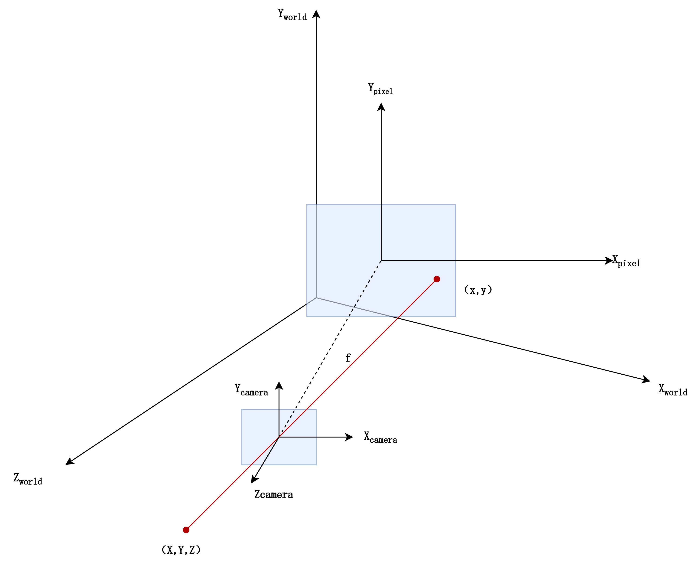

## 7.1 Light

“上帝说：要有光，就有了光。”我们的三维世界也需要有光，否则渲染出来的屏幕将会漆黑一片。有关灯光的介绍是一个大主题，甚至能够写好几本书，在这里我们只会简要的介绍一下几种常见的灯光，以便我们能够首先看到点什么，剩下的内容将会在下一章内更仔细的介绍。

### 7.1.1 PointLight

`PointLight`是一种从中心点开始向各个方向发光的光源，其结构体定义如下。我们现在主要关心的是color、intensity、range、radius这几个参数。他们分别设定了光源的颜色、强度、范围、光点半径。

```rust
pub struct PointLight {
    pub color: Color,
    pub intensity: f32,
    pub range: f32,
    pub radius: f32,
    pub shadows_enabled: bool,
    pub soft_shadows_enabled: bool,
    pub affects_lightmapped_mesh_diffuse: bool,
    pub shadow_depth_bias: f32,
    pub shadow_normal_bias: f32,
    pub shadow_map_near_z: f32,
}
```

### 7.1.2 SpotLight

`SpotLight`是一种从某个点朝着某个方向发射的光源，一般也叫聚光灯，形状是一个从源点沿着方向为轴线的锥形，其结构体定义如下。除了color、intensity、range、radius等参数，我们还需要关心inner_angle和outer_angle这两个参数，

```rust
pub struct SpotLight {
    pub color: Color,
    pub intensity: f32,
    pub range: f32,
    pub radius: f32,
    pub shadows_enabled: bool,
    pub soft_shadows_enabled: bool,
    pub affects_lightmapped_mesh_diffuse: bool,
    pub shadow_depth_bias: f32,
    pub shadow_normal_bias: f32,
    pub shadow_map_near_z: f32,
    pub outer_angle: f32,
    pub inner_angle: f32,
}
```

这两个参数是两个角度，范围应该在0～90度之间，且inner_angle应当小于outer_angle，这两个参数看起来就像下面这样。outer_angle指定了聚光灯的范围，而位于inner_angle和outer_angle之间的光强度将会逐渐减小来呈现一种边缘的光更弱的效果。


要使用`SpotLight`光指定`SpotLight`是不够的，我们还必须指定他的Position和Direction才行，但是定义中并没有提供我们相关的设置，我们要怎么办呢？当然，使用`Transform`即可。因此想要使用聚光灯，就要像下面这样，利用`Transform`组件来指定原点和方向。

```rust
commands.spawn((
    SpotLight {
        intensity: 100_000.0,
        color: LIME.into(),
        shadows_enabled: true,
        inner_angle: 0.6,
        outer_angle: 0.8,
        ..default()
    },
    Transform::from_xyz(-1.0, 2.0, 0.0).looking_at(Vec3::new(-1.0, 0.0, 0.0), Vec3::Z),
));
```

### 7.1.3 DirectionalLight

`DirectionalLight`意为平行光，是一种理想的现实里不存在的光源，我们的太阳光也可以视为这种光源。这种光源的光线不像`SpotLight`或者`PointLight`那样由一个点发出，而是由一个平面发出，就好像由一组光源列阵一样。

​	illuminance参数指定了照明的强度，但是这个单位与intensity不同。intensity以lumens（流明）为单位，而illuminance以lux（每平方米的流明）为单位。

```rust
pub struct DirectionalLight {
    pub color: Color,
    pub illuminance: f32,
    pub shadows_enabled: bool,
    pub soft_shadow_size: Option<f32>,
    pub affects_lightmapped_mesh_diffuse: bool,
    pub shadow_depth_bias: f32,
    pub shadow_normal_bias: f32,
}
```

## 7.2 Mesh3d

同`Mesh2d`一样，`Mesh3d`是我们用来表示一个三维网格模型的组件，其用法与`Mesh2d`也相同：传入一个`Mesh`的`Handler`。因此我们可以像下面的代码一样，创建一些内置的`Mesh`并添加到`Mesh`资产中，然后使用`Mesh3d`和`MeshMaterial3d`来显示这些物体。

同时，别忘了指定灯光和相机，否则我们的屏幕上将会一片漆黑。

```rust

fn setup(
    mut commands: Commands,
    mut meshes: ResMut<Assets<Mesh>>,
    mut images: ResMut<Assets<Image>>,
    mut materials: ResMut<Assets<StandardMaterial>>,
) {
    //创建一些基础的材质，不然无法显示我们的形状
    let debug_material = materials.add(StandardMaterial {
        base_color_texture: Some(images.add(uv_debug_texture())),
        ..default()
    });

    let shapes = [
        meshes.add(Cuboid::default()),
        meshes.add(Tetrahedron::default()),
        meshes.add(Capsule3d::default()),
        meshes.add(Torus::default()),
        meshes.add(Cylinder::default()),
        meshes.add(Cone::default()),
        meshes.add(ConicalFrustum::default()),
        meshes.add(Sphere::default().mesh().ico(5).unwrap()),
        meshes.add(Sphere::default().mesh().uv(32, 18)),
        meshes.add(Segment3d::default()),
        meshes.add(Polyline3d::new(vec![
            Vec3::new(-0.5, 0.0, 0.0),
            Vec3::new(0.5, 0.0, 0.0),
            Vec3::new(0.0, 0.5, 0.0),
        ])),
    ];

    let num_shapes = shapes.len();

    for (i, shape) in shapes.into_iter().enumerate() {
        commands.spawn((
            Mesh3d(shape),
            MeshMaterial3d(debug_material.clone()),
            Transform::from_xyz(
                -SHAPES_X_EXTENT / 2. + i as f32 / (num_shapes - 1) as f32 * SHAPES_X_EXTENT,
                2.0,
                Z_EXTENT / 2.,
            )
            .with_rotation(Quat::from_rotation_x(-PI / 4.)),
            Shape,
        ));
    }

    commands.spawn((
        PointLight {
            shadows_enabled: true,
            intensity: 10_000_000.,
            range: 100.0,
            shadow_depth_bias: 0.2,
            ..default()
        },
        Transform::from_xyz(8.0, 16.0, 8.0),
    ));
  
    commands.spawn((
      Camera3d::default(),
      Transform::from_xyz(0.0, 7., 14.0).looking_at(Vec3::new(0., 1., 0.), Vec3::Y),
  	));
}

```

### 7.2.1 加载glb/gltf

既然这一章讲得是3D，那么我们必须先好好讲明白如何把我们在blender中建模好的模型加载进bevy里并显示。bevy中的模型加载非常简单，但是也有些许的独特。

在bevy中， glb和gltf文件是一等公民，虽然bevy也支持加载obj或者其他格式的模型，但是bevy对于glb和gltf的支持是最好的。这其中涉及到很多复杂的原因，但是，如果你的模型不是glb格式的，你可以现在blender里将其重新导出为glb模型，或者你也可以使用bevy_obj等crate直接加载obj模型。

简单来说，**GLB 是 GLTF 的二进制（Binary）版本**，他们都通过bevy_gltf这个crate来进行加载。

glTF通常是一个 `.gltf` 文件（一般是JSON 格式），旁边带着一堆些`.bin` 文件（存储顶点、几何数据的二进制包）和一堆 `.png/.jpg` 图片（贴图）。

glb只有一个单独的 `.glb` 文件。它把 JSON 说明书、二进制数据、贴图全部塞进了一个大包里，因为是全二进制存储，且省去了 Base64 编码的开销，通常比散装的 glTF 更小，而且加载更快，因此更推荐使用glb格式。

模型一般约定放在asset/models文件夹下。因此，我们可以这样来加载模型。那么，下面的`SceneRoot`和`GltfAssetLabel`又是什么呢？简单来说，`SceneRoot`只是一个特殊的组件，代表了我们在使用 blender建模时的场景根，`GltfAssetLabel`则代表了各种可能的glb规范里的类型。

```rust
fn spawn_gltf(mut commands: Commands, asset_server: Res<AssetServer>) {
    let gltf_scene: Handle<Scene> = asset_server.load(GltfAssetLabel::Scene(0).from_asset("models/FlightHelmet/FlightHelmet.gltf"));
    //或者，我们可以使用这种带后戳的格式化字符串
	//let gltf_scene: Handle<Scene> = asset_server.load(format!("models/FlightHelmet/FlightHelmet.gltf#{}", GltfAssetLabel::Scene(0)));
    
    commands.spawn(( 
        SceneRoot(gltf_scene),
        Transform::from_xyz(2.0, 0.0, -5.0),
    ));
}
```

查看定义，可以看到GltfAssetLabel是一个枚举类型，其定义如下。这个枚举 `GltfAssetLabel` 实际上是 Bevy 为 glb/gltf 文件定义的**“内部地址薄”**。

```rust
pub enum GltfAssetLabel {
    Scene(usize),
    Node(usize),
    Mesh(usize),
    Primitive {
        mesh: usize,
        primitive: usize,
    },
    MorphTarget {
        mesh: usize,
        primitive: usize,
    },
    Texture(usize),
    Material {
        index: usize,
        is_scale_inverted: bool,
    },
    DefaultMaterial,
    Animation(usize),
    Skin(usize),
    InverseBindMatrices(usize),
}
```

在这里，我们给出每一种类型在glb规范中对应的部分，当我们加载后，我们便可以更改这些配置，来达到在游戏中变化的效果。

|        名称         |                             对应                             |
| :-----------------: | :----------------------------------------------------------: |
|        Scene        | GLTF 里的场景 ，一个 GLB 可以包含多个场景（例如一个文件里存了“白天”和“黑夜”两个版本的布局）。通常我们用 `Scene(0)`，它会包含模型的所有层级、灯光和初始位置还有所有的模型 |
|        Node         | 场景树的骨架。每个节点都有自己的 `Transform`（平移、旋转、缩放）。你可以通过索引单独加载某个节点 |
|        Mesh         |   对应网格，GLTF 里的 Mesh 并不直接包含顶点，它是一个容器    |
|      Primitive      | 一个 Mesh 可以由多个 Primitive 组成（例如一个角色的 Mesh，手是一个 Primitive，身体是另一个，因为它们可能使用不同的材质） |
|     MorphTarget     |  对应形态键，用于做面部表情或简单的形变动画（比如捏脸系统）  |
|       Texture       |                    对应贴图，和uv变换有关                    |
|      Material       |                 对应材质，就是7.3节中的材质                  |
|   DefaultMaterial   |   如果 GLTF 里有的物体没赋材质，Bevy 会分配一个默认材质。    |
|      Animation      | 文件里的动画，如 `Animation(0)` 可能是“走”，`Animation(1)` 可能是“跑” |
|        Skin         |                 对应骨架，存储了骨骼层级关系                 |
| InverseBindMatrices | 对应逆绑定矩阵，简单说，它是为了让 GPU 知道当骨骼旋转时，皮肤应该怎么跟着动 |
### 7.2.2 使用glb/gltf

在上面一节里，我们已经介绍了如何加载glb文件，并理解了加载后glb文件的构成，现在，我们需要来看看如何在ecs系统中使用这些加载好的glb文件。

先给出一个例，这个系统会查询一个有`MovedScene`组件的glb实体，然后对他的每一个子实体都进行修改。这个例子里有着很多有趣的细节。

首先，这个例子告诉我们，如果我们的glb中没有把模型合并，那么我们加载的模型并不是一个单一的实体。通过使用`Children`的方式可以发现，**Scene是一簇有着父子关系的实体**，整个场景通过`children`和`ChildOf`来组织(详情见第2章)。

```rust
//在setup中
//commands.spawn((
    //Transform::from_xyz(-1.0, 0.0, 0.0),
    //SceneRoot(
       //asset_server
       //.load(GltfAssetLabel::Scene(0).from_asset("models/FlightHelmet/FlightHelmet.gltf")),
       //),
//));

fn move_scene_entities(
    time: Res<Time>,
    moved_scene: Query<Entity, With<MovedScene>>,
    children: Query<&Children>,
    mut transforms: Query<&mut Transform>,
) {
    for moved_scene_entity in &moved_scene {
        let mut offset = 0.;
        //使用iter_descendants方法，递归遍历该实体的所有子实体
        for entity in children.iter_descendants(moved_scene_entity) {
            //获得每个子实体的transform，然后更改
            if let Ok(mut transform) = transforms.get_mut(entity) {
                transform.translation = Vec3::new(
                    offset * ops::sin(time.elapsed_secs()) / 20.,
                    0.,
                    ops::cos(time.elapsed_secs()) / 20.,
                );
                offset += 0.5;
            }
        }
    }
}
```

运行这些代码，可以发现他们的效果如下所示。因为每个子实体都有自己独立的`transform`，所以最终的效果会让模型的每个部分错位平移。



现在我们知道了，Scene是一簇有着父子关系的实体，那么如果我们需要访问其中的某一个或者某一些子实体的时候该怎么做？这可以通过下面这个例子来解释，我们利用了一个名为`GltfMaterialName`的组件来锁定正确的子实体。

```rust
//在setup中
//commands.spawn(SceneRoot(asset_server.load(
//    GltfAssetLabel::Scene(0).from_asset("models/GltfPrimitives/gltf_primitives.glb"),
//)));


fn find_top_material_and_mesh(
    mut materials: ResMut<Assets<StandardMaterial>>,
    mut meshes: ResMut<Assets<Mesh>>,
    time: Res<Time>,
    mat_query: Query<(
        &MeshMaterial3d<StandardMaterial>,
        &Mesh3d,
        &GltfMaterialName,
    )>,
) {
    for (mat_handle, mesh_handle, name) in mat_query.iter() {
        //利用name，我们可以找到正确的子实体
        if name.0 == "Top" {
            if let Some(material) = materials.get_mut(mat_handle) {
                if let Color::Hsla(ref mut hsla) = material.base_color {
                    *hsla = hsla.rotate_hue(time.delta_secs() * 100.0);
                } else {
                    material.base_color = Color::from(Hsla::hsl(0.0, 0.9, 0.7));
                }
            }
			//利用mesh_handle，从meshes中我们可以获取相应的mesh
            if let Some(mesh) = meshes.get_mut(mesh_handle)
                && let Some(VertexAttributeValues::Float32x3(positions)) =
                    mesh.attribute_mut(Mesh::ATTRIBUTE_POSITION)
            {
                for position in positions {
                    *position = (
                        position[0],
                        1.5 + 0.5 * ops::sin(time.elapsed_secs() / 2.0),
                        position[2],
                    )
                        .into();
                }
            }
        }
    }
}
```

关于名称，其实glft规范中有两个，他们在bevy中是：`GltfMeshName`与`GltfMaterialName`。我们从每个glb文件加载出的实体，这两个属性都会被自动的插入到实体上，他们的具体的内容则是我们在blender中指定的网格名称和材质名称。他们的定义很简单，如下所示，只是一个包含字符串的结构体。

```rust
pub struct GltfMeshName(pub String);
pub struct GltfMaterialName(pub String);
```

除了上面介绍的那些，还有一种名为`Extras`的数据，他们只是一些附加的文字描述，例如[GltfExtras](https://docs.rs/bevy_gltf/latest/bevy_gltf/struct.GltfExtras.html)、[GltfMaterialExtras](https://docs.rs/bevy_gltf/latest/bevy_gltf/struct.GltfMaterialExtras.html)、[GltfMeshExtras](https://docs.rs/bevy_gltf/latest/bevy_gltf/struct.GltfMeshExtras.html)等等，读者可以自行查看文档，这里不再赘述。

---

现在，让我们再重新回顾一下本小节。本小节的内容相当重要，当我们从glb文件中加载一个Scene的时候，我们获得的是一簇实体，而不是一个单一的实体，因此我们只使用了`SceneRoot`组件来挂载根，像这样加载glb模型。

```rust
 let flight_helmet = asset_server
        .load(GltfAssetLabel::Scene(0).from_asset("models/FlightHelmet/FlightHelmet.gltf"));

commands.spacwn((
    SceneRoot(flight_helmet.clone()),
    Transform::from_xyz(-1.25, 0., 0.),
));
```

从glb文件内加载的模型上，带有很多的组件，这些组件包括：`MeshMaterial3d`、`GltfMeshName`、`GltfMaterialName`、各种`Extras`等等。其中`MeshMaterial3d`描述了实体的材质，后两者描述了实体的网格和材质的名字，`Extras`则是一些附加的文本信息。这其中，最重要的是`MeshMaterial3d`，在下一章中，我们将会使用`MeshMaterial3d`来动态的修改一个已经加载好的模型或者shape的材质。

### 7.2.3 mesh animation

待写作

## 7.3 MeshMaterial3d

与`Mesh2d`对应的`MeshMaterial2d`相同，`Mesh3d`也对应了`MeshMaterial3d`。如果没有`MeshMaterial3d`只有`Mesh3d`，窗口上也不会渲染任何东西。

### 7.3.1 StandardMaterial

好吧，为什么在渲染2d时我们使用的是`ColorMaterial`，但是到了3d我们却使用`StandardMaterial`呢？总之，别搞混了，`ColorMaterial`是一种2d材质，不要把他用在3d上，否则后果你懂的。

`StandardMaterial`这个名字其实是来自于PBR光照模型的一种约定，PBR光照模型是一种广泛被使用的，用来模拟各种材质的三维物体在渲染时的效果的算法，负责执行这部分的内容通常也被成为渲染引擎。`StandardMaterial`的结构体参数多达60个，其结构体定义如下（如果你用过blender，那么你肯定对材质十分头疼，但是我们现在学的是Bevy而不是怎么选择参数来控制渲染效果，只需要掌握几种创建`StandardMaterial`的方式就足够了。）

这些字段的详细信息可以查看[文档](https://docs.rs/bevy/0.17.3/bevy/pbr/struct.StandardMaterial.html)。

```rust
pub struct StandardMaterial {Show 60 fields
    pub base_color: Color,
    pub base_color_channel: UvChannel,
    pub base_color_texture: Option<Handle<Image>>,
    pub emissive: LinearRgba,
    pub emissive_exposure_weight: f32,
    pub emissive_channel: UvChannel,
    pub emissive_texture: Option<Handle<Image>>,
    pub perceptual_roughness: f32,
    pub metallic: f32,
    pub metallic_roughness_channel: UvChannel,
    pub metallic_roughness_texture: Option<Handle<Image>>,
    pub reflectance: f32,
    pub specular_tint: Color,
    pub diffuse_transmission: f32,
    pub diffuse_transmission_channel: UvChannel,
    pub diffuse_transmission_texture: Option<Handle<Image>>,
    pub specular_transmission: f32,
    pub specular_transmission_channel: UvChannel,
    pub specular_transmission_texture: Option<Handle<Image>>,
    pub thickness: f32,
    pub thickness_channel: UvChannel,
    pub thickness_texture: Option<Handle<Image>>,
    pub ior: f32,
    pub attenuation_distance: f32,
    pub attenuation_color: Color,
    pub normal_map_channel: UvChannel,
    pub normal_map_texture: Option<Handle<Image>>,
    pub flip_normal_map_y: bool,
    pub occlusion_channel: UvChannel,
    pub occlusion_texture: Option<Handle<Image>>,
    pub specular_channel: UvChannel,
    pub specular_texture: Option<Handle<Image>>,
    pub specular_tint_channel: UvChannel,
    pub specular_tint_texture: Option<Handle<Image>>,
    pub clearcoat: f32,
    pub clearcoat_channel: UvChannel,
    pub clearcoat_texture: Option<Handle<Image>>,
    pub clearcoat_perceptual_roughness: f32,
    pub clearcoat_roughness_channel: UvChannel,
    pub clearcoat_roughness_texture: Option<Handle<Image>>,
    pub clearcoat_normal_channel: UvChannel,
    pub clearcoat_normal_texture: Option<Handle<Image>>,
    pub anisotropy_strength: f32,
    pub anisotropy_rotation: f32,
    pub anisotropy_channel: UvChannel,
    pub anisotropy_texture: Option<Handle<Image>>,
    pub double_sided: bool,
    pub cull_mode: Option<Face>,
    pub unlit: bool,
    pub fog_enabled: bool,
    pub alpha_mode: AlphaMode,
    pub depth_bias: f32,
    pub depth_map: Option<Handle<Image>>,
    pub parallax_depth_scale: f32,
    pub parallax_mapping_method: ParallaxMappingMethod,
    pub max_parallax_layer_count: f32,
    pub lightmap_exposure: f32,
    pub opaque_render_method: OpaqueRendererMethod,
    pub deferred_lighting_pass_id: u8,
    pub uv_transform: Affine2,
}
```

这些字段多到有点让人望而生畏，不过仔细看看，其中有一些我们确实在`ColorMaterial`见过功能类似的。仔细查看文档，可以发现`base_color`、`alpha_mode`、`base_color_texture`、`uv_transform`这四个参数分别对应了`ColorMaterial`中的四个参数，他们的说明几乎是相同的，因此接下来我们也会主要围绕这几个参数来讲。

```rust
pub struct ColorMaterial {
    pub color: Color,
    pub alpha_mode: AlphaMode2d,
    pub uv_transform: Affine2,
    #[texture(1)]
    #[sampler(2)]
    pub texture: Option<Handle<Image>>,
}
```

### 7.3.2 base_color

从纯色创建一个`StandardMaterial`最简单的，也是最常用的方法，就是直接创建一个`Color`然后添加到`StandardMaterial`的资产中，剩下的事情Bevy会为我们自己完成。

```rust
fn setup(
    mut commands: Commands,
    asset_server: Res<AssetServer>,
    mut meshes: ResMut<Assets<Mesh>>,
    mut materials: ResMut<Assets<StandardMaterial>>,
) {
  //....
    commands.spawn((
        Mesh3d(cube.clone()),
        MeshMaterial3d(materials.add(Color::from(hsla))),
        Transform::from_translation(Vec3::new(x as f32, 0.0, z as f32)),
    ));
  //...
}
```

或者，我们可以直接创建一个`StandardMaterial`并指定base_color。

```rust
MeshMaterial3d(materials.add(StandardMaterial {
    base_color: Color::srgba(0.5, 1.0, 0.5, 0.0),
    ..default()
})),
```

### 7.3.3 alpha_mode

让我们回顾一下，`ColorMaterial`中的`alpha_mode`参数是一个`AlphaMode2d`类型的枚举，包含了三个值，分别表示 不透明、阈值、混合模式。

```rust
pub enum AlphaMode2d {
    Opaque,
    Mask(f32),
    Blend,
}
```

在`StandardMaterial`中，`alpha_mode`参数变成了`AlphaMode`类型（令人疑惑的是，为什么不叫`AlphaMode3d`呢？）的枚举，在`AlphaMode2d`的基础上增加了四个值，一共包含了七个值。

```rust
pub enum AlphaMode {
    Opaque,
    Mask(f32),
    Blend,
    Premultiplied,
    AlphaToCoverage,
    Add,
    Multiply,
}
```

看起来后五个值的作用都很相似？那么他们有什么区别呢？

在`Blend`模式下，计算颜色公式是利用源图像和目标图像进行加权得到的，而这里的源图像的权值，就是我们透明通道的值。用公式表示为：$$\text{Final Color} = (C_{src} \times \alpha_{src}) + (C_{dst} \times (1 - \alpha_{src}))$$。

在`Premultiplied`模式下，将会假设你输入的图像已经与透明通道做了乘法，因此公式变为：$$\text{Final Color} = C_{src}+ (C_{dst} \times (1 - \alpha_{src}))$$，`Premultiplied`可以消除 `Blend` 模式中常见的黑色光环问题。

在`AlphaToCoverage`模式下的工作原理比较复杂，简而言之，它主要用于提高 多重采样抗锯齿（MSAA） 环境下，半透明或带遮罩边缘的渲染质量。因为在 MSAA 环境中，如果Blend模式导致一个像素被丢弃，它的所有 子样本也会被同时丢弃。这导致锯齿状的边缘非常明显，缺乏平滑过渡。

在`Add`模式下，前一种颜色的值会和后一种颜色的值直接相加，由于颜色分量相加，最终的颜色值会大于或等于原始的背景颜色，从而产生发光、发亮的效果，因此在火焰、烟雾、光晕和粒子特效中经常使用这种模式。

在`Multiply`模式下，源颜色和目标颜色的 RGB 分量被直接相乘。相乘的结果总是会比两个原始颜色中的任何一个都要暗。这可以产生一种褪色或者污渍的效果。

### 7.3.4 base_color_texture与uv_transform

之前我们在讲2D的时候，曾说过“`uv_transform`要与`texture`一起使用时才能发挥作用”。而在这里的3D的情况，其实也是相同的，不过这两个参数稍有不同，变成了`base_color_texture`与`uv_transform`。

如果你学习过一点blender，那你对uv肯定是再熟悉不过了，在这里我们不会去详细讨论这些概念，关于3维物体的图像材质与uv投影是一个很大的领域，这部分工作往往都是在建模软件里直接完成的，而不需要我们在bevy里做，我们也不应该在bevy里去做。

这里的`uv_transform`与blender中的uv略有不同。细心的读者可以发现，这里的`uv_transform`居然是一个`Affine2`类型，查看文档，可以发现这样的描述：“The transform applied to the UVs corresponding to `ATTRIBUTE_UV_0` on the mesh before sampling. Default is identity.”这说明，这里的`uv_transform`是**对uv图像本身给进行变换**。在99%的情况下，我们都不需要修改这些设置，因为在建模时已经对齐了。

## 7.4 环境与大气

### 7.4.1 skybox

### 7.4.2 atmosphere

### 7.4.3 fog
