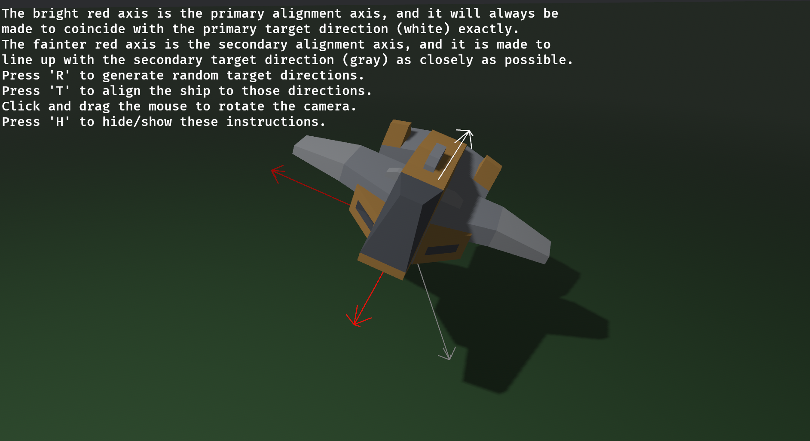

## 6.1 向量与变换

### 6.1.1 向量

在线性代数中，我们学习过，如果我们确定了一组线性无关的基，那么三维空间中的某个点坐标，可以使用一个向量来表示。一般而言，我们经常取一组空间相互正交的基，并令他们的模长为1，于是，我们的xyz三个轴的基向量分别表示为:$\mathbf{e_x}$、$\mathbf{e_y}$、$\mathbf{e_z}$。且相互之间两两做点积为0。

对于空间中的一个向量，利用我们的正交基，可以将其表示为$$\mathbf{a} = x \mathbf{e_x} + y \mathbf{e_y} + z \mathbf{e_z}$$即：

$$
\mathbf{a} = 
\begin{bmatrix} 
\mathbf{e}_x & \mathbf{e}_y & \mathbf{e}_z 
\end{bmatrix} 
\begin{bmatrix} 
x \\ y \\ z 
\end{bmatrix}
$$

一般情况下，我们将其基的三个系数，成为a在该基下的坐标。即$\mathbf{a}$的坐标为$\begin{bmatrix} x \\ y \\ z  \end{bmatrix} $

### 6.1.2 旋转

现在，假设我们有两组正交基，它们分别为 $\{\mathbf{e}_x, \mathbf{e}_y, \mathbf{e}_z\}$（世界空间基）和 $\{\mathbf{e}'_x, \mathbf{e}'_y, \mathbf{e}'_z\}$（局部空间基）。同一个空间向量 $\mathbf{r}$ 在这两组基下的表示分别为：

$$
\mathbf{r} =  \begin{bmatrix}  \mathbf{e}_x & \mathbf{e}_y & \mathbf{e}_z  \end{bmatrix}  \begin{bmatrix}  x \\ y \\ z  \end{bmatrix}
$$

$$
\mathbf{r} =  \begin{bmatrix}  \mathbf{e}'_x & \mathbf{e}'_y & \mathbf{e}'_z  \end{bmatrix}  \begin{bmatrix}  x' \\ y'  \\ z'   \end{bmatrix}
$$

于是，我们得到等式：

$$
\begin{bmatrix} \mathbf{e}_x & \mathbf{e}_y & \mathbf{e}_z \end{bmatrix} \begin{bmatrix} x \\ y \\ z \end{bmatrix} = \begin{bmatrix} \mathbf{e}'_x & \mathbf{e}'_y & \mathbf{e}'_z \end{bmatrix} \begin{bmatrix}  x' \\ y'  \\ z'  \end{bmatrix}
$$

现在，我们假设第二组正交基（局部基）中的每一个向量，都可以通过第一组基（世界基）的线性组合来表示。即：

$$
\begin{cases}  \mathbf{e}'_x = r_{11}\mathbf{e}_x + r_{21}\mathbf{e}_y + r_{31}\mathbf{e}_z \\ \mathbf{e}'_y = r_{12}\mathbf{e}_x + r_{22}\mathbf{e}_y + r_{32}\mathbf{e}_z \\ \mathbf{e}'_z = r_{13}\mathbf{e}_x + r_{23}\mathbf{e}_y + r_{33}\mathbf{e}_z  \end{cases}
$$

将其写成矩阵形式，我们得到了两组正交基的变换公式：

$$
\begin{bmatrix} \mathbf{e}'_x & \mathbf{e}'_y & \mathbf{e}'_z \end{bmatrix} =  \begin{bmatrix} \mathbf{e}_x & \mathbf{e}_y & \mathbf{e}_z \end{bmatrix} \begin{bmatrix}  r_{11} & r_{12} & r_{13} \\ r_{21} & r_{22} & r_{23} \\ r_{31} & r_{32} & r_{33}  \end{bmatrix}
$$

我们将这个中间的 $3 \times 3$ 矩阵记为 $\mathbf{R}$。将其带入之前的等式：

$$
\begin{bmatrix} \mathbf{e}_x & \mathbf{e}_y & \mathbf{e}_z \end{bmatrix}  \begin{bmatrix} x \\ y \\ z \end{bmatrix} =  \begin{bmatrix} \mathbf{e}_x & \mathbf{e}_y & \mathbf{e}_z \end{bmatrix} \mathbf{R}  \begin{bmatrix}  x' \\ y'  \\ z'   \end{bmatrix}
$$

由于基向量是线性无关的，我们便得到了两组坐标的转换公式：

$$
\begin{bmatrix} x \\ y \\ z \end{bmatrix} = \mathbf{R} \begin{bmatrix} x' \\ y'  \\ z'  \end{bmatrix}
$$

既然我们已经建立了等式 $\mathbf{x} = \mathbf{R}\mathbf{a}$，那么反过来，如果我们已知旋转后的向量在世界空间中的表示 $\mathbf{x}$，想要推导它在局部空间（即相对于那组新基 $\{\mathbf{e}'_x, \mathbf{e}'_y, \mathbf{e}'_z\}$）的坐标 $(x', y', z')$，该怎么办？

利用正交基的一个核心性质：**向量与基向量的点积即为该向量在该方向上的分量投影**。我们将等式两边同时与局部基向量做点积：

$$
\begin{cases}  x' = \mathbf{r} \cdot \mathbf{e}'_x \\ y' = \mathbf{r} \cdot \mathbf{e}'_y \\ z' = \mathbf{r} \cdot \mathbf{e}'_z  \end{cases}
$$

将 $\mathbf{r} = x \mathbf{e}_x + y \mathbf{e}_y + z \mathbf{e}_z$ 代入：

$$
x' = (x \mathbf{e}_x + y \mathbf{e}_y + z \mathbf{e}_z) \cdot \mathbf{e}'_x = x(\mathbf{e}_x \cdot \mathbf{e}'_x) + y(\mathbf{e}_y \cdot \mathbf{e}'_x) + z(\mathbf{e}_z \cdot \mathbf{e}'_x)
$$

同理可得 $b$ 和 $c$。写成矩阵形式：

$$
\begin{bmatrix}  x' \\ y'  \\ z'   \end{bmatrix} =  \begin{bmatrix}  \mathbf{e}_x \cdot \mathbf{e}'_x & \mathbf{e}_y \cdot \mathbf{e}'_x & \mathbf{e}_z \cdot \mathbf{e}'_x \\ \mathbf{e}_x \cdot \mathbf{e}'_y & \mathbf{e}_y \cdot \mathbf{e}'_y & \mathbf{e}_z \cdot \mathbf{e}'_y \\ \mathbf{e}_x \cdot \mathbf{e}'_z & \mathbf{e}_y \cdot \mathbf{e}'_z & \mathbf{e}_z \cdot \mathbf{e}'_z  \end{bmatrix} \begin{bmatrix} x \\ y \\ z \end{bmatrix}
$$

观察这个矩阵中的每一个元素。由于我们的基向量均为单位向量（模长为 1），根据点积的定义 $\mathbf{u} \cdot \mathbf{v} = |\mathbf{u}||\mathbf{v}|\cos\theta$，每一个元素 $\mathbf{e}_i \cdot \mathbf{e}'_j$ 实际上就是**两组基向量之间夹角的余弦值**。

因此，这个矩阵被称为**方向余弦矩阵**。并且，他就是$\mathbf{R}$的逆矩阵$\mathbf{R}^{-1}$

现在，我们将这个发现与之前的旋转矩阵 $\mathbf{R}$ 进行对比。你会发现一个极其优美的数学对称性：

1. **从局部到世界**：矩阵 $\mathbf{R}$ 的**列**是新基在旧基下的投影。
2. **从世界到局部**：上面这个投影矩阵的**行**是新基在旧基下的投影。

这意味着，对于正交旋转矩阵，**其逆矩阵等于其转置矩阵**（$\mathbf{R}^{-1} = \mathbf{R}^T$，这是一个很重要的性质！）。

**小结：不管是如何进行旋转变换，我们总要找出一个旋转矩阵，然后用旋转矩阵和原来的坐标做左乘，即可得到新的旋转之后的坐标。在正交基的情况下，这个矩阵就是方向余弦阵，因此我们有**
$$
\mathbf{x'} = \mathbf{R}^{-1}\mathbf{x}= \mathbf{R}^{T}\mathbf{x} \\
\mathbf{x} = \mathbf{R} \mathbf{x'}
$$

### 6.1.3 平移

相对于旋转，平移在直觉上要简单得多。在三维空间中，平移仅仅是将物体从一个点 $\mathbf{p}$ 移动到另一个点 $\mathbf{p}'$，其变换过程可以简单地表示为向量加法：
$$
\mathbf{p}' = \mathbf{p} + \mathbf{t}
$$


其中 $\mathbf{t} = [t_x, t_y, t_z]^T$ 是我们的平移向量。

### 6.1.4 World-to-Local

到目前为止，我们已经用 $3 \times 3$ 矩阵 $\mathbf{R}$ 解决了旋转和缩放。如果我们想对坐标系同时进行旋转和平移，那么我们的坐标变换公式会变成：
$$
\mathbf{x'} = \mathbf{T}\mathbf{x} + \mathbf{t}
$$
其中$\mathbf{x}$是原来坐标系下的坐标，$\mathbf{x'}$是变换之后的坐标。

这个公式在数学上被称为**仿射变换**。然而，从计算机图形学和引擎设计的角度来看，这个公式不适合硬件加速运算：

1. **无法合并**：如果你有一连串的变换（比如父实体转了 30 度并移动了 5 米，子实体又转了 20 度），必须交替进行矩阵乘法和向量加法，这使得变换的复合变得极其复杂。
2. **原点的“诅咒”**：对于任何 $3 \times 3$ 矩阵 $\mathbf{M}$，都有 $\mathbf{M} \cdot \mathbf{0} = \mathbf{0}$。这意味着在线性变换的视角下，原点是被钉死的，你永远无法通过“乘法”把一个处于原点的物体挪走。

为了将平移这个“加法”操作统一进矩阵的“乘法”大门，我们需要引入**齐次坐标**。我们将三维向量 $[x, y, z]^T$ 提升到四维，增加一个分量 $w=1$。

通过构建一个 **$4 \times 4$ 矩阵**，可以将旋转 $\mathbf{R}$ 和平移 $\mathbf{t}$ 完美地融合在一起：
$$
\begin{bmatrix} x' \\ y'  \\ z'   \\ 1 \end{bmatrix} = 
\left[ \begin{array}{ccc|c} 
\mathbf{e}'_x \cdot \mathbf{e}_x & \mathbf{e}'_x \cdot \mathbf{e}_y & \mathbf{e}'_x \cdot \mathbf{e}_z & t_a \\
\mathbf{e}'_y \cdot \mathbf{e}_x & \mathbf{e}'_y \cdot \mathbf{e}_y & \mathbf{e}'_y \cdot \mathbf{e}_z & t_b \\
\mathbf{e}'_z \cdot \mathbf{e}_x & \mathbf{e}'_z \cdot \mathbf{e}_y & \mathbf{e}'_z \cdot \mathbf{e}_z & t_c \\
\hline 
0 & 0 & 0 & 1 
\end{array} \right]
\begin{bmatrix} x \\ y \\ z \\ 1 \end{bmatrix}
$$
对于这个式子，我们把中间的矩阵记作如下，这个变换叫做 **World-to-Local（世界坐标系到局部坐标系）** 变换，其中$\mathbf{P}$是新的局部坐标系的原点，在世界的局部坐标系下的坐标。
$$
\mathbf{M}_{W \to L} = \left[ \begin{array}{c:c} 
\mathbf{R}^T_{3 \times 3} & \mathbf{t}_{3 \times 1} \\ \hdashline
\mathbf{0}_{1 \times 3} & 1 
\end{array} \right] \\
\mathbf{t} = - \mathbf{R}^T \mathbf{P}
$$


当展开这个矩阵乘法时，你会发现：

- 前三列与坐标相乘，完成了旋转。
- 第四列与 $w=1$ 相乘，恰好将平移分量 $t_x, t_y, t_z$ 加到了结果中。

这说明，**无论多么复杂的变换序列（移动、旋转、再移动、再缩放），在底层都可以坍缩为一连串 4x4 矩阵的连乘。** 这也是为什么 GPU 专门针对 4x4 矩阵运算进行了硬件优化。

**小结：如果假设点不动，而坐标系发生了旋转和平移，那么在新的坐标系下的坐标x'与x的关系为：**
$$
\mathbf{x'} = \mathbf{M}_{W \to L} \mathbf{x} \\
\mathbf{M}_{W \to L} = \left[ \begin{array}{c:c} 
\mathbf{R}^T_{3 \times 3} & \mathbf{t}_{3 \times 1} \\ \hdashline
\mathbf{0}_{1 \times 3} & 1 
\end{array} \right]
$$

### 6.1.5 Local-to-World

在前面的讨论中，我们研究的是如何将世界坐标映射到新的局部坐标系中。但在构建场景时，我们更常见的操作是：**定义一个物体在自己的局部空间中的样子，然后将其“放置”到世界空间中。**

如果我们已知点在局部坐标系下的坐标 $\mathbf{x'}$，想要反求它在世界坐标系下的坐标 $\mathbf{x}$，只需要对之前的等式 $\mathbf{x'} = \mathbf{M} \mathbf{x}$ 进行求逆操作：
$$
\mathbf{x} = \mathbf{M}^{-1}_{W \to L} \mathbf{x'}
$$


我们将这个逆矩阵记为 $\mathbf{M}_{L \to W}$。对于齐次变换矩阵 $\mathbf{M}$，其逆矩阵具有非常特殊的结构。利用旋转矩阵的正交性（$\mathbf{R}^{-1} = \mathbf{R}^T$），我们可以直接写出这个矩阵：
$$
\mathbf{M}_{L \to W} = \left[ \begin{array}{c:c}  \mathbf{R}_{3 \times 3} & \mathbf{t}'_{3 \times 1} \\ \hdashline \mathbf{0}_{1 \times 3} & 1  \end{array} \right] \\
\mathbf{t}' = -\mathbf{R}\mathbf{t} = \mathbf{P}
$$

> **注意**：这里的 $\mathbf{R}$ 不再带转置，因为它代表的是局部基向量在世界空间下的方向。$t'$不仅仅是平移的负，而是旋转和平移整体作用后的负

在 Bevy 中，当你创建一个实体并设置它的 `Transform` 时，你本质上就是在定义这个 **Local-to-World** 矩阵：

- **旋转（Rotation）**：填充矩阵左上角的 $3 \times 3$ 部分。
- **平移（Translation）**：填充矩阵第四列的前三个元素。

### 6.1.7 点旋转时的变换

在上面，我们讨论的都是**坐标系动、点不动**的情况。现在，我们切换到另一个视角：**坐标系 $\{\mathbf{e}_x, \mathbf{e}_y, \mathbf{e}_z\}$ 始终固定不变**，而空间中的点（或向量）从 $\mathbf{p}$ 位置旋转到了 $\mathbf{p}'$ 位置。

显而易见的，点相当于坐标系转换一个角度，等于坐标系**反向旋转（因此这里是R的逆的逆，即R本身）**一个相同的角度，因此我们可以直接得到。
$$
\mathbf{p}'=\mathbf{R} \mathbf{p}
$$
对于齐次变换，同样可以容易得到：
$$
\mathbf{p'} = \mathbf{M}_{point} \mathbf{p} \\
\mathbf{M}_{point} = \left[ \begin{array}{c:c} 
\mathbf{R}_{3 \times 3} & \mathbf{t}_{3 \times 1} \\ \hdashline
\mathbf{0}_{1 \times 3} & 1 
\end{array} \right]
$$
**除此之外，要注意！这里的$\mathbf{p'}$是在原来的坐标系下的坐标，也就是说他和p是同一个坐标系下面的坐标。**

**上一小节的$\mathbf{x'} = \mathbf{M} \mathbf{x}$中的$\mathbf{x'}$是坐标系在旋转后的，新的坐标系下面的，坐标。这很重要！很多教程往往不能正确区分他们。**

### 6.1.8 几种情况下的计算方法

情况1：假设某点坐标为$\mathbf{x}$，其按照如下顺序进行了变换：首先**相对于原始坐标系**旋转了一个角度，变换矩阵为$\mathbf{M}_{point1}$得到$\mathbf{x'}$，然后**又相对于原始坐标系**再次旋转了一个角度，变换矩阵为$\mathbf{M}_{point2}$，那么最终坐标$\mathbf{x''}$和$\mathbf{x}$的关系是什么？

**注意⚠️！这里是点绕着坐标系旋转，而不是坐标系本身在变化**

根据上一小节中的内容，经过第一次旋转后，点的位置变为：
$$
\mathbf{x}' = \mathbf{M}_{point1} \mathbf{x}
$$
此时，$\mathbf{x}'$ 是一个在原始坐标系下表达的新坐标值。

因为第二次旋转 $\mathbf{M}_2$ 依然是相对于**原始坐标系**定义的，它直接作用于当前空间中的任何向量。由于 $\mathbf{x}'$ 此时已经在原始坐标系中就位，我们直接对其应用 $\mathbf{M}_2$：
$$
\mathbf{x}'' = \mathbf{M}_{point2} (\mathbf{x}')
$$
将步骤 1 的等式代入步骤 2，利用矩阵乘法的结合律我们得到：
$$
\mathbf{x}'' =\mathbf{M}_{point2} \mathbf{M}_{point1} \mathbf{x}
$$
用处：这个公式解释了一个物体的中心点坐标应该如何在固定的世界坐标系中连续变换，只需要**不断的左乘在原来的结果**上即可。

---

情况2：假设某点坐标为$\mathbf{x}$，其**坐标系**按照如下顺序进行了变换：首先**相对于原始坐标系**旋转了一个角度，坐标系的变换矩阵为$\mathbf{M}_{L1 \to W}$，然后**又相对于原始坐标系**再次旋转了一个角度，坐标系变换矩阵为$\mathbf{M}_{L2 \to W}$，那么在最终的坐标系下的坐标$\mathbf{x''}$和$\mathbf{x}$的关系是什么？

**注意⚠️！这里是坐标本身在旋转，而点没有发生变化**

这个问题要稍微难一些。重新回顾我们前面的定义，如果有局部坐标下的坐标 $\mathbf{x'}$，想要反求它在世界坐标系下的坐标 $\mathbf{x}$，我们有：
$$
\mathbf{x'} = \mathbf{M}^{-1}_{L1 \to W} \mathbf{x}
$$
现在，我们来考察这两次变换后，最终的坐标系的基，在世界坐标系下的是什么。由于我们仅考虑旋转，因此平移向量是零向量。因此我们得到，每一次变换后，基的变换矩阵为：
$$
\mathbf{M}_{point} = \left[ \begin{array}{c:c} 
\mathbf{R}_{3 \times 3} & \mathbf{0}_{3 \times 1} \\ \hdashline
\mathbf{0}_{1 \times 3} & 1 
\end{array} \right] = \mathbf{M}_{L \to W}
$$
根据情况1的结论，当一个点（向量）绕着定轴连续绝对变换时，基的最终坐标为
$$
\begin{bmatrix} \mathbf{e''}_x & \mathbf{e''}_y & \mathbf{e''}_z \end{bmatrix} =  \mathbf{M}_{L2 \to W}  \mathbf{M}_{L1 \to W} \begin{bmatrix} \mathbf{e}_x & \mathbf{e}_y & \mathbf{e}_z \end{bmatrix}
$$
由于点没有发生变化，因此我们有:
$$
\begin{bmatrix} \mathbf{e}_x & \mathbf{e}_y & \mathbf{e}_z \end{bmatrix} \begin{bmatrix} x \\ y \\ z \end{bmatrix} = \mathbf{M}_{L2 \to W}  \mathbf{M}_{L1 \to W} \begin{bmatrix} \mathbf{e}_x & \mathbf{e}_y & \mathbf{e}_z \end{bmatrix} \begin{bmatrix}  x'' \\ y''  \\ z''  \end{bmatrix}
$$
因此我们得到（只有在$\begin{bmatrix} \mathbf{e}_x & \mathbf{e}_y & \mathbf{e}_z \end{bmatrix} $是单位阵下才成立）：
$$
\mathbf{x}'' =\mathbf{M}^{-1}_{L1 \to W}  \mathbf{M}^{-1}_{L2 \to W} \mathbf{x} = (\mathbf{M}_{L2 \to W}  \mathbf{M}_{L1 \to W})^{-1} \mathbf{x}
$$
用处：这个公式解释了**多个旋转如何被合并为一个旋转**。

---

情况3：假设某点坐标为$\mathbf{x}$，其**坐标系**按照如下顺序进行了变换：首先**相对于原始坐标系**旋转了一个角度，坐标系的变换矩阵为$\mathbf{M}_{L1 \to W}$，然后**又相对已经旋转后的新的坐标系**再次旋转了一个角度，坐标系变换矩阵为$\mathbf{M}_{L2 \to L1}$，那么最终坐标$\mathbf{x''}$和$\mathbf{x}$的关系是什么？

在第一次旋转时，对于新坐标系下的坐标$\mathbf{x'}$：
$$
\mathbf{x} = \mathbf{M}_{L1 \to W} \mathbf{x'}
$$
在第二次旋转时，对于最终的坐标系系下的坐标$\mathbf{x''}$：
$$
\mathbf{x'} = \mathbf{M}_{L2 \to L1} \mathbf{x''}
$$
我们可以得到
$$
\mathbf{x} = \mathbf{M}_{L1 \to W}\mathbf{M}_{L2 \to L1} \mathbf{x''}
$$
用处：这个公式解释了如何**相对自己目前的坐标来进行连续旋转**，只需要**不断的右乘在原来的变换矩阵**上即可。


---

### 6.1.9 总结

**上面各个例子也有对应的World To Local变换下的结果，但是最结论里的顺序都是相同的。**

**这部分相对来说比较绕，记住一个口诀“外左内右”：**

- **外**生变换（绕固定世界轴）：新矩阵往**左**边乘。
- **内**生变换（绕自身局部新轴）：新矩阵往**右**边乘。

## 6.2 四元数

### 6.2.1 万向锁问题

在上面的情况二和情况三中，我们介绍了将多个旋转合并为一个旋转的方法。然而在一般的实践中，我们常常用到的是情况三。因为我们人类习惯性的都会把旋转**相对于“当前的坐标系”，而不是最初的那个固定的原始坐标系**。

通过这种方式，我们可以将一次旋转分别分别成先后绕着$XYZ$的三次旋转，这样就可以很直观的方式来描述旋转。**注意！绕着XYZ和YXZ的顺序并不一样，这是因为矩阵乘法不是可交换的**。再例如，如果你做过类似航空、GIS、卫星相关的领域，那么你一定也知道“偏航角，俯仰角，滚动角”，这是一组经典的按照$ZYX$的顺序旋转。其中，$Z$轴朝正上方，$X$轴朝物体前方，$Y$轴则和$ZX$平面垂直（你能想象得到吗？，这种$ZYX$的习惯在游戏中也经常使用，在游戏中$Z$轴朝正上方，$X$轴朝物体前方，$Y$轴则和$ZX$平面垂直）。因此我们的旋转是：

1. 绕**物体自身的**Z轴旋转，旋转角度$yaw$
2. 绕**旋转之后的**Y轴旋转，旋转角度$pitch$
3. 绕**旋转之后的**X轴旋转。旋转角度$roll$

然而，如果你平时经常研究物理，那你一定知道采用这种方式来表达旋转会导致著名的万向锁问题。让我们来回忆一下，什么是万象锁吧。以$ZYX$旋转为例，当我们的俯仰角，也就是Y旋转了90度时，第一次旋转与第三次旋转将使用同一个轴。这是什么意思呢？

让我们来分析一下。现在我们就是游戏中的角色：

1. 我们首先往左看，“偏航”了一个角度，假设我们这次的旋转矩阵是$\mathbf{Yaw}_{W \to L1}$，下标为$W$是因为现在我们假设一开始是世界坐标系中，通过旋转我们进入了新的坐标系$L1$中。这时候我们得到了新的X和Y轴，而Z轴不变。
2. 然后我们直接抬头正视上方盯着天空。假设我们这时得到的旋转矩阵是$\mathbf{Pitch}_{L1 \to L2}$，这时候我们的新的X轴和Z轴，Y轴不变，但是，这时候可以发现，我们现在的新的X周和第一步的Z轴**重合**了。
3. 最后，我们绕着第二步得到的新X轴旋转，记作旋转矩阵$\mathbf{Roll}_{L2 \to L3}$得到了最终的结果。
4. 我们最终的变换矩阵则为$\mathbf{Yaw}_{W \to L1}\mathbf{Pitch}_{L1 \to L2}\mathbf{Roll}_{L2 \to L3}$(因为我们每次都是绕着上次旋转得到的新坐标系，遵从外左内右的规则，我们往右乘)

这里，我们就会发现，在第二步的时候我们注意到了一件非常重要的事情，我们最新的X轴和一开始的Z轴重合了。这有什么含义？这意味着，我们可以将3中的旋转，等同于一个“相对于最初的Z”轴的旋转，然而，我们1中的旋转，也是“相对于最初的Z”轴的旋转。

这在数学上意味着什么？按照外左内右的结论，如果我们把最后一次的旋转看作“相对于最初的Z”轴的旋转，这意味着我们好像可以把整个矩阵重写为这样$\mathbf{Roll'}_W\mathbf{Yaw}_{W \to L1}\mathbf{Pitch}_{L1 \to L2}$，然后我们可以发现似乎前两个式子由于都在同一个坐标系下，他们是可以被合并为同一个旋转的，于是我们在3中的旋转，可以直接被1中的旋转“一块”完成了。这次旋转失去了他的意义。

当最后一次旋转失去了意义，这就意味着我们的公式是有死角的，下面给出一个具体的例子来说明，什么情况下我们会遇到这在问题。

在游戏中，相机的朝向也可以用一个相对于世界坐标系的三次旋转来表达。在一些古早的游戏中，当玩家在游戏中将视角完全抬起，直视天空（$pitch = 90^\circ$）时，然后进行如下操作：

- **动作：** 玩家试图轻轻地水平移动鼠标（想要控制角色“偏航”）。
- **现象：** 游戏画面并没有平滑地水平旋转，而是发生极为**剧烈的翻转、跳跃，甚至整个画面倒置**。

这是因为，当时当时的许多游戏底层使用欧拉角来存储鏡头的姿态，并通过**插值**来实现平滑的视角转换。当玩家在直视天空时输入了一个微小的水平移动 $\Delta \text{yaw}$。由于角度处于 $y=90^\circ$ 这个奇异点时，雅可比矩阵的秩亏损（这时我们几乎相当于少了一个自由度，算出的分母非常小以至于近乎为0），如果不再代码中专门处理好这种情况。微小的 $\Delta \text{yaw}$ 输入，在求解公式中就会导致分母为0时算出的解非常巨大。结果就是，在游戏引擎在短短的一帧内，计算出了角度的剧烈跳变。反映在画面上，就是镜头在这一帧内疯狂旋转了近 180 度，造成了“视角错乱”。

### 6.2.2 四元数定义

为了彻底解决欧拉角带来的万象锁与计算奇异性，哈密顿（Hamilton）提出了著名的**四元数(Quaternion)**。要理解四元数，我们必须先跳出‘分步拆解’的思维，认识旋转的另一种形式：**轴角表示法**。

前面我们一直在尝试分解旋转，实际上，我们也可以找出一个特殊的旋转向量$n=[n_x,n_y,x_z]^T$，把旋转描述为：“绕着这个旋转向量旋转一个角度”。

这是什么意思呢？想象你在空间中插了一根柱子（旋转轴 $\mathbf{n}$），然后让物体绕着这根柱子拧动一个角度 $\theta$。这个描述只需要一个单位向量和一个角度，完全不涉及“先后顺序”，因此从定义上就**消灭了万象锁**。然而，这个方法的缺点是数学处理非常繁琐，甚至还专门产生了著名的罗德里格旋转公式（感兴趣的读者可以去看一下）。因此，有什么更好的方法，既能通过这样的旋转来避开万象锁的问题，又能便于计算机和人来计算吗？答案就是，四元数。

对于四元数，我们不再详细的复杂证明，而是直接给出结论。

在数学上，四元数可以看作是复数的扩充。一个四元数 $\mathbf{q}$ 由一个实部和三个虚部组成：
$$
\mathbf{q} = w + x\mathbf{i} + y\mathbf{j} + z\mathbf{k}
$$
其中 $w, x, y, z$ 是实数，而 $\mathbf{i, j, k}$ 是三个相互正交的虚数单位，满足哈密顿著名的公式：
$$
\mathbf{i}^2 = \mathbf{j}^2 = \mathbf{k}^2 = \mathbf{ijk} = -1
$$
为了方便工程计算，我们常将其写成**标量-向量**的形式：
$$
\mathbf{q} = [w, \mathbf{v}], \quad \text{其中 } \mathbf{v} = [x, y, z]^T
$$
四元数与旋转向量和旋转角有非常直接的对应关系，要描述“绕单位向量 $\mathbf{n}$ 旋转 $\theta$ 角度”这一动作，对应的**单位四元数**定义为：
$$
\mathbf{q} = \left[ \cos\frac{\theta}{2}, \mathbf{n}\sin\frac{\theta}{2} \right]
$$
即：

- $w = \cos(\theta/2)$
- $x = n_x \sin(\theta/2)$
- $y = n_y \sin(\theta/2)$
- $z = n_z \sin(\theta/2)$

注意到这里是$\theta/2$，好像给了我们一种“只转了一半的感觉”。对于开始位置，即不旋转的时候，我们有$n=[1,0,0,0]$

### 6.2.3 四元数的运算

四元数有一些定义的运算，这些常见的运算如下

#### 1. 加法与减法

这是最直观的运算，对应分量直接相加减。

$$\mathbf{q}_1 \pm \mathbf{q}_2 = [w_1 \pm w_2, \mathbf{v}_1 \pm \mathbf{v}_2]$$

#### 2. 四元数乘法（格拉斯曼积）

两个四元数 $\mathbf{q}_1, \mathbf{q}_2$ 的乘积并不是分量相乘，而是遵循类似多项式展开的规则：

$$\mathbf{q}_1 \mathbf{q}_2 = [w_1w_2 - \mathbf{v}_1 \cdot \mathbf{v}_2, \ w_1\mathbf{v}_2 + w_2\mathbf{v}_1 + \mathbf{v}_1 \times \mathbf{v}_2]$$

**这里有一点极其重要：**

- **不可交换性**：由于公式中包含向量叉乘（$\mathbf{v}_1 \times \mathbf{v}_2$），所以 $\mathbf{q}_1\mathbf{q}_2 \neq \mathbf{q}_2\mathbf{q}_1$。这与旋转矩阵乘法的性质完全一致。

#### 3. 共轭与求逆

- **共轭**：$\mathbf{q}^* = [w, -\mathbf{v}]$。即实部不变，虚部取反。
- **模长**：$\|\mathbf{q}\| = \sqrt{w^2 + x^2 + y^2 + z^2}$。
- **逆**：$\mathbf{q}^{-1} = \frac{\mathbf{q}^*}{\|\mathbf{q}\|^2}$。

在描述旋转时，我们只使用**单位四元数**（模长为 1）。此时 $\mathbf{q}^{-1} = \mathbf{q}^*$。这对应了旋转矩阵中“逆等于转置”的特点。

### 6.2.4 四元数与旋转

#### 1. 从旋转中构造四元数

要描述“绕单位轴 $\mathbf{n}$ 旋转 $\theta$ 角度”，四元数 $\mathbf{q}$ 的构造公式是：
$$
\mathbf{q} = \left[ \cos\frac{\theta}{2}, \mathbf{n}\sin\frac{\theta}{2} \right] = [w, \mathbf{v}], \quad \text{其中 } \mathbf{v} = [x, y, z]^T
$$
其中，$w$ 记录了旋转角度的信息，而虚部向量 $[x, y, z]$ 则记录了旋转轴的方向及其缩放后的分量。用于旋转的四元数必须是**单位四元数**，即 $\|\mathbf{q}\| = 1$。这能保证旋转不会改变物体的缩放比例。

要构造单位四元数，只需要保证n是一个单位旋转轴即可：


$$
\|\mathbf{q}\|^2 = \cos^2\frac{\theta}{2} + \left(n_x^2 + n_y^2 + n_z^2\right)\sin^2\frac{\theta}{2} = \cos^2\frac{\theta}{2} + \sin^2\frac{\theta}{2} = 1
$$
在实际的物理引擎或游戏引擎中，经过成千上万次的四元数乘法运算后，由于浮点数的精度误差，四元数的模长可能会略微偏离 1。如果 $\|\mathbf{q}\| > 1$，物体会随着旋转不断变大；反之则会萎缩。因此，引擎通常会在每一帧对四元数进行**归一化**处理，确保旋转的“纯净性”：
$$
\mathbf{q}_{normalized} = \frac{\mathbf{q}}{\|\mathbf{q}\|}
$$

#### 2. 利用四元数计算坐标

给定一个空间点（或向量）$\mathbf{p}$，使用四元数 $\mathbf{q}$ 对其进行旋转的计算公式为：
$$
\mathbf{p}' = \mathbf{q} \mathbf{p} \mathbf{q}^*
$$
其中 $\mathbf{q}^*$ 是 $\mathbf{q}$ 的共轭（对于单位四元数，共轭即为其逆 $\mathbf{q}^{-1}$）。这个公式将三维点投影到四维空间进行旋转运算，最后再投影回三维空间。它在数学上完全等价于 $\mathbf{p}' = \mathbf{R}\mathbf{p}$，但计算更平滑且抗干扰。

前面说到，$\theta/2$ 给人一种“只转了一半”的感觉。而在这里，我们可以发现另一半去哪儿了：四元数 $\mathbf{q}$ 与其共轭 $\mathbf{q}^*$ 各自贡献了一次旋转效果，从而在两次“合成”后得到正确的角度。

#### 3. 旋转的复合

对于连续的旋转，四元数同样遵循我们总结的“外左内右”的规则，即：

假设先进行旋转 $\mathbf{q}_1$，再进行旋转 $\mathbf{q}_2$。

- **外生变换**（绕固定世界轴）：总旋转 $\mathbf{q}_{total} = \mathbf{q}_2 \cdot \mathbf{q}_1$。
- **内生变换**（绕自身局部轴）：总旋转 $\mathbf{q}_{total} = \mathbf{q}_1 \cdot \mathbf{q}_2$。

四元数乘法本质上是在执行旋转轴的复合。由于不涉及中间轴的 90° 锁死，无论 $\mathbf{q}_1$ 或 $\mathbf{q}_2$ 是什么角度，乘法结果永远是一个有效的、无畸变的旋转姿态。

如果想把一个旋转“撤销”回来，只需要把四元数的虚部（旋转轴）取反即可。这对应了旋转矩阵的转置 $\mathbf{R}^T$。
$$
\mathbf{q}_{reverse} = \mathbf{q}^* = [w, -\mathbf{v}]
$$

> 与欧拉角对三个角度分别进行线性插值不同，四元数使用 **球面线性插值（Slerp）**。它能保证物体沿着四维超球面上最短的弧线进行平滑转动。无论起始姿态和目标姿态相差多大，球面线性插值都能保证旋转过程是匀速的。因为不涉及角度分解，即便经过 $90^\circ$ 这样的位置，插值过程依然极其丝滑。

## 6.3 Transform示例

Bevy中默认的数学运算库叫做glam，Bevy将其重新导出为了bevy_math这个crate。基本上来说，这个crate中包含了一些基本的数学类型，例如我们上面讲过的向量、矩阵、四元数、还有一些额外的辅助函数和数学曲线生成等，其命名方式非常直观，感兴趣的读者可以查看相关的[文档](https://docs.rs/bevy_math/latest/bevy_math/)即可，这里我们不再赘述，只是简单的列出一些常用的类型。

| 含义     | 类型 |
| -------- | ---- |
| 二维向量 | Vec2 |
| 三维向量 | Vec3 |
| 4x4矩阵  | Mat4 |
| 四元数   | Quat |

让我们来看看，`Transfrom`里到底有什么。翻开源代码，可以看到一个`Transform`包含了三个部分：平移、旋转、缩放。而且旋转是使用四元数来表达的。

> [!IMPORTANT]
>
> 如果实体有父实体，那么这些变换是相对于父实体的位置而言的。（详情见第2章中的Relationship）
>
> 如果实体没有父实体，那么是相对于世界坐标原点而言的

```rust
pub struct Transform {
    pub translation: Vec3,
    pub rotation: Quat,
    pub scale: Vec3,
}
```

那么？我们怎么知道实体在世界坐标系中的坐标呢？bevy为我们提供了一个`GlobalTransform`组件，当你在实体上插入`Transfrom`时，这个组件也会被同时插入。不过一般而言，你不能直接修改实体的`GlobalTransform`，这是由bevy维护的一个内部的坐标状态，通过更改组件的`Transfrom`，bevy会自动更新`GlobalTransform`。

终于说完了这些枯燥的理论知识。还是让我们来看看我们的代码到底应该是怎么工作的吧！这里我们以bevy的最复杂的`Transfrom`[例子](https://github.com/bevyengine/bevy/blob/main/examples/transforms/align.rs)为例来讲解，至于其他的平移和缩放，相信聪明的你能从其他简单的bevy官方仓库的例子里一下子就看懂。

这个比较复杂的例子的名字叫做align，运行`cargo run --example align`，可以发现例子做了一件很简单的事情：当我们按下R随机生成一个旋转轴，按下T时将飞船对齐到旋转轴。



让我们来看看代码都写了些什么？首先，例子里定义了这些组件，这些组件都非常的简单，只有一些需要额外的特殊说明。

```rust

// 这是我们的飞船上的一些组件
#[derive(Component, Default)]
struct Ship {
    /// 用以存储按下T时应该旋转到的角度
    target_transform: Transform,
    /// 一个用来标识飞船当前是否正在旋转的变量，如果飞船还没旋转完成，那么要阻止后续的操作
    in_motion: bool,
}
// Dir3只是一个简单的单位向量，用来代表方向，就是一个归一化的Vec3
// 这对应了图中的两个白色轴
#[derive(Component)]
struct RandomAxes(Dir3, Dir3);

// 一个简单的标识符，用来标识上面的那组文字
#[derive(Component)]
struct Instructions;

// 当前鼠标是否按下，我们需要这个状态因为我们需要按下之后才能拖动视角
#[derive(Resource)]
struct MousePressed(bool);

// 一个随机数生成器而已，不太需要关心
#[derive(Resource)]
struct SeededRng(ChaCha8Rng);
```

第二步，让我们来看看 setup逻辑里都做了一些什么事？

> [!IMPORTANT]
>
> 注意！bevy中的物体的局部坐标系是**-Z轴**是视野正前方，向上是Y轴，X和YZ组成**右手直角坐标系**。
>
> 世界坐标系中，向上是Y轴，从屏幕内只指向屏幕前的你是Z轴，X和YZ组成**右手直角坐标系**

```rust

fn setup(
    mut commands: Commands,
    mut meshes: ResMut<Assets<Mesh>>,
    mut materials: ResMut<Assets<StandardMaterial>>,
    asset_server: Res<AssetServer>,
) {
    // 创建了一个随机数生成器
    let mut seeded_rng = ChaCha8Rng::seed_from_u64(19878367467712);

    // 创建了我们的相机
    // 重点来了！这里终于见到了我们的Transform，前面我们说的相机本身就是一个带有Transfrom的实体
    // 其中视角的朝向就又旋转矩阵所决定，这里的意思是：请给我一个这样的Transform
    // 这个Transform的位置在坐标(3,2.5,4)处，并且他的旋转四元数刚好让视线(z轴)朝着坐标系原点
    // 并且，请保证我的相机自己的局部Y轴和世界坐标系的Y轴“一致”。
    commands.spawn((
        Camera3d::default(),
        Transform::from_xyz(3., 2.5, 4.).looking_at(Vec3::ZERO, Vec3::Y),
    ));

    // 没什么用的东西
    commands.spawn((
        Mesh3d(meshes.add(Plane3d::default().mesh().size(100.0, 100.0))),
        MeshMaterial3d(materials.add(Color::srgb(0.3, 0.5, 0.3))),
        Transform::from_xyz(0., -2., 0.),
    ));

    // 一盏灯光，位置在(4.0, 7.0, -4.0)
    commands.spawn((
        PointLight {
            shadow_maps_enabled: true,
            ..default()
        },
        Transform::from_xyz(4.0, 7.0, -4.0),
    ));

    // 随机生成两个轴
    let first = seeded_rng.random();
    let second = seeded_rng.random();
    commands.spawn(RandomAxes(first, second));

    // 加载我glft模型（还记得怎么加载模型吗？这是一个实体树）
    // 然后让初始化时让飞船的目标角度对准上面两个轴（这里的关键是，什么才算对准？稍后我们揭晓）
    commands.spawn((
        SceneRoot(
            asset_server
                .load(GltfAssetLabel::Scene(0).from_asset("models/ship/craft_speederD.gltf")),
        ),
        Ship {
            target_transform: random_axes_target_alignment(&RandomAxes(first, second)),
            ..default()
        },
    ));

    // 显示文字
    commands.spawn((
        Text::new(
            "The bright red axis is the primary alignment axis, and it will always be\n\
            made to coincide with the primary target direction (white) exactly.\n\
            The fainter red axis is the secondary alignment axis, and it is made to\n\
            line up with the secondary target direction (gray) as closely as possible.\n\
            Press 'R' to generate random target directions.\n\
            Press 'T' to align the ship to those directions.\n\
            Click and drag the mouse to rotate the camera.\n\
            Press 'H' to hide/show these instructions.",
        ),
        Node {
            position_type: PositionType::Absolute,
            top: px(12),
            left: px(12),
            ..default()
        },
        Instructions,
    ));

    commands.insert_resource(MousePressed(false));
    commands.insert_resource(SeededRng(seeded_rng));
}
```

好吧，上面的代码其实看起来简单，但是蕴含的信息其实很多。让我们首先来看看这一行 `Transform::from_xyz(3., 2.5, 4.).looking_at(Vec3::ZERO, Vec3::Y)`。这行代码非常有意思，后面的`looking_at(Vec3::ZERO, Vec3::Y)`的第二个参数是做什么的？

想象一下。当你的把视线中心对准这一行文字，你是不能确定自己的位置的。为什么？因为你可以始终对准这个点，然后以视线轴为中心，左右旋转自己的头。为了确定到底盯着原点看的时候头顶应该朝哪儿，因此我们才需要一个参考轴，这就是世界坐标系的Y轴（朝正上方）。

因此这段代码的后半段的意思是：我要看着这个点，而且我的头顶要朝着天。有意思的是，如果你把Vec3::Y改成-Vue3::Y，你会发现你得把屏幕倒过来看画面才正常。

在让我们看看`random_axes_target_alignment`，这个函数到底做了什么？

```rust
fn random_axes_target_alignment(random_axes: &RandomAxes) -> Transform {
    let RandomAxes(first, second) = random_axes;
    Transform::IDENTITY.aligned_by(Vec3::NEG_Z, *first, Vec3::X, *second)
}
```

这个函数一共其实就两行（其实有用的就一行）。不过这一行代码，也有很丰富的信息量。首先`Transform::IDENTITY`构造了一个单位变换。什么是单位变换？其实等同于坐标为(0,0,0)，旋转为单位四元数(不旋转)，缩放为1的一个`Transform`。然后，调用了`aligned_by`使其**“对齐”**随机生成的两个轴`first`和`second`。

如果你观察力足够强，你肯定能发现很多问题。由于我们前两个轴是随机生成的，他们可不一定是正交的。因此我们要旋转的话是根本不可能完整对齐的。所以，这里才需要四个参数，而且这四个参数的名称很有意思。分别是主轴、主轴方向、副轴、副轴方向。

```rust
pub fn aligned_by(
    mut self,
    main_axis: impl TryInto<Dir3>,
    main_direction: impl TryInto<Dir3>,
    secondary_axis: impl TryInto<Dir3>,
    secondary_direction: impl TryInto<Dir3>,
) -> Self {
    self.align(
        main_axis,
        main_direction,
        secondary_axis,
        secondary_direction,
    );
    self
}
```

这里的对齐，和我们上面讲的`looking_at`其实如出一辙。上面的代码翻译成人话，可以这样来理解：请给我这样一个四元数，让我旋转后我的正前方(`Vec3::NEG_Z`)朝着`first`，同时，我希望我的右侧(`Vec3::X`)**尽可能**的和`second`重合。如果实在重合不了，请给我找一个最小的差。

至于其余的代码，相信聪明的你一眼就能看明白了，这些代码不过是每当我们按下R时，重新生成一对轴然后保存。按下T时解开锁。

```rust
if keyboard.just_pressed(KeyCode::KeyR) {
    // Randomize the target axes
    let first = seeded_rng.0.random();
    let second = seeded_rng.0.random();
    **random_axes = RandomAxes(first, second);

    // Stop the ship and set it up to transform from its present orientation to the new one
    ship.in_motion = false;
    ship.target_transform = random_axes_target_alignment(&random_axes);
}
if keyboard.just_pressed(KeyCode::KeyT) {
    ship.in_motion ^= true;
}
```

然后，利用几个简单的api，就可以控制飞船的`Transform`旋转到我们生成的角度。

```rust
fn rotate_ship(ship: Single<(&mut Ship, &mut Transform)>, time: Res<Time>) {
    let (mut ship, mut ship_transform) = ship.into_inner();

    if !ship.in_motion {
        return;
    }

    let target_rotation = ship.target_transform.rotation;

    ship_transform
        .rotation
        .smooth_nudge(&target_rotation, 3.0, time.delta_secs());

    if ship_transform.rotation.angle_between(target_rotation) <= f32::EPSILON {
        ship.in_motion = false;
    }
}
```

至于剩下的示例，相信你现在已经有足够的水平去看得懂了，这里就不再赘述。
