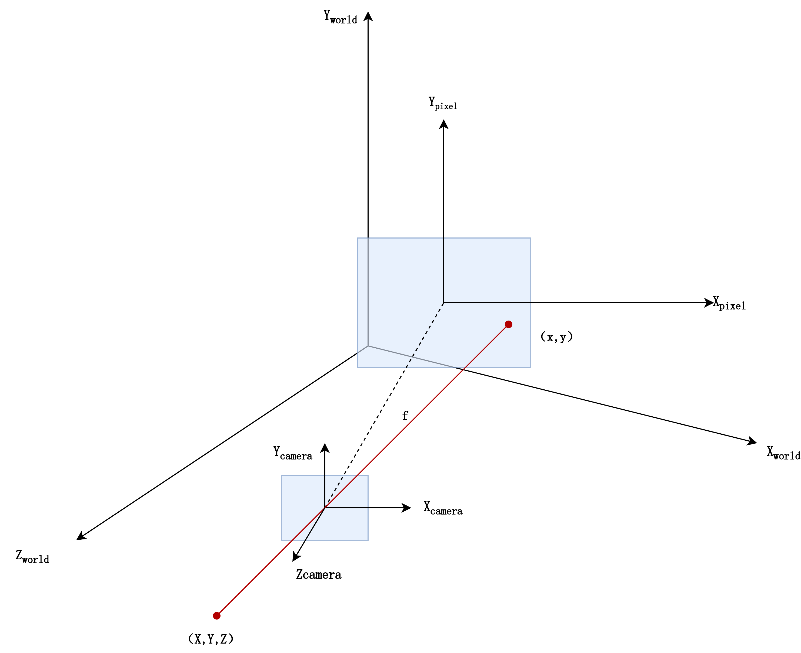
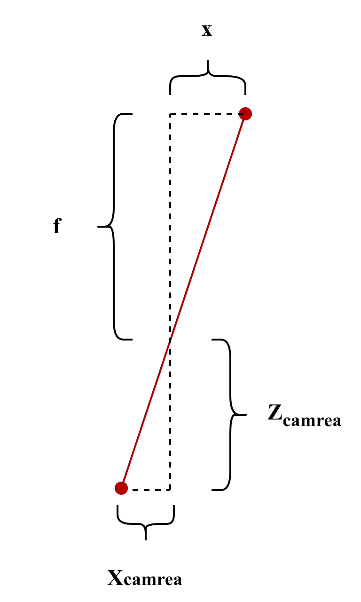
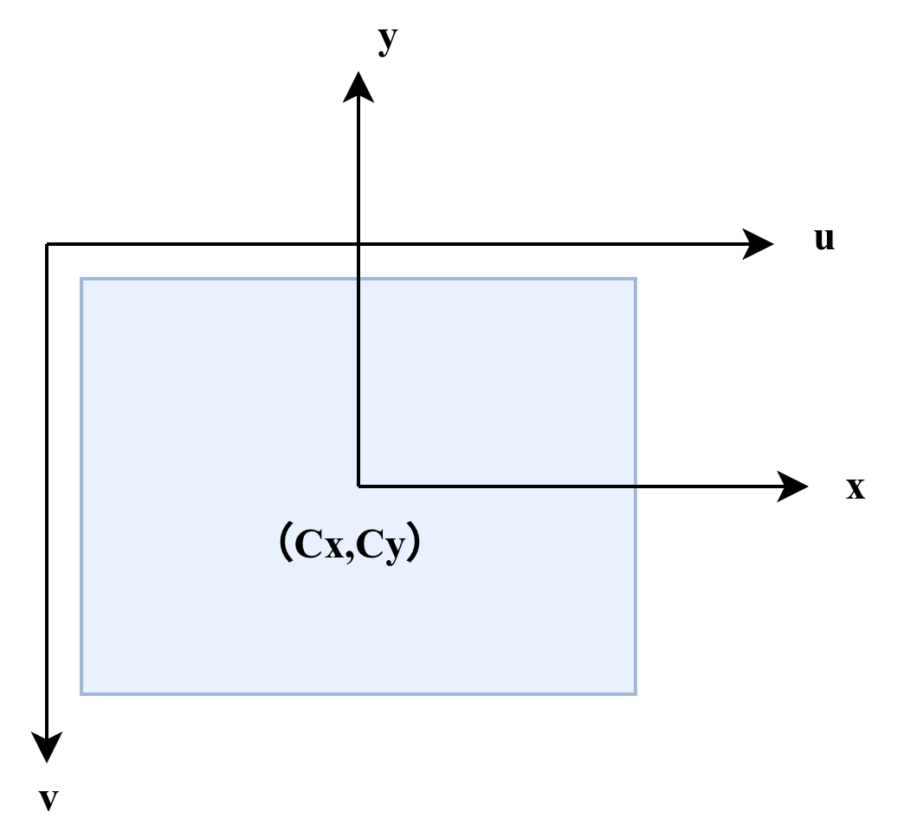

## 7.1 针孔相机模型

要介绍相机的成像原理，必须先讲清楚相机的成像模型。根据第六章中的内容，我们已经知道了在bevy中坐标系的组成和变换公式，现在让我们做如下推理来看看相机到底是怎么成像的。

假设我们的世界坐标是$X_{local}$,$Y_{local}$,$Z_{local}$，根据我们前面的知识，$Z_{local}$由屏幕内指向我们，$Y_{local}$指向正上方，$X_{local}$与前二者组成右手坐标系(即朝右侧)，如下图所示。

假设我们的相机，在世界坐标系中的姿态(以方向余弦阵表示)和坐标表示为：$R$和$P$。根据我们前面的知识，对于空间中的一个在世界坐标系下的点$(X,Y,Z)$，在相机坐标系中的坐标为$(X_{camera},Y_{camera},Z_{camera})$，那么我们有：
$$
\begin{bmatrix} X_{camera} \\Y_{camera}  \\ Z_{camera}   \\ 1 \end{bmatrix} = 
\left[ \begin{array}{c:c} 
\mathbf{R}^T_{3 \times 3} & \mathbf{t}_{3 \times 1} \\ \hdashline
\mathbf{0}_{1 \times 3} & 1 
\end{array} \right] \\
\begin{bmatrix} X \\ Y  \\ Z   \\ 1 \end{bmatrix}
$$

$$
\mathbf{t} = - \mathbf{R}^T \mathbf{P}
$$

根据相似三角形原理，通过透镜成像的几何关系，我们可以推导相机投影模型。

假设相机光心位于坐标原点，光轴与 $Z_{camera}$ 轴重合。一个位于相机前方距离为 $Z_{camera}$ 的点 $(X_{camera}, Y_{camera}, Z_{camera})$，经过焦距为 $f$ 的透镜，在成像平面上形成点 $(x, y, -f)$。

根据几何相似关系，我们将成像平面放在光心前方（焦距 $f$ 处），此时推导出的投影关系为：
$$
\frac{x}{f} = \frac{X_{camera}}{-Z_{camera}} \implies x = -f \frac{X_{camera}}{Z_{camera}}
$$

$$
\frac{y}{f} = \frac{Y_{camera}}{-Z_{camera}} \implies y = -f \frac{Y_{camera}}{Z_{camera}}
$$

这里的负号揭示了**针孔相机的特性之一：倒立成像**。根据几何光学的相似三角形，物体在成像平面上的投影相对于原物体是上下左右颠倒的。为了在数值处理上更符合直觉，我们通常会对投影结果再取一次负号（或者将成像平面定义在光心前方），从而将模型修正为正立的投影：
$$
x = f \frac{X_{camera}}{Z_{camera}}, \quad y = f \frac{Y_{camera}}{Z_{camera}}
$$
观察上面的式子，由于右侧存在除以 $Z_c$ 的操作，这在齐次坐标的线性矩阵乘法中是无法直接表示的。为了将其转化为矩阵运算，我们**将方程两侧同时乘以 $Z_c$**：
$$
Z_c \cdot x = f \cdot X_c
$$

$$
Z_c \cdot y = f \cdot Y_c
$$

$$
Z_c \cdot 1 = 1 \cdot Z_c
$$

现在，我们将这三个线性方程组合起来，就可以构建成一个矩阵乘法运算：
$$
Z_{camera} \begin{bmatrix} x \\ y \\ 1 \end{bmatrix} = \begin{bmatrix} f & 0 & 0  \\ 0 & f & 0  \\ 0 & 0 & 1  \end{bmatrix} \begin{bmatrix} X_{camera} \\ Y_{camera} \\ Z_{camera} \end{bmatrix}
$$
最后，我们将最开始的世界坐标系到相机坐标系的变换关系带入其中，并添加一个维度，可以得到世界坐标到成像平面的直接变换：

$$
Z_{camera} 
\begin{bmatrix} x \\ y \\ 1 \end{bmatrix} = 
\underbrace{
\begin{bmatrix} f & 0 & 0 & 0 \\ 0 & f & 0 & 0 \\ 0 & 0 & 1 & 0 \end{bmatrix}}_{\mathbf{K}}
\underbrace{
\left[ \begin{array}{c:c} 
\mathbf{R}^T_{3 \times 3} & \mathbf{t}_{3 \times 1} \\ \hdashline
\mathbf{0}_{1 \times 3} & 1 
\end{array} \right]}_{\mathbf{T}} 
\begin{bmatrix} X \\ Y \\ Z \\ 1 \end{bmatrix}
$$
上述公式完整描述了 3D 世界点到 2D 成像平面的投影过程，其中包含两个核心矩阵和一个深度因子：

- **$\mathbf{K}$（内参矩阵）**：

  这是一个 $3 \times 4$ 的矩阵（实际上这个矩阵里还应该有两个 代表uv变换的参数，不过这个变换在图形学中用的极少，一般只用在计算机视觉中），它负责将 3D 相机坐标系下的点，按照焦距 $f$ 投影到 2D 平面上。

- **$\mathbf{T}$（外参矩阵）**：

  这是一个 $4 \times 4$ 的矩阵，代表了相机在世界坐标系中的位姿。它通过旋转矩阵 $\mathbf{R}^T$ 和平移向量 $\mathbf{t}$，将任何世界坐标系下的点转换到相机坐标系中。这是一个典型的World-To-Local变换。

- **$Z_{camera}$（深度/归一化因子）**：

  这是公式中最特殊的部分。观察矩阵乘法的结果，你会发现左侧是一个三维向量，其中最后一个分量正好是 $Z_{camera}$。在齐次坐标体系中，**该分量代表了点在相机坐标系下的垂直深度**。

  这也是为什么我们需要在矩阵运算后执行**“透视除法”**：因为矩阵运算的结果左侧不是直接的 $(x, y, 1)^T$，而是 $(Z_c \cdot x, Z_c \cdot y, Z_c)^T$。要得到最终的成像坐标 $(x, y)$，我们必须将前两个分量除以第三个分量 $Z_{camera}$。

记得我们之前说过，bevy中相机的-z轴是视野正前方，现在你能解释为什么了吗?

> [!NOTE]
>
> 观察第一幅图，如果你想要观察成像平面，你应该怎么看？这时候$Z_{camera}$朝什么方向？

---

还是让我们来简单的再讲一下uv变换吧(不然总感觉不够完整)。

前面我们得到了成像平面内的坐标，但是在最后，我们还需要将物理平面的坐标 $(x, y)$ 映射到图像的 像素坐标 $(u, v)$。

在成像平面上，假设我们的成像平面坐标系的原点位于$(c_x, c_y)$，通常这个点被称为**像主点**，而像素坐标系的原点位于图像的左上角这之间很明显差了一个平移和翻转。此外，还需要考虑物理单位与像素之间的缩放比例（$d_x, d_y$）。

**实际上在大多数的计算机视觉领域中，由于一开始采用的y并不是竖直朝上，而是竖直朝下的右手坐标系，因此不存在这个翻转y轴的问题。**

这里我们也以不需要翻转y轴的情况为例。设像素坐标为 $(u, v)$，则uv坐标系与成像平面坐标系的坐标关系为：
$$
u = \alpha \cdot x + c_x
$$

$$
v = \beta \cdot y + c_y
$$

其中 $\alpha$ 和 $\beta$ 是将物理长度转换为像素单位的尺度因子(包含焦距 $f$ 的影响)。为了简化，常将 $f_x = \alpha f$ 和 $f_y = \beta f$ 合并入内参矩阵。最后得到我们的完整的内参矩阵K与投影公式。
$$
Z_{camera} \begin{bmatrix} u \\ v \\ 1 \end{bmatrix} = \begin{bmatrix} f_x & 0 & c_x & 0 \\ 0 & f_y & c_y & 0 \\ 0 & 0 & 1 & 0 \end{bmatrix} \begin{bmatrix} X_{camera} \\ Y_{camera} \\ Z_{camera} \\ 1 \end{bmatrix}
$$
通常情况下，在计算机视觉中，我们才需要通过标定精确测出内参矩阵 $\mathbf{K}$ 以描述真实的物理相机。而在图形学引擎中，我们往往直接通过投影矩阵来定义视锥体。这是因为，**图形学引擎隐含地将像主点 $(c_x, c_y)$ 预设为图像中心**，并将坐标范围通过 NDC（归一化设备坐标）统一映射到了 **$[-1, 1]$ 之间**，从而避免了手动处理像素坐标 $u, v$ 。

## 7.2  Camera2d

// TODO

## 7.3 Camera3d

// TODO
