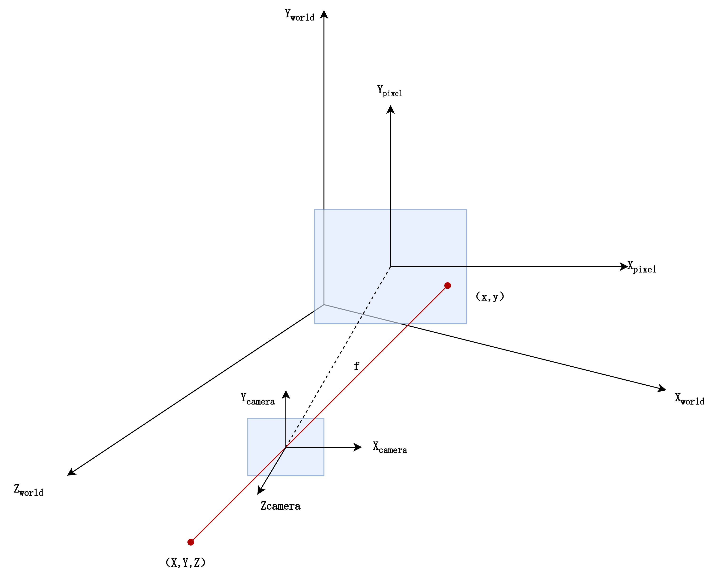
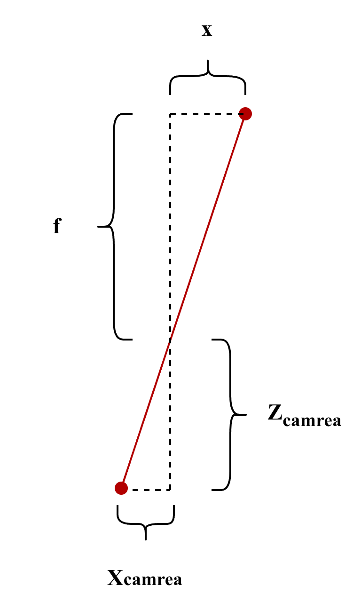
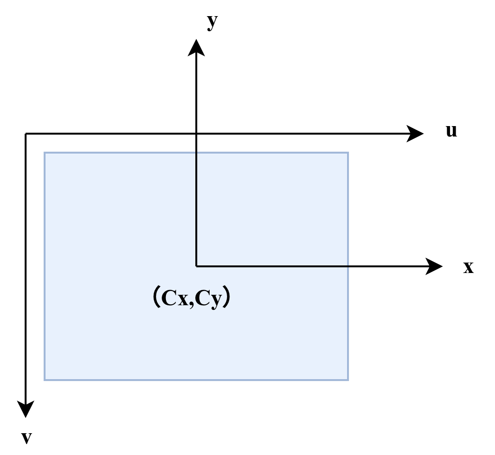

## 7.1 针孔相机模型

要介绍相机的成像原理，必须先讲清楚相机的成像模型。根据第六章中的内容，我们已经知道了在bevy中坐标系的组成和变换公式，现在让我们做如下推理来看看相机到底是怎么成像的。

假设我们的世界坐标是$X_{local}$,$Y_{local}$,$Z_{local}$，根据我们前面的知识，$Z_{local}$由屏幕内指向我们，$Y_{local}$指向正上方，$X_{local}$与前二者组成右手坐标系(即朝右侧)，如下图所示。



假设我们的相机，在世界坐标系中的姿态(以方向余弦阵表示)和坐标表示为：$R$和$P$。根据我们前面的知识，对于空间中的一个在世界坐标系下的点$(X,Y,Z)$，在相机坐标系中的坐标为$(X_{camera},Y_{camera},Z_{camera})$，那么我们有：
$$
\begin{bmatrix} X_{camera} \\Y_{camera}  \\ Z_{camera}   \\ 1 \end{bmatrix} = 
\left[ \begin{array}{c:c} 
\mathbf{R}^T_{3 \times 3} & \mathbf{t}_{3 \times 1} \\ \hdashline
\mathbf{0}_{1 \times 3} & 1 
\end{array} \right] \\
\begin{bmatrix} X \\ Y  \\ Z   \\ 1 \end{bmatrix}
$$

$$
\mathbf{t} = - \mathbf{R}^T \mathbf{P}
$$

根据相似三角形原理，通过透镜成像的几何关系，我们可以推导相机投影模型。



假设相机光心位于坐标原点，光轴与 $Z_{camera}$ 轴重合。一个位于相机前方距离为 $Z_{camera}$ 的点 $(X_{camera}, Y_{camera}, Z_{camera})$，经过焦距为 $f$ 的透镜，在成像平面上形成点 $(x, y, -f)$。

根据几何相似关系，我们将成像平面放在光心前方（焦距 $f$ 处），此时推导出的投影关系为：
$$
\frac{x}{f} = \frac{X_{camera}}{-Z_{camera}} \implies x = -f \frac{X_{camera}}{Z_{camera}}
$$

$$
\frac{y}{f} = \frac{Y_{camera}}{-Z_{camera}} \implies y = -f \frac{Y_{camera}}{Z_{camera}}
$$

这里的负号揭示了**针孔相机的特性之一：倒立成像**。根据几何光学的相似三角形，物体在成像平面上的投影相对于原物体是上下左右颠倒的。为了在数值处理上更符合直觉，我们通常会对投影结果再取一次负号（或者将成像平面定义在光心前方），从而将模型修正为正立的投影：
$$
x = f \frac{X_{camera}}{Z_{camera}}, \quad y = f \frac{Y_{camera}}{Z_{camera}}
$$
观察上面的式子，由于右侧存在除以 $Z_c$ 的操作，这在齐次坐标的线性矩阵乘法中是无法直接表示的。为了将其转化为矩阵运算，我们**将方程两侧同时乘以 $Z_c$**：
$$
Z_c \cdot x = f \cdot X_c
$$

$$
Z_c \cdot y = f \cdot Y_c
$$

$$
Z_c \cdot 1 = 1 \cdot Z_c
$$

现在，我们将这三个线性方程组合起来，就可以构建成一个矩阵乘法运算：
$$
Z_{camera} \begin{bmatrix} x \\ y \\ 1 \end{bmatrix} = \begin{bmatrix} f & 0 & 0  \\ 0 & f & 0  \\ 0 & 0 & 1  \end{bmatrix} \begin{bmatrix} X_{camera} \\ Y_{camera} \\ Z_{camera} \end{bmatrix}
$$
最后，我们将最开始的世界坐标系到相机坐标系的变换关系带入其中，并添加一个维度，可以得到世界坐标到成像平面的直接变换：

$$
Z_{camera} 
\begin{bmatrix} x \\ y \\ 1 \end{bmatrix} = 
\underbrace{
\begin{bmatrix} f & 0 & 0 & 0 \\ 0 & f & 0 & 0 \\ 0 & 0 & 1 & 0 \end{bmatrix}}_{\mathbf{K}}
\underbrace{
\left[ \begin{array}{c:c} 
\mathbf{R}^T_{3 \times 3} & \mathbf{t}_{3 \times 1} \\ \hdashline
\mathbf{0}_{1 \times 3} & 1 
\end{array} \right]}_{\mathbf{T}} 
\begin{bmatrix} X \\ Y \\ Z \\ 1 \end{bmatrix}
$$
上述公式完整描述了 3D 世界点到 2D 成像平面的投影过程，其中包含两个核心矩阵和一个深度因子：

- **$\mathbf{K}$（内参矩阵）**：

  这是一个 $3 \times 4$ 的矩阵（实际上这个矩阵里还应该有两个 代表uv变换的参数，不过这个变换在图形学中用的极少，一般只用在计算机视觉中），它负责将 3D 相机坐标系下的点，按照焦距 $f$ 投影到 2D 平面上。

- **$\mathbf{T}$（外参矩阵）**：

  这是一个 $4 \times 4$ 的矩阵，代表了相机在世界坐标系中的位姿。它通过旋转矩阵 $\mathbf{R}^T$ 和平移向量 $\mathbf{t}$，将任何世界坐标系下的点转换到相机坐标系中。这是一个典型的World-To-Local变换。

- **$Z_{camera}$（深度/归一化因子）**：

  这是公式中最特殊的部分。观察矩阵乘法的结果，你会发现左侧是一个三维向量，其中最后一个分量正好是 $Z_{camera}$。在齐次坐标体系中，**该分量代表了点在相机坐标系下的垂直深度**。


  这也是为什么我们需要在矩阵运算后执行**“透视除法”**：因为矩阵运算的结果左侧不是直接的 $(x, y, 1)^T$，而是 $(Z_c \cdot x, Z_c \cdot y, Z_c)^T$。要得到最终的成像坐标 $(x, y)$，我们必须将前两个分量除以第三个分量 $Z_{camera}$。

记得我们之前说过，bevy中相机的-z轴是视野正前方，现在你能解释为什么了吗?

> [!NOTE]
>
> 观察第一幅图，如果你想要观察成像平面，你应该怎么看？这时候$Z_{camera}$朝什么方向？

---

还是让我们来简单的再讲一下uv变换吧(不然总感觉不够完整)。

前面我们得到了成像平面内的坐标，但是在最后，我们还需要将成像平面的坐标 $(x, y)$ 映射到图像的 像素坐标 $(u, v)$。

在成像平面上，假设我们的成像平面坐标系的原点位于$(c_x, c_y)$，通常这个点被称为**像主点**，而像素坐标系的原点位于图像的左上角这之间很明显差了一个平移和翻转。此外，还需要考虑物理单位与像素之间的缩放比例（$d_x, d_y$）。



**实际上在大多数的计算机视觉领域中，由于一开始采用的y并不是竖直朝上，而是竖直朝下的右手坐标系，因此不存在这个翻转y轴的问题。**

这里我们也以不需要翻转y轴的情况为例。设像素坐标为 $(u, v)$，则uv坐标系与成像平面坐标系的坐标关系为：
$$
u = \alpha \cdot x + c_x
$$

$$
v = \beta \cdot y + c_y
$$

其中 $\alpha$ 和 $\beta$ 是将物理长度转换为像素单位的尺度因子(包含焦距 $f$ 的影响)。为了简化，常将 $f_x = \alpha f$ 和 $f_y = \beta f$ 合并入内参矩阵。最后得到我们的完整的内参矩阵K与投影公式。
$$
Z_{camera} \begin{bmatrix} u \\ v \\ 1 \end{bmatrix} = \begin{bmatrix} f_x & 0 & c_x & 0 \\ 0 & f_y & c_y & 0 \\ 0 & 0 & 1 & 0 \end{bmatrix} \begin{bmatrix} X_{camera} \\ Y_{camera} \\ Z_{camera} \\ 1 \end{bmatrix}
$$
通常情况下，在计算机视觉中，我们才需要通过标定精确测出内参矩阵 $\mathbf{K}$ 以描述真实的物理相机。而在图形学引擎中，我们往往直接通过投影矩阵来定义视锥体。这是因为，**图形学引擎隐含地将像主点 $(c_x, c_y)$ 预设为图像中心**，并将坐标范围通过 NDC（归一化设备坐标）统一映射到了 **$[-1, 1]$ 之间**，从而避免了手动处理像素坐标 $u, v$ 。

## 7.2  Camera2d

讲解完了枯燥的数学知识，现在来看看bevy中的相机是如何工作的吧。在bevy中，有2d和3d两种基本相机类型。他们的具体代码在bevy_camera这个crate中。这个crate以一个`Plugin`的形式注册了相机相关的插件。

```rust
#[derive(Default)]
pub struct CameraPlugin;

impl Plugin for CameraPlugin {
    fn build(&self, app: &mut App) {
        app.init_resource::<ClearColor>().add_plugins((
            CameraProjectionPlugin,
            visibility::VisibilityPlugin,
            visibility::VisibilityRangePlugin,
        ));
    }
}
```

先让我们来看看bevy中的2d相机是如何工作的吧。找到该crate中的Camera2d定义，可以发现如下定义：

```rust
/// A 2D camera component. Enables the 2D render graph for a [`Camera`].
#[derive(Component, Default, Reflect, Clone)]
#[reflect(Component, Default, Clone)]
#[require(
    Camera,
    Projection::Orthographic(OrthographicProjection::default_2d()),
    Frustum = OrthographicProjection::default_2d().compute_frustum(&GlobalTransform::from(Transform::default())),
)]
pub struct Camera2d;
```

看起来`Camera2d`只是一个空壳子而已，该组件的全部功能都由`require`中的`component`来实现。(还记得第2章中的require吗？)

观察这些`component`，可以发现其总共由三个部分组成：`Camera`(相机)、`Projection`(投影方式)、`Frustum`(视锥)。这些组成了一个2d相机的基本要素。

### 7.2.1 Camera

Camera组件是一个相机的基本组成部分之一，该component的定义如下：

```rust
#[derive(Component, Debug, Reflect, Clone)]
#[reflect(Component, Default, Debug, Clone)]
#[require(
    Frustum,
    CameraMainTextureUsages,
    VisibleEntities,
    Transform,
    Visibility,
    RenderTarget
)]
pub struct Camera {
    // 定义在渲染目标的哪个矩形区域内绘图，决定了“归一化设备坐标”到“屏幕空间像素坐标(uv)”的最终变换。
    // 这个参数可以实现分屏游戏、左下角的小地图、或者后视镜效果。如果不设置，默认撑满整个渲染目标。
    pub viewport: Option<Viewport>,
    // 决定多个相机之间的渲染先后。order 越大，越晚渲染。
    // 例如UI 相机的 order 通常比 3D 场景相机高，确保 UI 始终盖在场景上方
    pub order: isize,
    // 如果为 false，渲染世界在Extract阶段就会忽略这个相机，从而节省所有的 CPU 剔除和 GPU 渲染开销
    pub is_active: bool,
    // 一个只读/自动更新的字段，存储了相机的最终数学状态，根据Projection来计算4x4的投影矩阵
    pub computed: ComputedCameraValues,
    // 决定渲染结果如何处理
    pub output_mode: CameraOutputMode,
    // 控制多重采样抗锯齿（MSAA）的数据同步
    pub msaa_writeback: MsaaWriteback,
    // 在相机开始画第一笔之前，要把画布刷成什么样。如果设置为None意味着你会直接在“上一个相机”画好的结果上继续画
    pub clear_color: ClearColorConfig,
    // 把背面剔除变成正面剔除，制作平面反射镜或水面反射
    pub invert_culling: bool,
    // 用于超大分辨率渲染或多屏拼接，允许你定义当前相机只负责完整投影矩阵中的“一小块”
    pub sub_camera_view: Option<SubCameraView>,
}
```

这里面最值得一提的是`require`中的`RenderTarget`组件，这个组件决定了该相机渲染出的图像应该如何显示，他是一个简单的枚举。前两者不言而喻，根据窗口或者一个图像的句柄，渲染到窗口或者一个图像中。

值得一提的是后两个，`TextureView`允许相机渲染到一个由外部创建或手动管理的纹理视图上，这个选项是因为有些特殊场景（如 **OpenXR** 或与外部图形 API 交互时），纹理是由外部系统分配的，Bevy 只需要一个句柄来向其写入数据。

`None { size: UVec2 }`表示相机不渲染任何颜色信息，但它依然具有物理尺寸，这个选项可以用来在Prepass阶段生成深度图、法线图等。

```rust
#[derive(Component, Debug, Clone, Reflect, From)]
#[reflect(Clone, Component)]
pub enum RenderTarget {
    Window(WindowRef),
    Image(ImageRenderTarget),
    TextureView(ManualTextureViewHandle),
    None {
        size: UVec2,
    },
}
```

等等！为什么`ComputedCameraValues`是4x4的矩阵？而我们前面推导出来的K，是一个3x3或者3x4的矩阵呢？

回顾我们之前的投影公式，我们直接一步到位把一个世界坐标系里的坐标转换成了归一化设备坐标系里了。这很方便也很直白，但是在真正的GPU运算上稍微有点不一样。
$$
Z_{camera} 
\begin{bmatrix} x \\ y \\ 1 \end{bmatrix} = 
\underbrace{
\begin{bmatrix} f & 0 & 0 & 0 \\ 0 & f & 0 & 0 \\ 0 & 0 & 1 & 0 \end{bmatrix}}_{\mathbf{K}}
\underbrace{
\left[ \begin{array}{c:c} 
\mathbf{R}^T_{3 \times 3} & \mathbf{t}_{3 \times 1} \\ \hdashline
\mathbf{0}_{1 \times 3} & 1 
\end{array} \right]}_{\mathbf{T}} 
\begin{bmatrix} X \\ Y \\ Z \\ 1 \end{bmatrix}
$$
不一样在哪儿呢？由于GPU被设计用来只能进行4x4矩阵的运算（因为T是4x4的，K如果也是4x4的就能省事很多），而且我们需要一种更方便方式保留Z轴的信息来进行深度测试（否则出现遮挡的时候我们将不能知道到底应该怎么画）。因此我们需要对这个公式进行一些改造。我们的新的投影不再是丢弃$Z$轴，而是将一个不规则的梯形视锥体挤压成一个标准单位立方体。

在 GPU 中，我们不再使用 $\mathbf{K}$，而是使用 投影矩阵，记作 $\mathbf{M}_{proj}$。它的形式通常如下：
$$
\mathbf{M}_{proj} =  \begin{bmatrix}  \frac{f}{aspect} & 0 & 0 & 0 \\ 0 & f & 0 & 0 \\ 0 & 0 & A & B \\ 0 & 0 & -1 & 0  \end{bmatrix}
$$
因此我们的新公式可以写成：
$$
V_{clip} = \begin{bmatrix} X_{clip} \\ Y_{clip} \\ Z_{clip} \\ w \end{bmatrix} = 
\underbrace{
 \begin{bmatrix}  \frac{f}{aspect} & 0 & 0 & 0 \\ 0 & f & 0 & 0 \\ 0 & 0 & A & B \\ 0 & 0 & -1 & 0  \end{bmatrix}}_{\mathbf{M}_{proj}}
\underbrace{
\left[ \begin{array}{c:c} 
\mathbf{R}^T_{3 \times 3} & \mathbf{t}_{3 \times 1} \\ \hdashline
\mathbf{0}_{1 \times 3} & 1 
\end{array} \right]}_{\mathbf{T}} 
\begin{bmatrix} X \\ Y \\ Z \\ 1 \end{bmatrix}
$$


这里有几个极其关键的数学技巧：

- **第一行的 $\frac{f}{aspect}$**：

  我们的在x和y方向的焦距不再是相同的，根据一个长宽比来计算。通过这种方式我们可以控制相机的投影长宽比，而不再只能是一个简单的正方形。注意到，同时我们也去除了uv变换参数 ，正如之前所说，这一步在图形学里往往由底层自动完成。

- **第四行的 $[0, 0, -1, 0]$**：

  用这个矩阵乘以相机坐标系下的点 $(X_c, Y_c, Z_c, 1)^T$ 时，结果向量的 $w$ 分量会变成 $-Z_c$。还记得公式左边的那个 $Z_{camera}$ 吗？现在它没有消失，它被藏进了齐次坐标的 $w$ 里。

- **第三行的 $[0, 0, A, B]$**：

  这是 CV 与 CG 的最大区别。CV 只需要知道 $(x, y)$，但 GPU 必须知道这个像素点到底有多深。$A$ 和 $B$ 是常数，它们负责将 $Z$ 映射到 $[0, 1]$ 范围（在 Bevy 中通常是 1 到 0 的反转深度）。

在图形学中，为了节省计算资源，我们需要一个视锥体。这个由 $near$（近平面）和 $far$（远平面）定义的梯形空间，必须通过 $A$ 和 $B$ 映射到这个范围。只有当坐标在这个由近平面+远平面+长宽比组成的是视椎内，才会被相机渲染并显示。

对于 Bevy 使用的 WGPU 后端，深度范围是 $[0, 1]$。这两个常数的推导结果通常如下。当点在近平面时（$Z_c = -near$），计算出的 $Z_{clip} / w$ 恰好为 $0$；当点在远平面时，结果为 $1$。
$$
A = \frac{far}{near - far}, \quad B = \frac{far \cdot near}{near - far}
$$
在进行完这一步后，**硬件电路**将会自动执行剩下的归一化过程。利用我们保留的$w$，我们可以将整个坐标都映射到一个立方体空间里。这一步往往被称为**透视除法**。此时，所有的坐标都被塞进了一个坐标范围在 $[-1, 1]$（$x$ 和 $y$）以及 $[0, 1]$（$z$）的立方体中。这个立方体空间就是 **NDC（归一化设备坐标系）**。
$$
\begin{bmatrix} x_{ndc} \\ y_{ndc} \\ z_{ndc} \end{bmatrix} = \begin{bmatrix} X_{clip} / w \\ Y_{clip} / w \\ Z_{clip} / w \end{bmatrix}
$$
有了 $z_{ndc}$，GPU 可以在不进行任何颜色计算前，先对比当前像素的深度。如果新来的像素比缓存里的更远，直接丢弃就能避免大量的无效计算。

### 7.2.2 Projection

Camera组件决定了相机的通用配置，但是并没有说明相机的投影到底是采用的何种方式。这个配置使用何种方式来进行投影的选项被单独声明为一个组件，其定义如下：

```rust
#[derive(Component, Debug, Clone, Reflect, From)]
#[reflect(Component, Default, Debug, Clone)]
pub enum Projection {
    Perspective(PerspectiveProjection),
    Orthographic(OrthographicProjection),
    Custom(CustomProjection),
}
```

可以看到前两个正是我们提到过的透视投影与正交投影。其定义如下：

```rust
pub struct PerspectiveProjection {
    // fov是相机广角，一个弧度，用来计算fy = cot(fov/2)
    pub fov: f32,
    // fx = fy/aspect_ratio
    pub aspect_ratio: f32,
    pub near: f32,
    pub far: f32,
    pub near_clip_plane: Vec4,
}

pub struct OrthographicProjection {
    pub near: f32,
    pub far: f32,
    // 投影矩阵中的平移分量，默认是 (0.5, 0.5)，意味着相机的坐标 (0,0) 映射到屏幕中心。
    // 如果你改为 (0,0)，相机的坐标就会映射到屏幕左下角
    pub viewport_origin: Vec2,
    // 下面两个均用于指定世界单位与像素的线性比例
    // ScalingMode 决定了基准。例如 WindowSize 模式下，1个单位可能对应1个像素
    // scale 则是叠加在基准上的缩放
    // 在 2D 游戏中，这就是缩放倍率
    pub scaling_mode: ScalingMode,
    pub scale: f32,
    pub area: Rect,
}
```

在`Camera2d`中，默认的值为`Projection::Orthographic(OrthographicProjection::default_2d())`，因此对于2d相机，bevy采用的是正交投影的形式。

从数学本质上而言，正交投影只是透视投影的一种特殊形式而已。假设你的正交相机视口宽度为 $w$，高度为 $h$，近平面为 $n$，远平面为 $f$（在 Bevy 中这些由 `scale` 和 `scaling_mode` 算出），其矩阵形式如下：
$$
\mathbf{M}_{ortho} = \begin{bmatrix}  \frac{2}{w} & 0 & 0 & 0 \\  0 & \frac{2}{h} & 0 & 0 \\  0 & 0 & \frac{1}{n-f} & \frac{n}{n-f} \\  \mathbf{0} & \mathbf{0} & \mathbf{0} & \mathbf{1}  \end{bmatrix}
$$

### 7.2.3 Frustum

`Frustum`是一个非常特殊的组件，这个组件需要配合`Aabb`组件一起使用来完成**视锥剔除**功能。当将该组件与`Camera`组件一同使用时，bevy会计算每个具有`Aabb`组件的实体与`Frustum`的交叉关系，所有未包含在视锥内的物体都将被剔除不会参加渲染。因此，**最简单的渲染优化方案就是为你的实体添加一个`Aabb`组件。**

`Aabb`的定义如下，可见该组件非常的简单，只有一个中心坐标与三个轴半长。二者共同组成了一个立方体。

```rust
pub struct Aabb {
    pub center: Vec3A,
    pub half_extents: Vec3A,
}
```

除了`Aabb`，bevy还提供了`Sphere`，这是一个三维球体，也可用来进行视锥剔除，但优先级要比`Aabb`低。

```rust
pub struct Sphere {
    pub center: Vec3A,
    pub radius: f32,
}
```

### 7.2.4 渲染流程

前面我们详细讲解了一个`Camera2d`相机的各种配置，但是我们没有涉及任何如何利用这些配置将其绘制到窗口上的内容。那么这些流程在哪儿呢？bevy到底是在哪儿完成的视锥剔除和渲染呢？

好吧，这些所有的GPU渲染、视锥剔除，根本就不在`bevy_camera`这个crate里，这些相关的代码在`bevy_render`中。这一部分的内容涉及到详细的渲染管线处理，因此我们在目前暂不详细介绍。

总之，我们上面配置的这些每个`component`，是在`bevy_render`的`system`中进行了相关的查询和处理，并最终渲染到`RenderTarget`上的。你会看到类似下面这样的一些system，来对拥有上面那些组件的实体进行查询和处理。

```rust
pub fn camera_system(
    mut window_resized_reader: MessageReader<WindowResized>,
    mut window_created_reader: MessageReader<WindowCreated>,
    mut window_scale_factor_changed_reader: MessageReader<WindowScaleFactorChanged>,
    mut image_asset_event_reader: MessageReader<AssetEvent<Image>>,
    primary_window: Query<Entity, With<PrimaryWindow>>,
    windows: Query<(Entity, &Window)>,
    images: Res<Assets<Image>>,
    manual_texture_views: Res<ManualTextureViews>,
    mut cameras: Query<(&mut Camera, &RenderTarget, &mut Projection)>,
) -> Result<(), BevyError> {
    //....
}
```

## 7.3 Camera3d

// TODO


