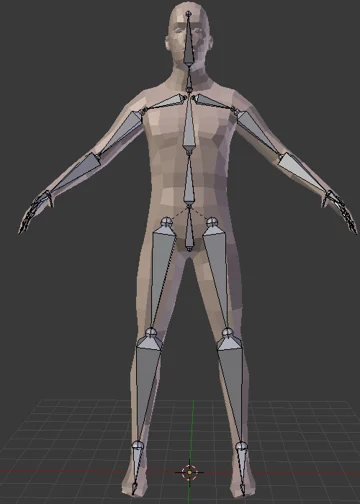
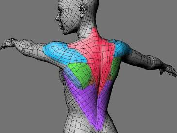

## 9.1 动画总览

要播放3D模型动画，不管怎样，我们都要先拿到模型，**Gltf模型其实是一种Asset**，因此我们在第三章中讨论的如何加载资产的那一整套，都可以完美的平移过来。

首先我们需要一个`Resource`来存储句柄，以便在不同的系统之间传递。当然也可以传递一些别的东西，不过目前而言我们主要关心的是其中的`Handle`。

```rust
#[derive(Resource)]
struct Fox(Handle<Gltf>);
```

然后，在`startup`阶段我们的`setup`系统中，只需要直接加载即可。

```rust
fn setup(
    mut commands: Commands,
    asset_server: Res<AssetServer>,
    mut meshes: ResMut<Assets<Mesh>>,
    mut materials: ResMut<Assets<StandardMaterial>>,
) {
    commands.insert_resource(Fox(asset_server.load(FOX_PATH)));
    //....
}
```

在这里，我们将用上我们在第2章中介绍的条件运行(参见2.3.2 run_if)。我们希望在资源加载完成并且配置完成之前，不要运行我们的动画系统。（或者，我们也可以采用state的方法来切换系统的运行，你能想到怎么做吗？）

```rust
// 存储动画相关的资源
#[derive(Resource)]
struct Animations {
    // 至于AnimationNodeIndex和AnimationGraph是什么，等待下文我们揭晓
    animations: Vec<AnimationNodeIndex>,
    graph_handle: Handle<AnimationGraph>,
}

// 这个系统在资产加载完成之前将会一直尝试运行
app.add_systems(
    Update,
    spawn_fox_asset_when_ready.run_if(not(resource_exists::<Animations>)),
)
// 这个系统只有在加载完成后运行
.add_systems(
    Update,
    keyboard_control.run_if(resource_exists::<Animations>),
)
```

在`spawn_fox_asset_when_ready`系统中，我们依然采用我们的三板斧。使用`is_loaded_with_dependencies`来判断是否已经加载完成(详见3.1.1节，要时常复习才能温故知新！)

```rust
fn spawn_fox_asset_when_ready(
    mut commands: Commands,
    fox_handle: Res<Fox>,
    asset_server: Res<AssetServer>,
    gltfs: Res<Assets<Gltf>>,
    mut graphs: ResMut<Assets<AnimationGraph>>,
) {
    // 如果尚未加载完成，那么先不执行
    if !asset_server.is_loaded_with_dependencies(&fox_handle.0) {
        return;
    }
	// 然后后利用句柄来获得我们的资产，你还记得吗？
    let fox = gltfs
        .get(&fox_handle.0)
        .expect("a loaded asset should exist in the glTF assets collection");

    // 很快你就会知道这里的三个动画对应了什么了
    // 现在，只需要知道我们有了一个AnimationGraph类型的graph
    // 还有了一个Vec<NodeIndex>类型的node_indices
    let (graph, node_indices) = AnimationGraph::from_clips([
        fox.named_animations["Run"].clone(),
        fox.named_animations["Walk"].clone(),
        fox.named_animations["Survey"].clone(),
    ]);

    // 保存这些动画信息，以便我们后续使用
    let graph_handle = graphs.add(graph);
    commands.insert_resource(Animations {
        animations: node_indices,
        graph_handle,
    });

    // 现在，我们才向bevy中添加真正的模型
    commands
        .spawn(SceneRoot(
            fox.default_scene
                .clone()
                .expect("a default scene exists in this file"),
        ))
    	// 这里用到了observe，还记得observe有什么用吗？（详见2.7.1节，再次强调温故知新的重要性～）
        .observe(setup_scene);
}

// 现在，每当SceneInstanceReady触发时，该函数将会被执行
// 可是SceneInstanceReady是什么？他的完整路径是bevy::scene::SceneInstanceReady
// 简而言之，这是bevy的一个内置事件，其定义如下，每当整个场景加载完成之后会被触发
// pub struct SceneInstanceReady {
//     pub entity: Entity,
//     pub instance_id: InstanceId,
// }
// 而AnimationPlayer组件，是跟随scene自动添加的
// 所以当SceneInstanceReady触发的时候，AnimationPlayer也已经存在
fn setup_scene(
    _ready: On<SceneInstanceReady>,
    mut commands: Commands,
    animations: Res<Animations>,
    player: Single<(Entity, &mut AnimationPlayer)>,
) {
    // 直接将内部的两个组件的所有权拿出来
    let (entity, mut player) = player.into_inner();
    // 然后我们需要new一个AnimationTransitions
    // 如果你用过css，那么你一定也知道transition有什么用，这里的AnimationTransitions
    // 也是一样的，当动画切换的时候，将会在动画之间插入平滑的过渡
    let mut transitions = AnimationTransitions::new();
	// 立刻开始重复播放第一个动画
    transitions
        .play(&mut player, animations.animations[0], Duration::ZERO)
        .repeat();
	// 这里的commands.entity对应了我们在第2章介绍的EntityComands，还记得吗？
    // 因此我们向scene根实体上，插入了这两个新的组件
    commands
        .entity(entity)
        .insert(AnimationGraphHandle(animations.graph_handle.clone()))
        .insert(transitions);
}

```

这些代码看下来真是让人大汗淋漓。你可能心里会想，怎么那么多没见过的东西？`AnimationNodeIndex`是什么？`AnimationGraph`是什么？`AnimationTransitions`又是什么？`AnimationGraphHandle`又是什么？？

让我们来一个个翻一翻源代码看看吧。`AnimationNodeIndex`其实只是一个别名，其本质上不过是一个含有u32类型的枚举罢了，这个数字标识了一个动画在gltf中的索引。这解释了为什么我们使用`transitions.play`方法时需要他。

```rust
/// The index of either an animation or blend node in the animation graph.
///
/// These indices are the way that [animation players] identify each animation.
///
/// [animation players]: crate::AnimationPlayer
pub type AnimationNodeIndex = NodeIndex<u32>;
```

`AnimationGraph`包含了一个有向无环图，感兴趣的读者可以查看[文档](https://docs.rs/bevy/latest/bevy/animation/graph/struct.AnimationGraph.html)，他其实相当复杂。描述了多个动画应该如何混合在一起。这是什么意思呢？我们在设计动画时，比如行走和攻击，一般都会设计成为两个单独的动画。如果不能将其混合起来一起播放，那么你行走的时候攻击时角色就会发生诡异的漂移（即脚不动但是角色还在跑，这在很多粗制滥造的游戏中很常见）。

```rust
#[derive(Asset, Reflect, Clone, Debug)]
#[reflect(Debug, Clone)]
pub struct AnimationGraph {
    /// The `petgraph` data structure that defines the animation graph.
    pub graph: AnimationDiGraph,

    /// The index of the root node in the animation graph.
    pub root: NodeIndex,

    /// The mask groups that each animation target (bone) belongs to.
    ///
    /// Each value in this map is a bitfield, in which 0 in bit position N
    /// indicates that the animation target doesn't belong to mask group N, and
    /// a 1 in position N indicates that the animation target does belong to
    /// mask group N.
    ///
    /// Animation targets not in this collection are treated as though they
    /// don't belong to any mask groups.
    pub mask_groups: HashMap<AnimationTargetId, AnimationMask>,
}
// 其中
/// A type alias for the `petgraph` data structure that defines the animation
/// graph.
pub type AnimationDiGraph = DiGraph<AnimationGraphNode, (), u32>;
pub type AnimationMask = u64;
pub struct AnimationTargetId(pub Uuid);
```

观察其代码，可以发现其由`graph`、`root`、`mask_groups`构成。`AnimationGraphNode`描述了如何对动画进行混合。`HashMap<AnimationTargetId, u64>`则描述了**每块动画骨骼的uuid和掩码组**之间的关系。掩码组是什么意思？

为什么这里是一个`HashMap<AnimationTargetId, AnimationMask>`类型呢？其实这是一种典型的位图。u64类型含有64个bit位。因此每个骨骼，最多支持定义 **64 个不同的掩码组**。

举个例子，一个复杂的模型可能有几百根骨骼，但你可能只想给其中的一部分（比如只有右手、或者只有上半身）分配掩码组。`HashMap` 只存储那些被分配了组的骨骼。你在 `mask_groups` 里把所有属于“上半身”的骨骼 ID 都标记为 `1 << 0`（第 0 组）。**节点 A** 播放“奔跑”动画（不带掩码，作用于全身）。**节点 B** 播放“挥剑”或“换弹”动画，但你给这个节点设置一个掩码，指定它**只作用于第 0 组**。角色就可以一边跑（下半身由节点 A 控制），一边做攻击动作（上半身被节点 B 覆盖）。

这方面的混合其实非常复杂，三言两语是搞不定的。如果对动画混合更感兴趣的读者，则需要查阅更详细的资料，这里就不再赘述。至于`AnimationGraphHandle`，这名字显而易见，由于`AnimationGraph`实际上是一种`asset`，因此当然也有对应的`handle`。

---

`AnimationTransitions`是一个用于控制动画之间过度的“增强型”`AnimationPlayer`。前面我们说当场景生成时，`AnimationPlayer`会自动添加到场景的任何根动画中。要使用`AnimationTransitions`你还必须把`AnimationGraphHandle`也同时放在一个实体上。仔细一想这也是正常的。因为动画过渡，本身就是利用动画图来实现的。

```rust
// 第一次动画必须使用transitions.play而不能使用AnimationPlayer上的play方法
// 因为AnimationTransitions需要记录动画的顺序，如果直接操作AnimationPlayer开始
// 会导致AnimationTransitions 无法确定动画的切换关系，从而导致过渡效果通常不正确。
let mut transitions = AnimationTransitions::new();
transitions
    .play(&mut player, animations.animations[0], Duration::ZERO)
    .repeat();
// 并且我们把这两个组件都插入到了根上
commands
    .entity(entity)
    .insert(AnimationGraphHandle(animations.graph_handle.clone()))
    .insert(transitions);
```

最后，一切大功告成，只需要在按下不同的按键时切换不同动画即可。

```rust
fn keyboard_control(
    keyboard_input: Res<ButtonInput<KeyCode>>,
    mut animation_players: Query<(&mut AnimationPlayer, &mut AnimationTransitions)>,
    animations: Res<Animations>,
    mut current_animation: Local<usize>,
) {
    // 这里的player是一个AnimationPlayer
    // 而transitions则是我们插入的AnimationTransitions
    for (mut player, mut transitions) in &mut animation_players {
        // 我们可以获取下一个动画的NodeIndex
        let Some((&playing_animation_index, _)) = player.playing_animations().next() else {
            continue;
        };
		// 当按下特定的按键时，可以控制播放器的行为，比如播放暂停
        if keyboard_input.just_pressed(KeyCode::Space) {
            let playing_animation = player.animation_mut(playing_animation_index).unwrap();
            if playing_animation.is_paused() {
                playing_animation.resume();
            } else {
                playing_animation.pause();
            }
        }
        // 还可以控制播放速度
         if keyboard_input.just_pressed(KeyCode::ArrowUp) {
            let playing_animation = player.animation_mut(playing_animation_index).unwrap();
            let speed = playing_animation.speed();
            playing_animation.set_speed(speed * 1.2);
        }
        // 对于动画的切换，我们需要计算下一个索引，并重新使用transitions来切换
        // 必须使用transitions.play()!否则过渡会出问题
        if keyboard_input.just_pressed(KeyCode::Enter) {
            *current_animation = (*current_animation + 1) % animations.animations.len();
            transitions
                .play(
                    &mut player,
                    animations.animations[*current_animation],
                    Duration::from_millis(250),
                )
                .repeat();
        }

       // ..... 等等的类似逻辑
    }
}

```

## 9.2 动画图与控制

上面那些乱七八糟的东西实在是看的让人头大，让我们首先来更仔细的看看所谓`AnimationGraph`的概念到底是什么吧。

用更规范一些的说法，动画图（Animation Graph）是游戏引擎中用来管理、混合、切换和控制角色复杂动画的数据结构或可视化节点图。在不同的游戏引擎中有不同的名字（UE 中叫做 AnimGraph、Unity 中叫做 Animator Controlle），但是他们的核心作用是一样的，都负责在不同的模型动画之间进行过渡、平滑、混合。

---

### 9.2.1 骨骼与动画

要理解为什么需要动画图，就必须理解，模型在建模软件中的骨骼动画是如何存在的。

简而言之，如下图所示，骨架被外部模型表面包围，而模型的表面由顶点与三角形或四边形构成。骨架中的每一根骨骼都会影响皮肤的形状和位置。



骨架本身就是一个树状层级结构，每根骨骼都有一个相对父节点的位置、旋转和缩放（第六章中我们详细讨论过这些变换）。要给模型加入动画，就需要在时间轴的关键节点打上**关键帧**。Blender 会使用函数曲线在关键帧之间进行自动插值。这些针对同一套骨骼的所有的关键帧和时间曲线组合在一起，在 Blender 中被称为一个 Action（动作）。

除此之外，为了让外部的模型顶点和三角形能够跟随骨架的变换而变化，网格的每个顶点都会绑定到一到多根骨骼上，并赋予 0 到 1 之间的权重。当骨骼移动时，顶点会根据权重按比例跟随移动。这些骨架顶点和周围网格顶点组成的关系叫做**蒙皮(Skin)**。



对于 gltf 格式来说，骨骼本质上就是一个普通的 `Node`，**Node** 是一个纯粹的空间节点，它有层级关系（父子关系），并记录了自己的平移, 旋转, 缩放。例如他看起来可能是这样。

```json
"nodes": [
  { "name": "Hips", "children": [ 1 ], "translation": [0, 1, 0] },     // Index 0: 髋关节（根节点）
  { "name": "Thigh_L", "children": [ 2 ], "rotation": [0, 0, 0, 1] }, // Index 1: 左大腿
  { "name": "Shin_L", "rotation": [0, 0, 0, 1] }                      // Index 2: 左小腿
]
```

其中的 children 指明了个节点之间的父子关系，当 Hips 移动时，Thigh_L和 Shin_L 作为子节点，在空间中会自动跟着一起移动。

而 gltf 的 Mesh 字段里，存的是几何体的顶点坐标。为了支持蒙皮，Mesh 的每个顶点都会额外附带两组数据：

- **JOINTS_0**（关联骨骼）：这个顶点受哪几根骨头影响？（通常最多支持 4 根，用 Node 的索引表示）。
- **WEIGHTS_0**（权重比例）：受这 4 根骨头影响的程度是多少？（4 个浮点数，加起来等于 1.0）。

现在有了 Node 和 Mesh，但 GPU 还是不知道怎么算。这是因为Node和Mesh的坐标系之间是独立的，二者之间缺少一个变换矩阵。

---

这个问题值得我们好好再聊一聊。举个例子，假如Mesh是手掌表面，而Node是手掌骨骼，在没有蒙皮的情况下，他们的坐标是相对于世界原点或者自己的父节点的。现在假如手掌骨骼相对手腕骨骼旋转了90度，这个旋转矩阵，是在骨骼自己的坐标系下旋转的，如果直接将其应用到手掌表面，那么骨骼会直接从手掌里甩出去了。

因此，我们在做这个变换之前，需要先把Mesh顶点的坐标系和Node的坐标系对齐，这是一个4*4的变换矩阵（如果对应了四根骨头，那么就有4个变换矩阵）。这个矩阵就就叫做 `inverseBindMatrices`。

---

Skin 就要负责提供这些信息。他看起来可能是这样的。`joints`字段告诉了引擎“这个 Skin 包含了哪些 Node 作为关节”，`inverseBindMatrices` 里是一个索引，意思是去寻找索引为 5 的 Accessor 里的数据作为逆变换矩阵。

```json
"skins": [
  { "name": "HumanoidSkin", "joints": [ 0, 1, 2 ], "inverseBindMatrices": 5 }
]
```

假如 Mesh 的每个顶点都存着：

- **JOINTS_0**: [1, 2, 0, 0] （这个顶点关联了 1 号骨骼小臂、2 号骨骼手腕）

- **WEIGHTS_0**: [0.7, 0.3, 0, 0] （小臂占 70% 权重，手腕占 30% 权重）

在这种情况下，这个变换就可以表示为。
$$
\begin{aligned} \text{顶点最终位置} &= \mathbf{0.7} \times \left( \text{1号骨骼当前动画矩阵} \times \mathbf{\text{1号骨骼逆绑定矩阵}} \times \text{顶点初始位置} \right) \\ &+ \mathbf{0.3} \times \left( \text{2号骨骼当前动画矩阵} \times \mathbf{\text{2号骨骼逆绑定矩阵}} \times \text{顶点初始位置} \right) \end{aligned}
$$

---

说到这里我们终于说完了最基本的骨骼知识，那么让我们回到正题，为什么我们需要`AnimationGraph`？

因为 gltf 里，一个动画就是一段固定的、写死的数据采样流（例如从 0 秒到 1 秒，骨骼 A 旋转 45 度）。动画师不可能穷尽所有的动画可能，必须由游戏引擎在运行时利用动画师的这些已经写好的动画，拼接出新的动画。

### 9.2.2 AnimationGraph

一个`AnimationGraph`是由`AnimationGraphNode`组成的一个有向无环图，其中后者分为三种类型。

```json
pub enum AnimationNodeType {
    /// 动画图的数据源头。它负责从内存中加载并播放一个具体的动画资源
    /// 它永远是动画图的叶子节点，没有子节点，只负责向上传递数据。
    Clip(Handle<AnimationClip>),
    /// 将多个子节点（可以是 Clip 或其他 Blend 节点）的动画效果按比例归一化后线性混合。
    #[default]
    Blend,
    /// 将子节点的动画叠加到动画上。
    Add,
}
```

一个典型的游戏角色动画图在内存中可以是这样组合的。底层的两个 **`Clip`** 负责提供 `Walk` 和 `Run` 的原始骨骼矩阵。中间的 **`Blend`** 按照当前移动速度，把两者插值混合成一个自然快走姿势。顶层的 **`Add`** 节点直接把 `Attack` 的右手挥剑差值数据“加”在刚刚混合好的姿势上，最终算出送往顶点着色器（Vertex Shader）的骨骼矩阵。

```tex
                 [ 最终输出到骨骼 (Final Output) ]
                               │
                       [ Add 叠加节点 ] 
                         /          \
                        /            \  (加性叠加右手动作)
           [ Blend 混合节点 ]        [ Clip: 挥剑攻击 (Attack) ]
            /              \
           /                \ (按速度 40%/60% 归一化混合)
[ Clip: 走路 (Walk) ]   [ Clip: 跑步 (Run) ]
```

用代码来写这些流程的话，大概长这样。除了最通用的`add_edge`、`add_clip`之外，读者可以查看[文档](https://docs.rs/bevy/latest/bevy/animation/graph/struct.AnimationGraph.html)，还有很多例如 [add_clips](https://docs.rs/bevy/latest/bevy/animation/graph/struct.AnimationGraph.html#method.add_clips)，[add_blend](https://docs.rs/bevy/latest/bevy/animation/graph/struct.AnimationGraph.html#method.add_blend) [from_clips](https://docs.rs/bevy/latest/bevy/animation/graph/struct.AnimationGraph.html#method.from_clips)（我们在之前使用过这个方法）之类的便捷方法。

```rust
fn setup_animation_graph(
    mut commands: Commands,
    mut animation_graphs: ResMut<Assets<AnimationGraph>>,
    mut players: Query<(Entity, &mut AnimationPlayer), Added<AnimationPlayer>>,
    asset_server: Res<AssetServer>,
) {
    for (entity, mut player) in &mut players {
        // 构建动画图节点
        let mut graph = AnimationGraph::new();
        // 创建 Clip 节点
        let clip_walk = asset_server.load(GltfAssetLabel::Animation(0).from_asset("models/character.gltf"));
        let clip_run = asset_server.load(GltfAssetLabel::Animation(1).from_asset("models/character.gltf"));
        let clip_attack = asset_server.load(GltfAssetLabel::Animation(2).from_asset("models/character.gltf"));

        let node_walk = graph.add_clip(clip_walk, 1.0, graph.root);
        let node_run = graph.add_clip(clip_run, 1.0, graph.root);
        let node_attack = graph.add_clip(clip_attack, 1.0, graph.root);

        // 将 Walk 和 Run 按 50%/50% 混合成移动动画
        let node_blend = graph.add_node(AnimationNodeType::Blend, graph.root);
        graph.add_edge(node_walk, node_blend);
        graph.add_edge(node_run, node_blend);

        // 将 Blend 产生的移动动画 作为基础，叠加 Attack
        let node_add = graph.add_node(AnimationNodeType::Add, graph.root);
        graph.add_edge(node_blend, node_add);
        graph.add_edge(node_attack, node_add);

        // 将根节点设为最终输出的 Add 节点
        graph.root = node_add;

        // 注册并播放动画图
        let graph_handle = animation_graphs.add(graph);

        // 在 AnimationPlayer 上开始播放该动画图
        player.play(node_add).repeat();
        
        commands.entity(entity).insert(CharacterAnimation {
            graph_handle,
            node_walk,
            node_run,
            node_blend,
            node_attack,
            node_add,
        });
    }
}
```

### 9.2.3 AnimationPlayer

仅仅能够混合不同的动画是远远不够的，我们还需要能够在运行时动态的改变动画的混合逻辑与速度等控制要素。

在前面我们说到，`AnimationPlayer` 会自动添加到场景的任何根动画中，而控制动画，就要用到 `AnimationPlayer` 身上的方法。`AnimationPlayer` 上有着 `start`、`play`、`stop`、`is_playing_animation`、`animation_mut` 等等非常有用的方法，这些方法都需要一个 `AnimationNodeIndex` 类型的参数，即动画的 `index` ，读者可以查看[文档](https://docs.rs/bevy/latest/bevy/animation/struct.AnimationPlayer.html)。

这里我们主要介绍 `is_playing_animation` 与 `animation_mut` 两个方法。前者主要用来查询当前播放的动画的`index`是否为该`index`，后者则用于获取id对应的 `ActiveAnimation` 。

```rust
static CLIP_NODE_INDICES: [u32; 3] = [2, 3, 4];

fn sync_weights(mut query: Query<(&mut AnimationPlayer, &ExampleAnimationWeights)>) {
    for (mut animation_player, animation_weights) in query.iter_mut() {
        for (&animation_node_index, &animation_weight) in CLIP_NODE_INDICES
            .iter()
            .zip(animation_weights.weights.iter())
        {
            // 查询当前动画的index是否为animation_node_index，如果不是那么则播放该动画
            if !animation_player.is_playing_animation(animation_node_index.into()) {
                animation_player.play(animation_node_index.into());
            }

            // 获得当前动画的ActiveAnimation并设置其权重
            // 这里的active_animation是一个ActiveAnimation类型的结构体
            if let Some(active_animation) =
                animation_player.animation_mut(animation_node_index.into())
            {
                active_animation.set_weight(animation_weight);
            }
        }
    }
}

```

`ActiveAnimation` 是 bevy 用来实时追踪和控制单个正在运行（或暂停）的动画实例的底层状态。里面存储了非常多有用的信息，并且暴露了很多有用的调整方法。读者可以查看[文档](https://docs.rs/bevy/latest/bevy/animation/struct.ActiveAnimation.html)。

```rust
pub struct ActiveAnimation {
    /// 该动画当前生效的权重系数。动画图中的节点权重会乘以这个值，用来在运行时做平滑淡入淡出或调节混合比例。
    weight: f32,
    repeat: RepeatAnimation,
    /// 播放倍速
    speed: f32,
    /// 该动画累计播放的总时间
    elapsed: f32,
    /// 动画片段内部的当前时间戳。永远限定在 [0.0, 动画时长] 范围内。
    seek_time: f32,
    /// 上一帧的 seek_time。
    /// 引擎用它和当前的 seek_time 对比，来判断这一帧动画是否跨过了某个关键帧或动画事件
    last_seek_time: Option<f32>,
    /// 动画已经播放完成的次数
    completions: u32,
    /// 这一帧是否刚刚播放完一次
    just_completed: bool,
    paused: bool,
}
```

